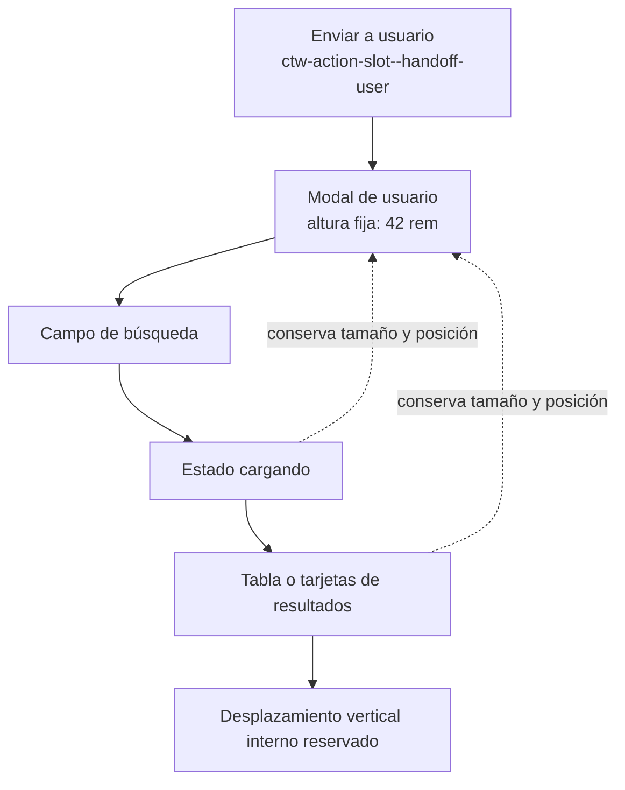

# Geometría estable de la interfaz

El control nuevo recibe las mismas clases de ubicación que el control sustituido. El cuerpo del modal mantiene scroll vertical reservado, así la carga, una lista vacía o los resultados no cambian el tamaño del diálogo.
