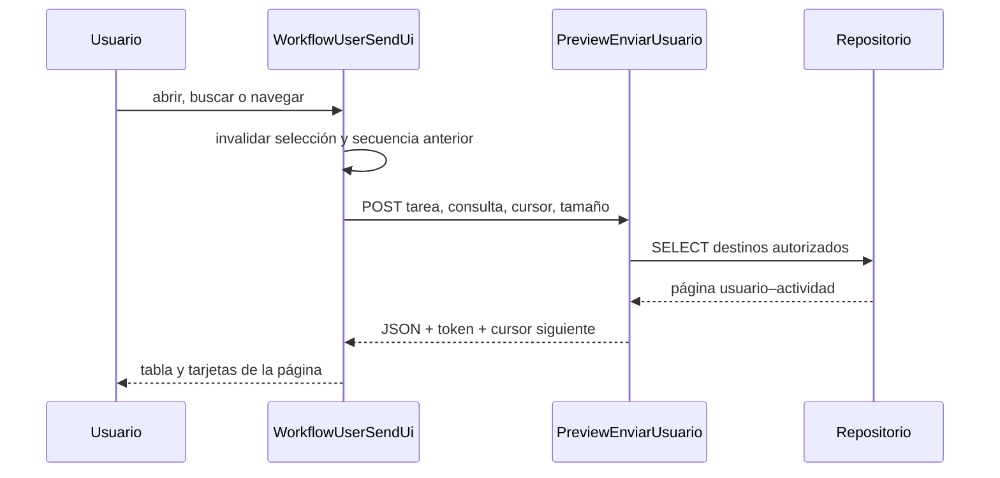

# Secuencia de consulta preview

```mermaid
sequenceDiagram
    participant U as Usuario
    participant UI as WorkflowUserSendUi
    participant S as PreviewEnviarUsuario
    participant R as Repositorio

    U->>UI: abrir, buscar o navegar
    UI->>UI: invalidar selección y secuencia anterior
    UI->>S: POST tarea, consulta, cursor, tamaño
    S->>R: SELECT destinos autorizados
    R-->>S: página usuario–actividad
    S-->>UI: JSON + token + cursor siguiente
    UI-->>U: tabla y tarjetas de la página
```
