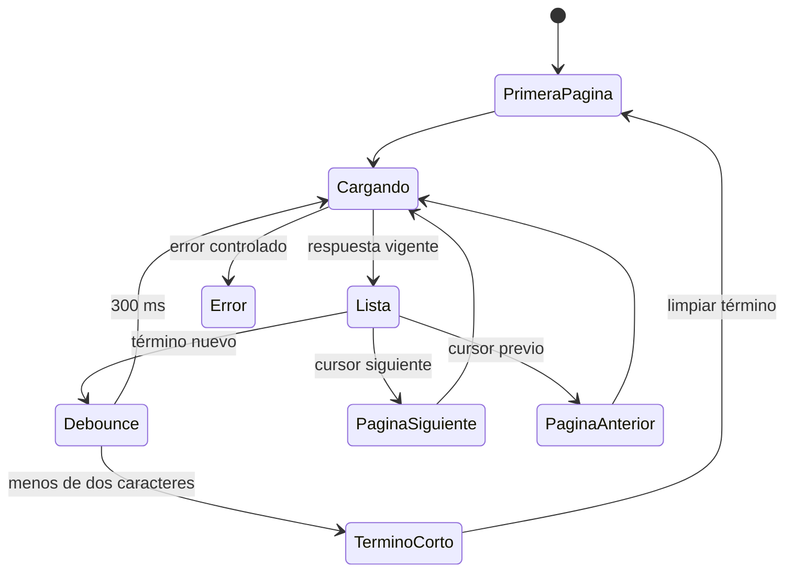

# Estados de búsqueda y cursor

```mermaid
stateDiagram-v2
    [*] --> PrimeraPagina
    PrimeraPagina --> Cargando
    Cargando --> Lista: respuesta vigente
    Cargando --> Error: error controlado
    Lista --> Debounce: término nuevo
    Debounce --> Cargando: 300 ms
    Lista --> PaginaSiguiente: cursor siguiente
    PaginaSiguiente --> Cargando
    Lista --> PaginaAnterior: cursor previo
    PaginaAnterior --> Cargando
    Debounce --> TerminoCorto: menos de dos caracteres
    TerminoCorto --> PrimeraPagina: limpiar término
```
