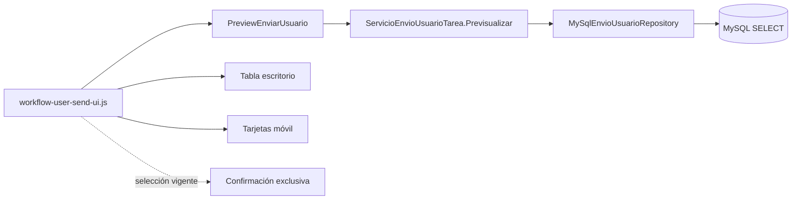

# Componentes y fronteras

```mermaid
flowchart LR
    UI[workflow-user-send-ui.js] --> ASMX[PreviewEnviarUsuario]
    ASMX --> Service[ServicioEnvioUsuarioTarea.Previsualizar]
    Service --> Repo[MySqlEnvioUsuarioRepository]
    Repo --> DB[(MySQL SELECT)]
    UI --> Desktop[Tabla escritorio]
    UI --> Mobile[Tarjetas móvil]
    UI -. selección vigente .-> Confirm[Confirmación exclusiva]
```
