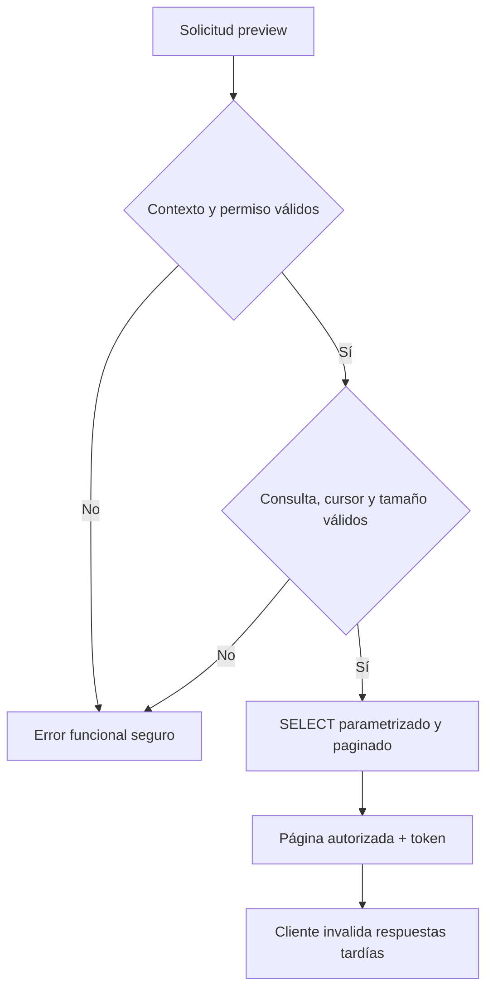

# Controles de validación y seguridad

```mermaid
flowchart TD
    Request[Solicitud preview] --> Context{Contexto y permiso válidos}
    Context -- No --> SafeError[Error funcional seguro]
    Context -- Sí --> Query{Consulta, cursor y tamaño válidos}
    Query -- No --> SafeError
    Query -- Sí --> Read[SELECT parametrizado y paginado]
    Read --> Page[Página autorizada + token]
    Page --> Client[Cliente invalida respuestas tardías]
```
