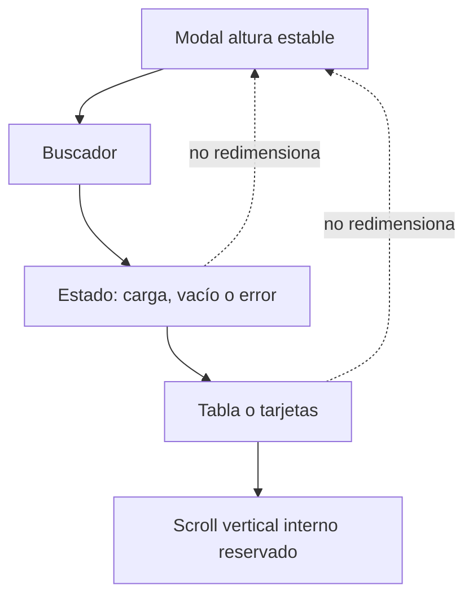

# Representación estable de la lista

```mermaid
flowchart TB
    Modal[Modal altura estable] --> Search[Buscador]
    Search --> Status[Estado: carga, vacío o error]
    Status --> Content[Tabla o tarjetas]
    Content --> Scroll[Scroll vertical interno reservado]
    Status -. no redimensiona .-> Modal
    Content -. no redimensiona .-> Modal
```
