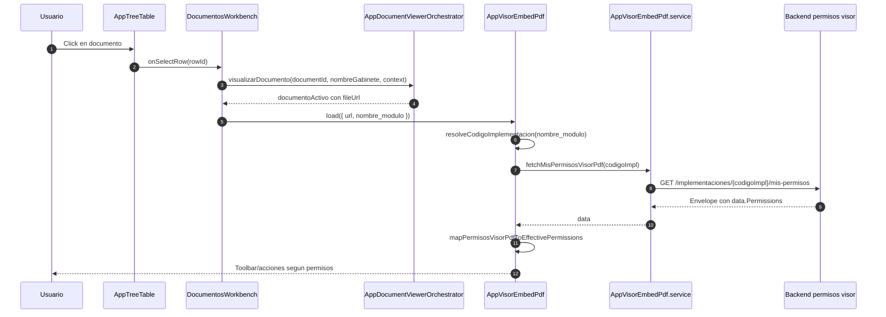
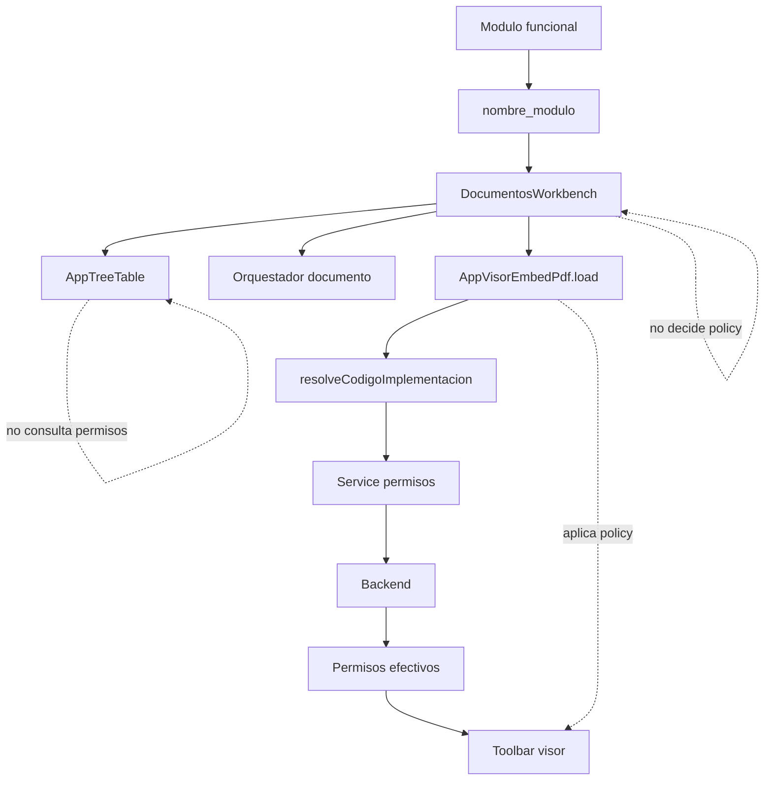

# SCRUMCORE-236 - Arquitectura

## Objetivo

Alinear la capa frontend del visor PDF con el contrato oficial de permisos sin mover responsabilidades entre componentes.

## Responsabilidades

- `AppTreeTable`: emite seleccion o accion de fila.
- `DocumentosWorkbench`: orquesta documento activo y llama `AppVisorEmbedPdf.load`.
- `AppVisorEmbedPdf`: resuelve `codigoImpl`, consulta permisos y aplica policy.
- `AppVisorEmbedPdf.service.ts`: consume el endpoint y valida el envelope.
- Backend: resuelve `IdUsuario` desde JWT y retorna permisos efectivos.

## Flujo

## Diagrama de responsabilidades

## ADRs

### ADR-236-01: Unwrap estricto del envelope

Se consume el contrato oficial `{ success, message, data, meta, errors }` y se retorna solo `data` al visor.

### ADR-236-02: No enviar idUsuario

`mis-permisos` usa JWT. Frontend no envia `idUsuario`.

### ADR-236-03: No ampliar UI para permisos no conectados

`pdf.view`, `pdf.zoom` y `pdf.rotate` quedan documentados sin nuevas capacidades UI.
