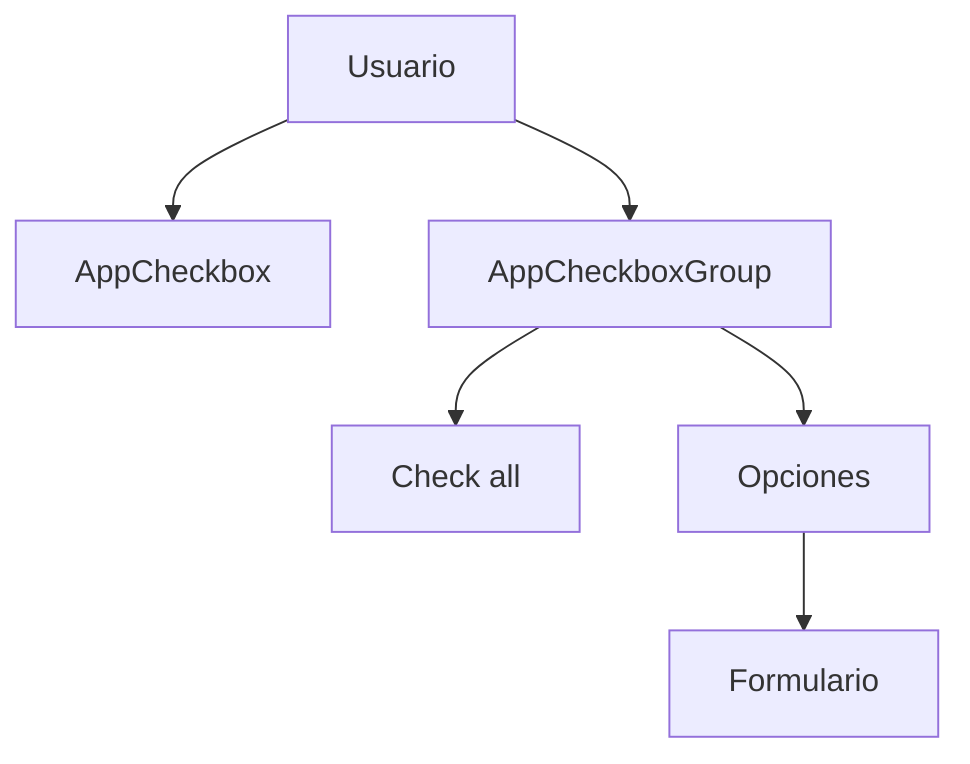
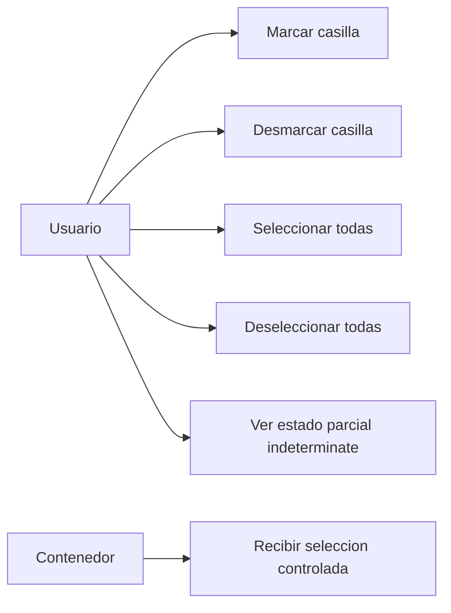
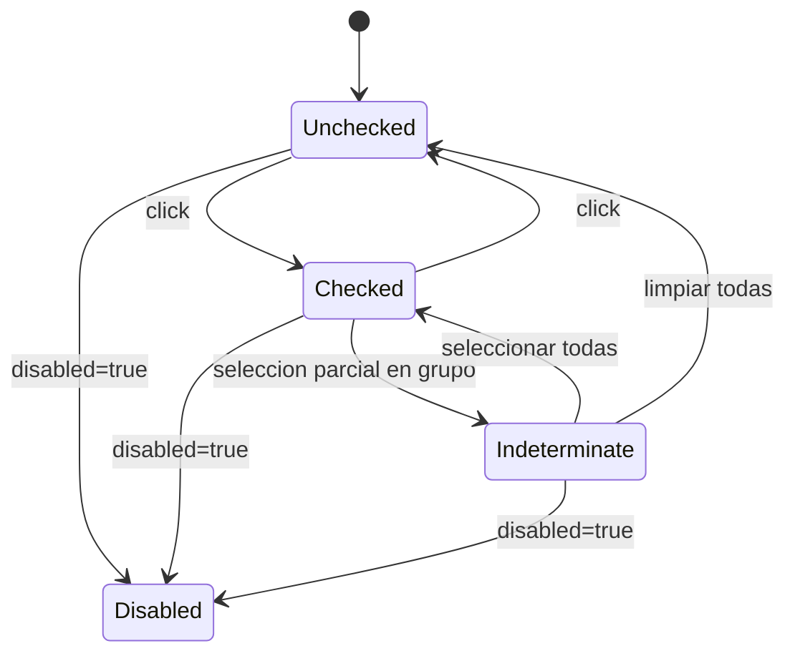
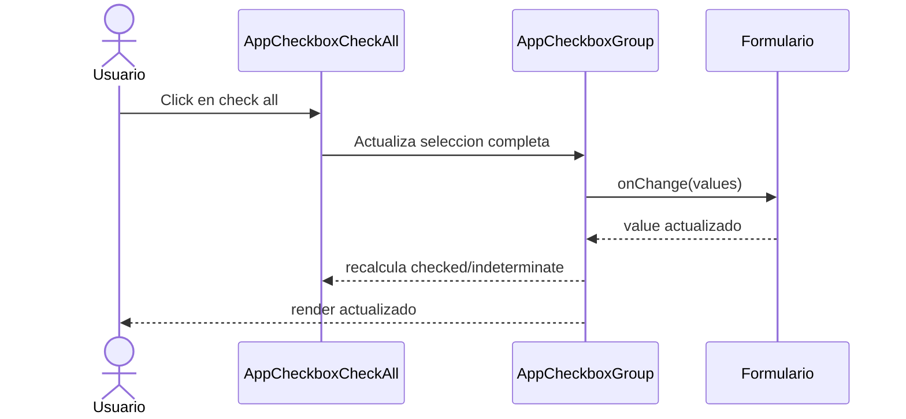

# Arquitectura Maestra: AppCheckbox

## Objetivo

Definir un componente reusable `AppCheckbox` basado en `Checkbox` de Ant Design,
con soporte para casilla individual, grupo de casillas y patron `check all`,
manteniendo una API shared tipada, accesible y desacoplada del dominio.

## Alcance

Aplica a:

- Formularios con confirmaciones booleanas
- Grupos de seleccion multiple con checkboxes
- Workflows que necesiten patron `Seleccionar todo`
- Casos con estados controlados, no controlados y deshabilitados

No aplica a:

- Logica de negocio especifica de modulos
- Validaciones de dominio embebidas en el shared
- Persistencia, backend o efectos secundarios automaticos

## Contexto existente (referencia obligatoria)

El componente debe seguir la filosofia shared de `AppButton`, `AppInputSelect`,
`AppInputTags` y demas wrappers UI del proyecto:

- API tipada y controlada
- apariencia consistente
- sin logica de negocio embebida
- documentacion de uso y ejemplos

Referencia tecnica obligatoria:

- `src/app/Components/UI/AppButton/`
- `src/app/Components/UI/AppInput/`
- `src/app/Components/UI/AppInputSelect/`
- Ant Design `Checkbox`

## Resumen de arquitectura

Frontend

- `AppCheckbox`: wrapper principal para checkbox individual
- `AppCheckboxGroup`: composicion para multiples casillas
- `check all controller`: variante o helper para seleccionar/desmarcar todas
- `size mapping`: alineacion visual con `sm`, `md`, `lg`

Backend

- no requiere integracion directa
- los datos del grupo deben entrar via props normalizadas
- cualquier adaptador de dominio vive fuera del componente shared

## Principios

- Reutilizable y desacoplado del dominio
- Basado en Ant Design, no en estilos arbitrarios
- Tipado estricto para `checked`, `value`, `options` y callbacks
- Soporte para composicion simple y grupal
- UX predecible en estados `default`, `checked`, `indeterminate`, `disabled`, `error`

## Contrato base (obligatorio)

```ts
export type AppCheckboxSize = "sm" | "md" | "lg";

export type AppCheckboxOption<TValue extends string | number = string> = {
  label: ReactNode;
  value: TValue;
  disabled?: boolean;
  meta?: Record<string, unknown>;
};

export type AppCheckboxProps = {
  checked?: boolean;
  defaultChecked?: boolean;
  disabled?: boolean;
  indeterminate?: boolean;
  size?: AppCheckboxSize;
  label?: ReactNode;
  helperText?: ReactNode;
  error?: boolean;
  className?: string;
  onChange?: (checked: boolean, event: CheckboxChangeEvent) => void;
  "aria-label"?: string;
  "aria-labelledby"?: string;
  "aria-describedby"?: string;
};

export type AppCheckboxGroupProps<TValue extends string | number = string> = {
  value: TValue[];
  options: AppCheckboxOption<TValue>[];
  disabled?: boolean;
  size?: AppCheckboxSize;
  direction?: "vertical" | "horizontal";
  label?: ReactNode;
  helperText?: ReactNode;
  error?: boolean;
  name?: string;
  rules?: Rule[];
  onChange: (value: TValue[]) => void;
};

export type AppCheckboxCheckAllProps<TValue extends string | number = string> = {
  options: AppCheckboxOption<TValue>[];
  value: TValue[];
  disabled?: boolean;
  size?: AppCheckboxSize;
  checkAllLabel?: ReactNode;
  name?: string;
  rules?: Rule[];
  onChange: (value: TValue[]) => void;
};
```

## Contratos publicos completos (obligatorio)

La arquitectura debe dejar definidos desde el inicio todos los contratos publicos:

- `AppCheckbox`
- `AppCheckboxGroup`
- `AppCheckboxCheckAll`

No debe quedar ninguna API importante implícita para una FE posterior.

## Control de estado explicito

Para variantes grupales y `check all`, el contrato es controlado de forma
obligatoria:

```ts
value: string[]
onChange: (value: string[]) => void
```

Esto evita duplicidad de estados internos y hace predecible la integracion con
formularios, filtros y contenedores. `AppCheckboxGroup` y `AppCheckboxCheckAll`
no deben exponer `defaultValue` en la API base.

## Integracion con formularios

Debe contemplarse compatibilidad con `Form.Item` de Ant Design:

- soporte de `name`
- soporte de `rules`
- integracion limpia con validaciones externas
- sin acoplar el shared a una instancia concreta de formulario

El tipado de `rules` debe ser fuerte y alineado con Ant Design. Debe evitarse
`unknown[]` o tipos debiles equivalentes.

## Relacion entre componentes

La arquitectura debe dejar explicita la relacion interna:

- `AppCheckbox` es la unidad base
- `AppCheckboxGroup` compone multiples `AppCheckbox`
- `AppCheckboxCheckAll` usa `AppCheckboxGroup` como fuente de verdad visual y de seleccion

La logica de seleccion total/parcial puede vivir en un helper o hook interno
compartido, pero `CheckAll` no debe duplicar una segunda implementacion paralela
del grupo.

## Comportamiento requerido

- Debe soportar checkbox individual controlado y no controlado.
- Debe soportar estado `indeterminate`.
- Debe soportar grupos con seleccion multiple.
- Debe soportar patron `check all` sincronizado con el grupo.
- Debe reflejar `disabled` a nivel individual y grupal.
- Debe exponer callbacks claros y tipados.
- Debe permitir labels visibles y accesibles.

## Apariencia (alineada a Ant Design)

Requisitos visuales minimos:

- usar `Checkbox` de Ant Design como base visual principal
- mantener apariencia nativa de Ant Design con refinamiento shared minimo
- soportar `sm`, `md`, `lg` alineados con el sistema UI
- spacing y click target claros
- `border-radius` leve y moderno cuando aplique a wrappers o contenedores

## Accesibilidad

- `aria-label` o `aria-labelledby` cuando no haya label visible
- foco visible y navegacion por teclado correcta
- labels clicables
- soporte correcto para `disabled` e `indeterminate`
- grupos anunciados de forma clara si incluyen label o descripcion

## Errores a evitar

- Mezclar checkbox individual con APIs de input textual
- Acoplar `check all` a un caso de negocio concreto
- Duplicar componentes shared ya existentes
- Romper el comportamiento accesible de Ant Design con wrappers rigidos

## Pruebas minimas

- Render basico de checkbox controlado y no controlado
- Cambio de estado y disparo de `onChange`
- Estado `disabled`
- Estado `indeterminate`
- Grupo con multiples opciones
- `check all` marca y desmarca todas
- `check all` entra en `indeterminate` cuando solo una parte esta seleccionada

## Diagramas

### Diagrama de uso



### Diagrama de casos de uso



### Diagrama de estados



### Diagrama de secuencia



## Documentacion de uso

### Ejemplo basico

```tsx
<AppCheckbox
  label="Acepto terminos y condiciones"
  checked={accepted}
  onChange={(checked) => setAccepted(checked)}
/>
```

### Ejemplo grupo

```tsx
<AppCheckboxGroup
  label="Canales de notificacion"
  options={[
    { label: "Correo", value: "correo" },
    { label: "SMS", value: "sms" },
    { label: "WhatsApp", value: "whatsapp" },
  ]}
  value={channels}
  onChange={setChannels}
/>
```

### Ejemplo check all

```tsx
<AppCheckboxCheckAll
  checkAllLabel="Seleccionar todos"
  options={[
    { label: "Lectura", value: "lectura" },
    { label: "Escritura", value: "escritura" },
    { label: "Aprobacion", value: "aprobacion" },
  ]}
  value={permissions}
  onChange={setPermissions}
/>
```
