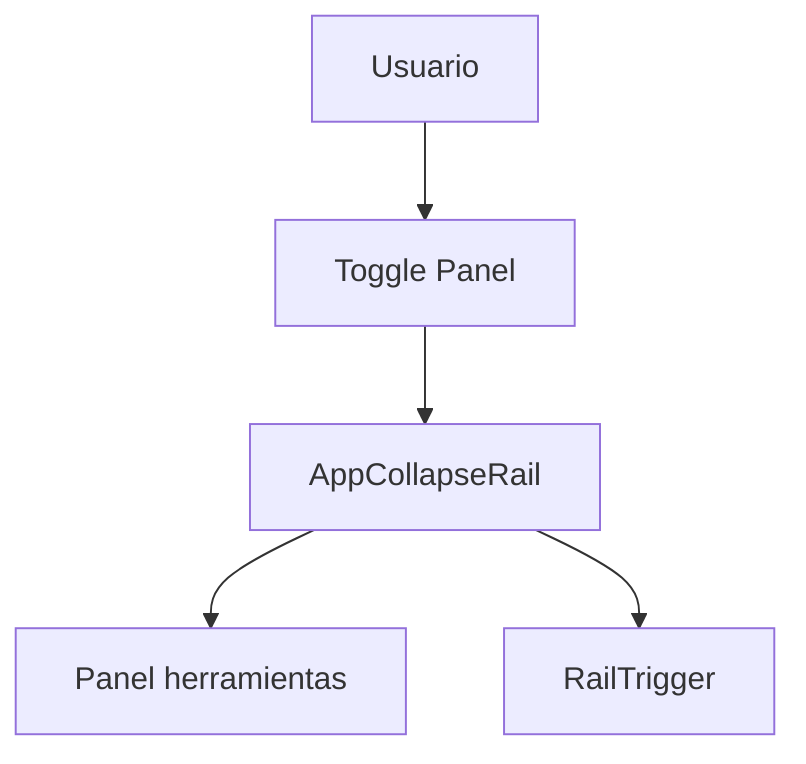
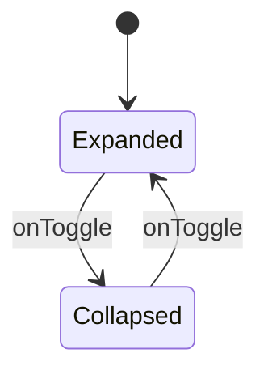
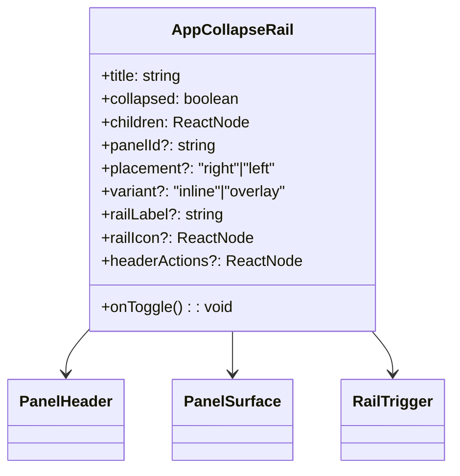
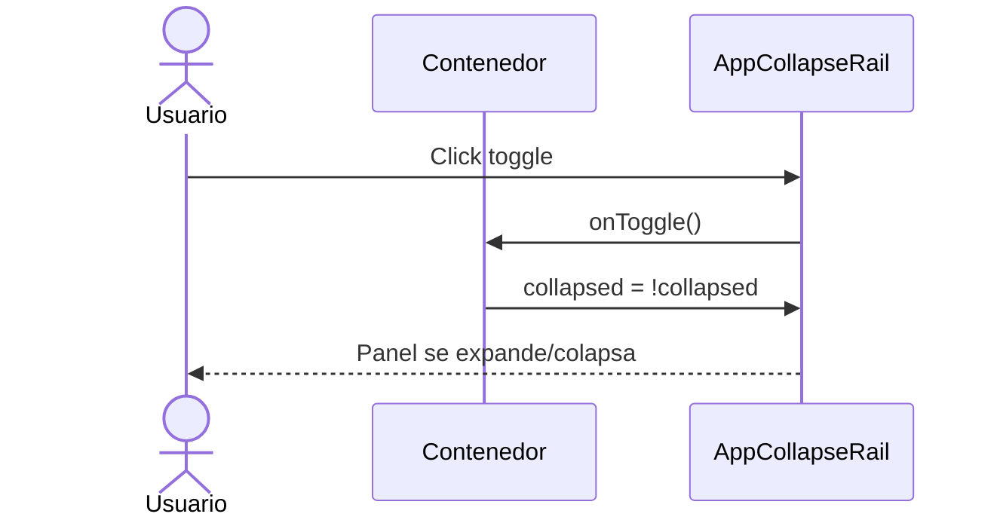

# Arquitectura Maestra: AppCollapseRail

## Objetivo

Definir un componente reusable `AppCollapseRail` que encapsule el comportamiento de
panel lateral colapsable usado en GestionRespuesta, con apariencia consistente,
accesibilidad completa y responsive para desktop, tablet y mobile.

## Alcance

Aplica a:

- Workbenches con panel lateral de herramientas/ayuda
- Modulos que requieran un rail colapsable sin perder estado interno
- Layouts que necesiten panel derecho o izquierdo con control visible

No aplica a:

- Logica de negocio (validaciones, permisos, flujos de modulo)
- Llamadas a API
- Persistencia remota de estado (opcional futuro)

## Contexto existente (referencia obligatoria)

El comportamiento base y la apariencia deben emular el panel derecho de herramientas
en `GestionRespuesta`, con:

- panel colapsable con `aria-expanded`
- rail de restauracion visible cuando esta colapsado
- transiciones suaves
- contenido no desmontado al colapsar
- responsive: overlay tipo bottom-sheet en mobile

Archivos de referencia visual y de comportamiento:

- `src/modules/gestionCorrespondencia/components/gestionRespuestaMainTab/GestionRespuestaRightToolsPanel.tsx`
- `src/modules/gestionCorrespondencia/components/gestionRespuestaMainTab/GestionRespuestaMainTabContent.module.css`

## Resumen de arquitectura

Frontend

- AppCollapseRail: contenedor principal
- PanelHeader: titulo + boton de colapso
- PanelSurface: cuerpo scrolleable
- RailTrigger: control flotante cuando esta colapsado

Backend (futuro opcional)

- Persistir preferencia de colapso por usuario/contexto

## Principios

- Reutilizable y desacoplado
- Tipado estricto (sin `any`)
- Separacion de responsabilidades: UI + control, sin logica de negocio
- Accesible por teclado y lector de pantalla
- Responsive first (desktop/tablet/mobile)

## Contrato base (obligatorio)

```ts
export type AppCollapseRailPlacement = "right" | "left";
export type AppCollapseRailVariant = "inline" | "overlay";

export type AppCollapseRailProps = {
  title: string;
  collapsed: boolean;
  onToggle: () => void;
  children: ReactNode;
  panelId?: string;
  placement?: AppCollapseRailPlacement;
  variant?: AppCollapseRailVariant;
  railLabel?: string;
  railIcon?: ReactNode;
  headerActions?: ReactNode;
  className?: string;
};
```

## Comportamiento requerido

- `collapsed` controlado externamente.
- El contenido del panel no se desmonta al colapsar.
- `RailTrigger` visible solo cuando `collapsed = true`.
- `onToggle` se dispara tanto desde el header como desde el rail.
- En mobile, el panel se comporta como bottom-sheet overlay.
- En tablet, el panel puede iniciar colapsado por defecto (responsabilidad del contenedor).

## Responsive (obligatorio)

Desktop (>= 1025px)

- Panel lateral inline en layout principal.
- Colapso desplaza fuera del viewport lateral.
- Rail flotante discreto.

Tablet (769px - 1024px)

- Panel colapsado por defecto.
- Mantiene rail flotante visible.
- Panel inline con ancho reducido si se expande.

Mobile (<= 768px)

- Panel overlay tipo bottom-sheet con altura maxima 70% - 80%.
- Rail flotante tipo chip con texto + icono.
- Sombras y handle superior para indicar draggable (solo visual).

## Apariencia (alineada a GestionRespuesta)

Requisitos visuales minimos:

- Panel con fondo claro, borde sutil y radius 12-20px.
- Transicion suave en `transform` y `opacity`.
- Rail flotante con sombra suave y borde tenue.
- Icono de colapso consistente con `RightOutlined`/`LeftOutlined`.

## Accesibilidad

- `aria-label` en el panel (ej: "Panel de herramientas").
- `aria-expanded` en el boton de toggle.
- `aria-controls` apuntando a `panelId`.
- Foco visible en controles.

## Errores a evitar

- Manejar logica de negocio en el componente.
- Desmontar contenido al colapsar (pierde estado).
- Estilos globales o acoplar a AntD.
- No exponer `onToggle` en rail y header.

## Pruebas minimas

- Renderiza panel y titulo.
- Toggle actualiza `aria-expanded`.
- Rail visible cuando colapsado.
- Contenido persiste al colapsar/expandir.
- Responsive: overlay en mobile.

## Diagramas

### Diagrama de uso



### Diagrama de estados



### Diagrama de clases



### Diagrama de secuencia


