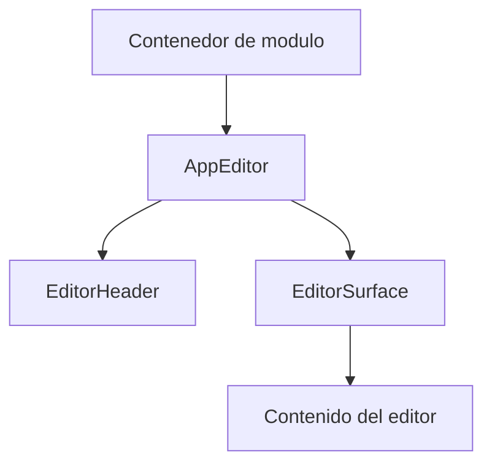
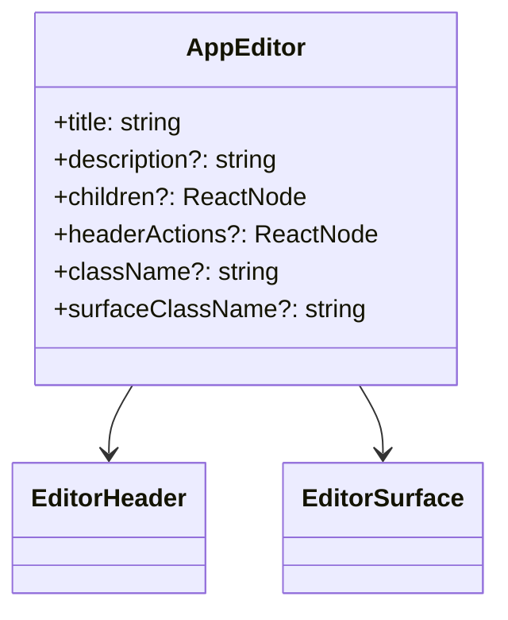

# Arquitectura Maestra: AppEditor

## Objetivo

Definir un componente reusable `AppEditor` para la capa UI que encapsule la
superficie principal de edicion usada hoy en `GestionRespuesta`, manteniendo un
layout dominante, scroll interno, encabezado contextual y desacople total de la
logica de negocio del modulo consumidor.

## Alcance

Aplica a:

- Workbenches con una columna principal de edicion o composicion.
- Pantallas master-detail donde el editor comparte espacio con un panel lateral.
- Modulos que necesiten preservar altura, scroll interno y consistencia visual.

No aplica a:

- Integracion con APIs o persistencia remota.
- Reglas de negocio del dominio.
- Toolbars, paneles laterales o tabs de navegacion.

## Contexto existente (referencia obligatoria)

La referencia actual esta en:

- `src/modules/gestionCorrespondencia/components/gestionRespuestaMainTab/GestionRespuestaEditorContainer.tsx`
- `src/modules/gestionCorrespondencia/components/gestionRespuestaMainTab/GestionRespuestaMainTabContent.module.css`

El patron existente resuelve:

- encabezado con `title` y `description`;
- superficie principal dominante para renderizar contenido del editor;
- `overflow: auto` interno en la superficie;
- contenedor visual desacoplado del workbench general.

## Resumen de arquitectura

Frontend

- `AppEditor`: contenedor principal reusable.
- `EditorHeader`: bloque contextual con titulo, descripcion y acciones opcionales.
- `EditorSurface`: superficie scrolleable donde vive el contenido principal.

Backend

- No requiere dependencias de backend.

## Principios

- Reusable y desacoplado del dominio.
- Tipado estricto.
- Sin `any` ni contratos implicitos.
- Scroll interno controlado por el componente.
- Composicion por `children`, sin acoplarse a librerias de rich text.

## Contrato base (obligatorio)

```ts
export type AppEditorProps = {
  title: string;
  description?: string;
  children?: ReactNode;
  headerActions?: ReactNode;
  className?: string;
  surfaceClassName?: string;
  "aria-label"?: string;
};
```

## Comportamiento requerido

- Debe renderizar encabezado contextual con `title`.
- `description` es opcional y no debe dejar espacios visuales incorrectos.
- La superficie principal debe ocupar el alto disponible del layout padre.
- El contenido debe scrollear dentro de `EditorSurface`, no en el body del modulo.
- El componente debe aceptar cualquier contenido por `children`.
- Si no hay `children`, puede renderizar un estado placeholder neutro.

## Layout y responsive

Desktop

- El editor ocupa la columna principal del workbench.
- Debe tolerar layouts de dos columnas con panel lateral derecho o izquierdo.

Tablet

- Mantiene jerarquia visual del editor como superficie principal.
- Debe seguir funcionando aunque el panel lateral colapse.

Mobile

- El editor pasa a stack vertical sin perder padding, borde ni scroll interno.
- No debe depender de anchos fijos del layout desktop.

## Apariencia minima

- Fondo claro y superficie limpia.
- Borde sutil y radius consistente con la UI shared.
- Separacion clara entre encabezado y superficie editable.
- Altura flexible con `min-height: 0` para convivir dentro de grids.

## Accesibilidad

- El contenedor principal debe exponer `aria-label` significativo.
- La jerarquia visual del encabezado debe traducirse a semantica clara.
- El contenido insertado por `children` debe heredar un contenedor estable.

## Errores a evitar

- Mezclar logica de negocio del modulo en el componente shared.
- Hacer que el scroll dependa del body o del tab completo.
- Acoplar `AppEditor` a un editor WYSIWYG especifico.
- Fijar alturas rigidas incompatibles con workbenches responsivos.

## Pruebas minimas

- Renderiza `title` y `description` cuando existen.
- Renderiza `children` dentro de la superficie principal.
- Mantiene la superficie con scroll interno.
- Soporta ausencia de `description` sin romper layout.

## Diagramas

### Diagrama de uso



### Diagrama de clases


