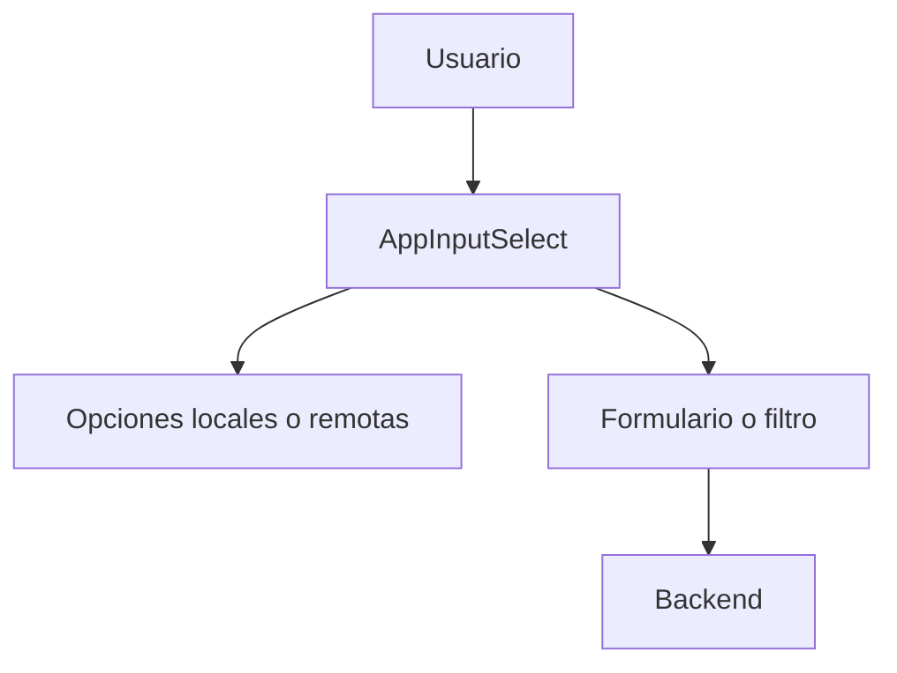
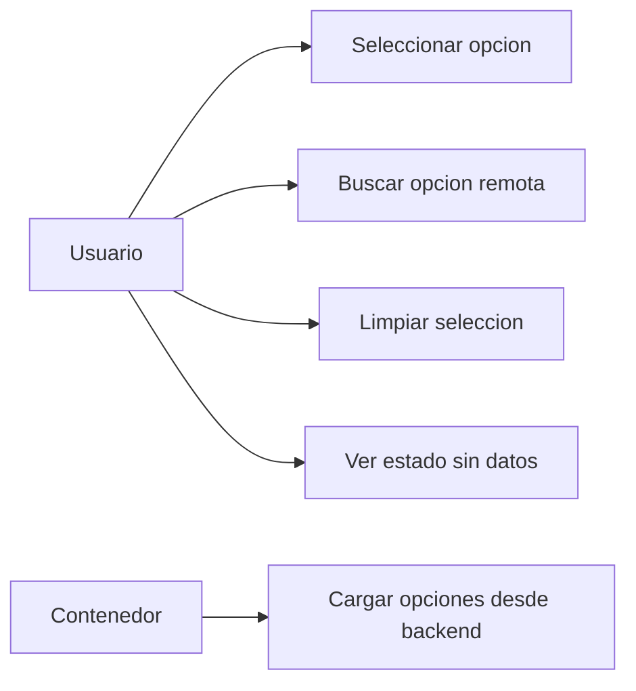
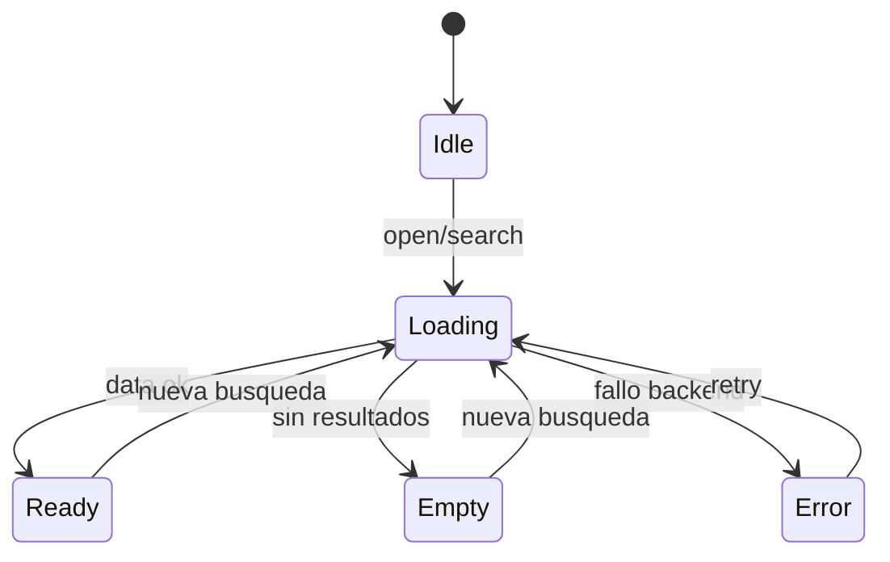
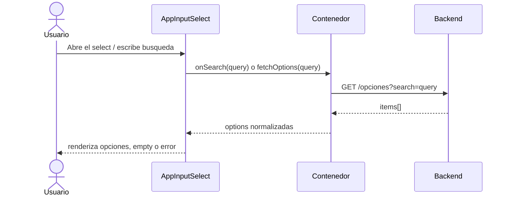

# Arquitectura Maestra: AppInputSelect

## Objetivo

Definir un componente reusable `AppInputSelect` basado en `Select` de Ant Design,
con apariencia visual nativa de Ant Design, soporte para datos remotos desde
backend, estados de carga y vacio consistentes, y una API shared alineada con el
ecosistema UI del proyecto.

## Alcance

Aplica a:

- Formularios que necesiten seleccionar una o multiples opciones cargadas desde API
- Filtros y buscadores con opciones remotas
- Workflows que requieran `Select` tipado, reusable y desacoplado

No aplica a:

- Logica de negocio especifica de cada modulo
- Transformaciones complejas de dominio fuera del adaptador de datos
- Orquestacion de queries o cache global

## Contexto existente (referencia obligatoria)

El componente debe seguir la filosofia shared de `AppButton`, `AppToolbar` y
demas UI wrappers del proyecto:

- API tipada y controlada
- apariencia consistente
- sin logica de negocio embebida
- documentacion de uso y ejemplos

Referencia tecnica obligatoria:

- `src/app/Components/UI/AppButton/`
- `src/app/Components/UI/AppDropdown/`
- `src/app/Components/UI/AppInput/`
- Ant Design `Select`

## Resumen de arquitectura

Frontend

- `AppInputSelect`: wrapper principal sobre `Select` de Ant Design
- `option adapter`: mapea respuestas backend a `label/value/meta`
- `empty state`: render vacio consistente con Ant Design
- `loading state`: spinner y bloqueo opcional de interaccion

Backend

- endpoint REST o query wrapper que retorna colecciones normalizadas
- contrato de respuesta adaptable a opciones del select
- soporte para filtros de busqueda, paginacion simple y reintento

## Principios

- Reutilizable y desacoplado del dominio
- Basado en Ant Design, no en estilos custom arbitrarios
- Tipado estricto para `value`, `option`, `mode` y callbacks
- Integracion remota opcional, no obligatoria
- UX predecible en estados `idle`, `loading`, `success`, `empty`, `error`

## Contrato base (obligatorio)

```ts
export type AppInputSelectSize = "sm" | "md" | "lg";

export type AppInputSelectOption<TValue extends string | number = string> = {
  label: ReactNode;
  value: TValue;
  disabled?: boolean;
  meta?: Record<string, unknown>;
};

export type AppInputSelectFetchResult<TValue extends string | number = string> = {
  options: AppInputSelectOption<TValue>[];
  total?: number;
};

export type AppInputSelectProps<TValue extends string | number = string> = {
  value?: TValue | TValue[];
  defaultValue?: TValue | TValue[];
  options?: AppInputSelectOption<TValue>[];
  placeholder?: string;
  size?: AppInputSelectSize;
  mode?: "single" | "multiple" | "tags";
  disabled?: boolean;
  loading?: boolean;
  allowClear?: boolean;
  searchable?: boolean;
  noDataText?: ReactNode;
  onChange?: (value: TValue | TValue[], option?: AppInputSelectOption<TValue> | AppInputSelectOption<TValue>[]) => void;
  onSearch?: (query: string) => void;
  fetchOptions?: (query?: string) => Promise<AppInputSelectFetchResult<TValue>>;
  className?: string;
  status?: "error" | "warning";
};
```

## Comportamiento requerido

- Debe aceptar opciones locales y remotas.
- Si existe `fetchOptions`, el componente puede cargar datos al abrir o al buscar.
- Debe mostrar estado `loading` mientras espera datos del backend.
- Debe mostrar estado `no data` visualmente consistente con Ant Design.
- Debe mapear `size="sm" | "md" | "lg"` a tamaños equivalentes del sistema UI.
- Debe exponer hooks/callbacks para integrarse con formularios y filtros.
- Debe soportar `single`, `multiple` y `tags` si el caso de uso lo requiere.

## Integracion con backend (obligatorio)

Patrones esperados:

- `fetchOptions(query)` invocado por el contenedor o por el propio wrapper
- adaptador que convierte DTO backend a `AppInputSelectOption`
- soporte para debounce en busqueda remota
- manejo de errores sin romper el formulario padre

Contrato sugerido del backend:

```ts
type BackendSelectItem = {
  id: string | number;
  nombre: string;
  activo?: boolean;
};
```

Transformacion sugerida:

```ts
const toOption = (item: BackendSelectItem) => ({
  label: item.nombre,
  value: item.id,
  disabled: item.activo === false,
});
```

## Apariencia (alineada a Ant Design)

Requisitos visuales minimos:

- usar `Select` de Ant Design como base visual principal
- respetar estados de foco, hover, disabled y status propios de Ant Design
- estado vacio alineado con `Empty` o `notFoundContent` de Ant Design
- tamaños alineados con `AppButton`: `sm`, `md`, `lg`
- mantener un `border-radius` leve y moderno, cercano al lenguaje visual de Ant Design,
  sin volver el control excesivamente redondeado

## Accesibilidad

- `aria-label` o `aria-labelledby` cuando no haya label visible
- navegacion por teclado compatible con Ant Design
- estado loading anunciado visualmente y sin bloquear lectura del valor actual
- soporte correcto para `disabled`, `status` y mensajes de error externos

## Errores a evitar

- Acoplar el componente a un endpoint concreto
- Duplicar visualmente el estilo de Ant Design con CSS innecesario
- Hacer fetch sin control de concurrencia o respuestas fuera de orden
- Mezclar normalizacion backend y render en el mismo bloque sin adaptadores

## Pruebas minimas

- Render basico con placeholder y opciones locales
- Cambio de valor en modo simple
- Render de `noDataText` cuando no hay opciones
- Estado `loading` visible durante fetch
- Busqueda remota dispara `fetchOptions`
- Tamaños `sm`, `md`, `lg` mapeados correctamente

## Diagramas

### Diagrama de uso



### Diagrama de casos de uso



### Diagrama de estados



### Diagrama de secuencia



## Documentacion de uso

### Ejemplo basico local

```tsx
<AppInputSelect
  placeholder="Seleccione una opcion"
  size="md"
  options={[
    { label: "Radicado", value: "radicado" },
    { label: "Expediente", value: "expediente" },
  ]}
/>
```

### Ejemplo con backend

```tsx
<AppInputSelect
  placeholder="Buscar tercero"
  size="sm"
  searchable
  fetchOptions={async (query) => {
    const response = await api.get("/terceros", { params: { q: query } });
    return {
      options: response.data.items.map((item) => ({
        label: item.nombre,
        value: item.id,
      })),
    };
  }}
/>
```

### Ejemplo multiple

```tsx
<AppInputSelect
  mode="multiple"
  size="lg"
  allowClear
  options={rolesOptions}
  placeholder="Seleccione roles"
/>
```
