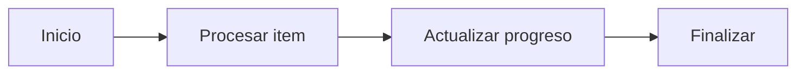

# AppProgressBatch - Preview check

Este archivo contiene un diagrama Mermaid minimo para validar si el preview de VS Code esta funcionando.

Si este diagrama tambien aparece y desaparece, el problema esta en la extension o en el preview de VS Code, no en los diagramas de arquitectura.

