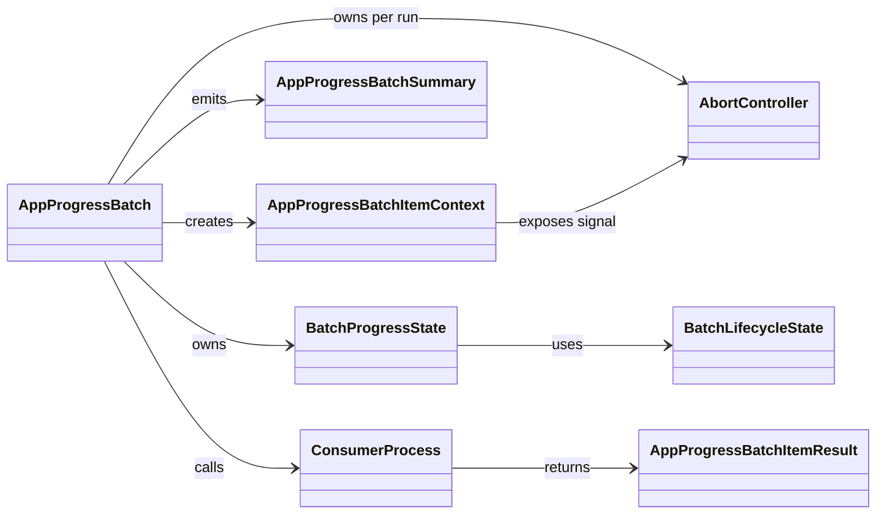

# AppProgressBatch - Diagrama de clases

## Proposito

Representar el contrato publico, los tipos de estado y las responsabilidades internas del componente reusable `AppProgressBatch`.

## Lectura

- `AppProgressBatch` no conoce dominio; solo coordina items y resultados.
- El consumidor inyecta la operacion concreta en `processItem`.
- `AbortController` permite cancelar sin depender de banderas globales.
- Los resultados tipados reemplazan `YES`, `CTRL`, `CTRLRETURN` y errores string del legacy.
