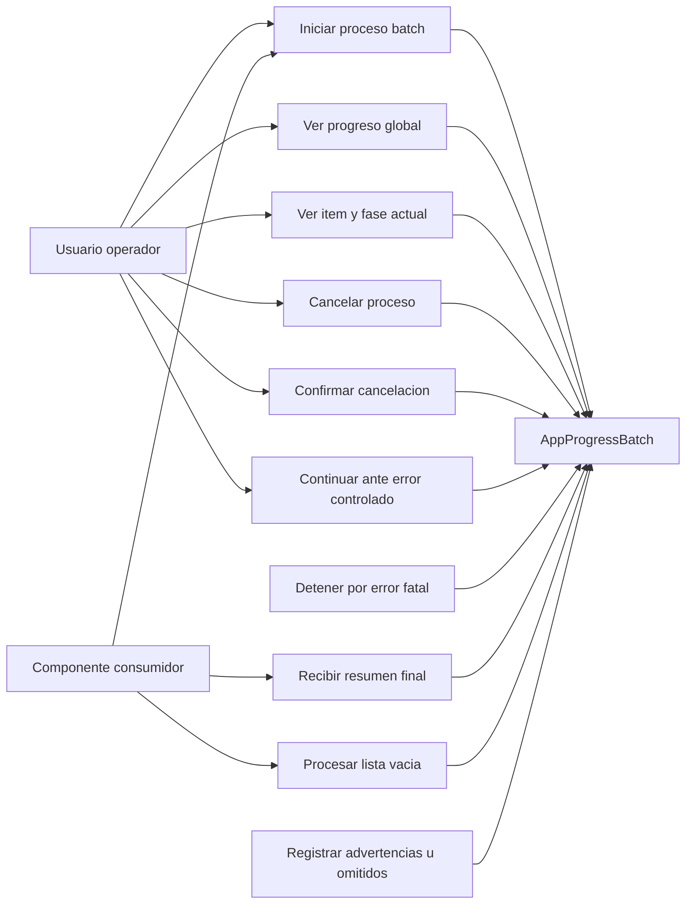

# AppProgressBatch - Casos de uso

## Proposito

Mostrar los actores y casos de uso soportados por el componente generico de progreso batch.

## Detalle de casos

| Caso | Descripcion | Resultado esperado |
| --- | --- | --- |
| Iniciar proceso batch | El consumidor abre el componente con una lista de items y `autoStart` o accion manual. | El primer item pasa a procesamiento. |
| Ver progreso global | El usuario observa porcentaje y contador `x de y`. | La UI refleja avance global estable. |
| Ver item y fase actual | `processItem` actualiza etiqueta y fase. | La UI muestra que se esta validando, cargando, guardando u otra fase del dominio. |
| Cancelar proceso | El usuario cancela una ejecucion activa. | Se aborta el item actual y no se procesan pendientes. |
| Confirmar cancelacion | Si `confirmOnCancel` esta activo, el usuario decide si cancela o continua. | El batch pasa a `cancelling` o vuelve a `running`. |
| Continuar ante error controlado | Un item retorna `controlled-error`. | El usuario decide continuar o cancelar. |
| Detener por error fatal | Un item retorna `fatal-error` o lanza excepcion. | El batch se detiene y emite `onError`. |
| Recibir resumen final | El batch termina, cancela o falla. | El consumidor recibe conteos de exitos, advertencias, omitidos y errores. |
| Procesar lista vacia | `items` llega vacio. | No llama `processItem`; muestra `emptyMessage`. |
| Registrar advertencias u omitidos | Un item retorna `warning` o `skipped`. | El batch registra conteo y continua. |

