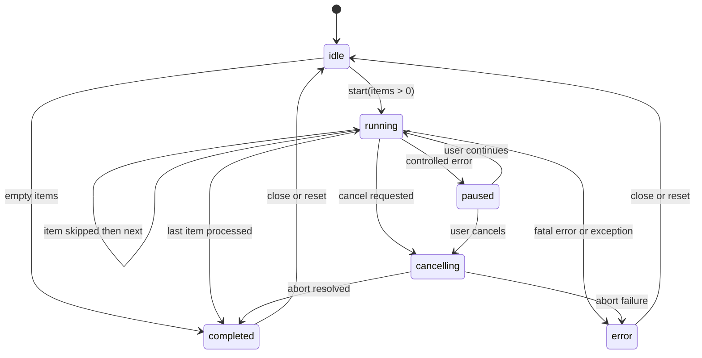

# AppProgressBatch - Diagrama de estados

## Proposito

Definir el ciclo de vida del proceso batch sin depender de banderas numericas legacy como `estado_control`.

## Estados

| Estado | Significado |
| --- | --- |
| `idle` | No hay proceso activo. |
| `running` | Se esta procesando un item. |
| `paused` | El proceso espera decision del usuario por error controlado o confirmacion. |
| `cancelling` | Se solicito cancelacion y se esta abortando el item actual. |
| `completed` | El proceso termino, fue cancelado limpiamente o no habia items. |
| `error` | Hubo un error fatal o fallo de cancelacion. |

## Reglas

- No puede iniciar procesamiento si no hay items.
- No puede cerrar sin resolver cancelacion cuando esta `running` o `paused`.
- `warning` y `skipped` no bloquean.
- `controlled-error` pausa.
- `fatal-error` detiene.
