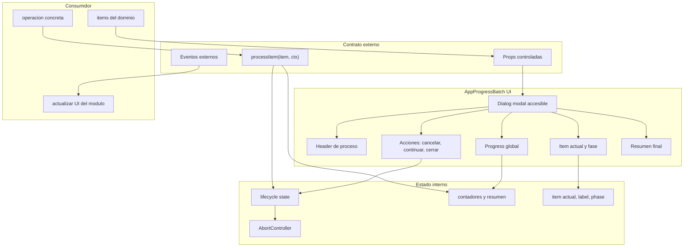

# AppProgressBatch - Diagrama de componentes

## Proposito

Mostrar como se compone internamente `AppProgressBatch` y como interactua con consumidores externos.

## Principios

- La UI no ejecuta logica de negocio directamente.
- El estado interno solo conoce progreso y ciclo de vida.
- El consumidor decide que significa procesar un item.
- Los eventos devuelven control al modulo consumidor.
