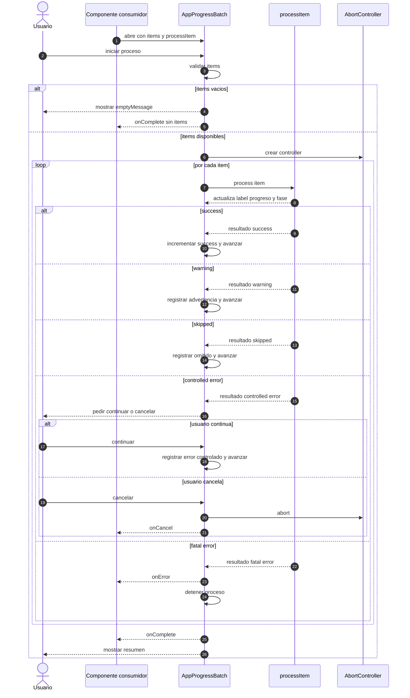

# AppProgressBatch - Diagrama de secuencia

## Proposito

Describir el flujo principal de ejecucion batch con item exitoso, advertencia, error controlado, cancelacion y cierre.

## Observaciones

- `setCurrentLabel`, `setItemProgress` y `setPhase` son llamadas desde el proceso consumidor hacia el contexto.
- Cancelar no depende del dominio; se propaga por `AbortSignal`.
- El resumen siempre debe reflejar la ruta real: exito, cancelacion, advertencias, omitidos o error.
