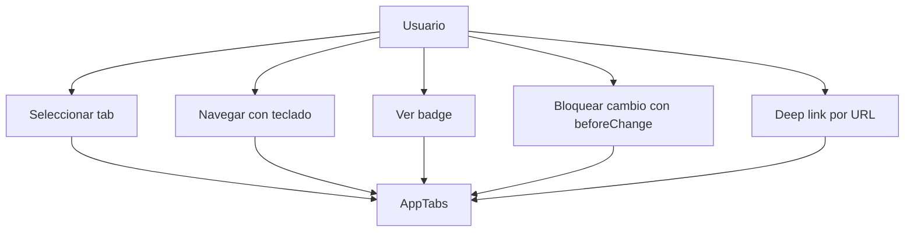
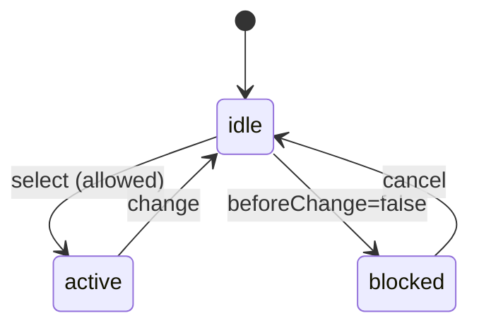
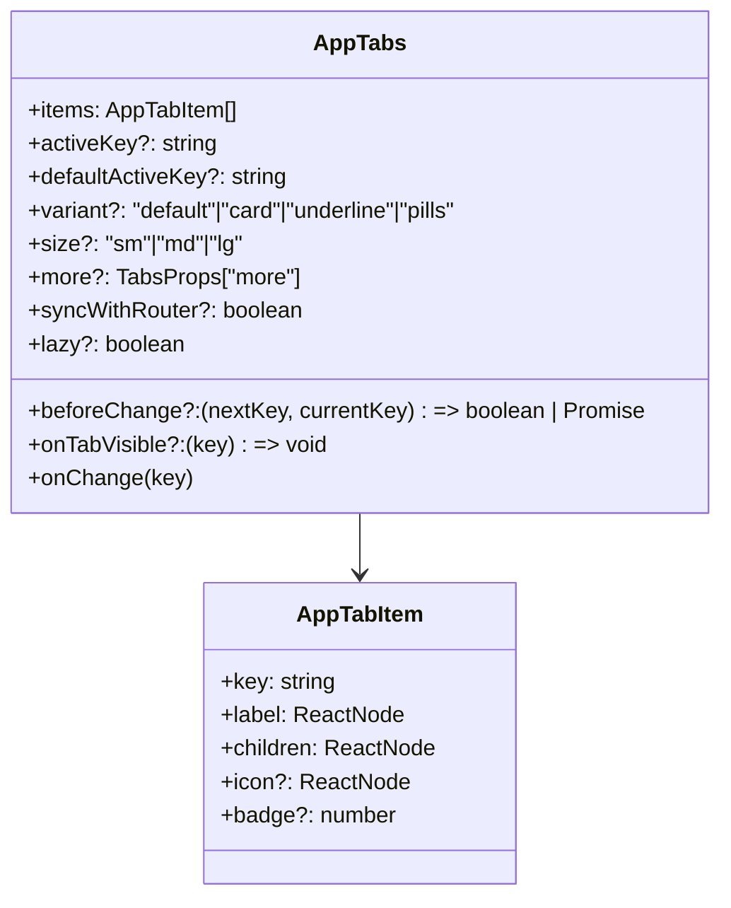
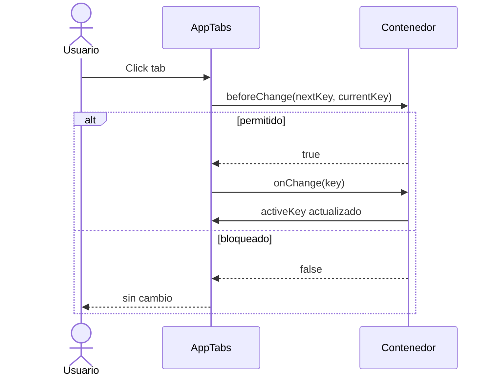

# Arquitectura Maestra: AppTabs (AntD Tabs Wrapper + Iconos + Badges)

## Objetivo

Definir una arquitectura reusable para `AppTabs` que abstraiga Ant Design `Tabs` y estandarice la navegacion por pestañas con soporte de iconos, badges y estilos enterprise, sin acoplarse a modulos concretos.

## Alcance

Aplica a:

- AppTabs como control reusable
- pantallas con navegacion por pestañas
- contenedores que orquestan secciones o paneles

No aplica a:

- logica de negocio
- llamadas a API
- rediseño global del sistema

## Resumen de arquitectura

Frontend

- AppTabs: UI + semantica de eventos
- Item mapper: adapta `AppTabItem` a `Tabs` de AntD
- Contenedor: decide items y estado activo

Backend (futuro)

- endpoint opcional para persistir tab activa por usuario
- endpoint opcional para cargar configuracion de tabs

## Principios

- Control reusable, no acoplado
- Wrapper estricto sobre AntD Tabs
- Tipado estricto (sin `any`)
- SoC: UI e interaccion, sin logica de negocio
- Accesibilidad heredada y reforzada (aria + teclado)
- Integracion backend opcional y desacoplada

## Contrato base

- props principales: `items`, `defaultActiveKey`, `activeKey`, `onChange`, `tabPosition`, `destroyInactiveTabPane`, `animated`
- compatibilidad con `ComponentProps<typeof Tabs>` sin perder tipado estricto

## Integracion futura con backend

Objetivo:

- persistir tab activa por usuario o contexto
- cargar configuracion de tabs desde backend (opcional)

Endpoints sugeridos (opcionales):

- `POST /ui/tabs/state`
  - payload: `{ userId, route, activeKey, timestamp }`
  - respuesta: `{ status: "ok", saved: true }`
  - ejemplo:
    - request:
      - `{ "userId": "u123", "route": "/pagina/historial", "activeKey": "history", "timestamp": "2026-04-09T00:00:00Z" }`
    - response:
      - `{ "status": "ok", "saved": true }`

- `GET /ui/tabs/state?route=...`
  - respuesta: `{ activeKey }`
  - ejemplo:
    - response:
      - `{ "activeKey": "history" }`

- `GET /ui/tabs/config?route=...`
  - respuesta: `{ items: [{ key, label, order, disabled? }] }`
  - ejemplo:
    - response:
      - `{ "items": [{ "key": "info", "label": "Información", "order": 1 }, { "key": "history", "label": "Historial", "order": 2, "disabled": true }] }`

Seguridad (opcional):

- requiere auth (token/session)
- validar pertenencia de `userId` al tenant

Reglas:

- no acoplar AppTabs a estos endpoints
- la integracion la maneja el contenedor o un hook externo

## Control de estado (obligatorio)

El componente debe soportar dos modos:

- Modo controlado
  - Se usa `activeKey`
  - El estado es manejado por el contenedor
- Modo no controlado
  - Se usa `defaultActiveKey`
  - El componente maneja su estado interno

Regla critica:

- No mezclar `activeKey` y `defaultActiveKey`
- Si existe `activeKey`, se ignora `defaultActiveKey`

## Control de navegacion avanzada

Agregar:

- `beforeChange?: (nextKey, currentKey) => boolean | Promise<boolean>`

Comportamiento:

- permite bloquear cambio de tab (ej: cambios sin guardar)
- si retorna `false`, no se ejecuta `onChange` ni se cambia `activeKey`

## Tipo de item

type AppTabItem = {
  key: string
  label: ReactNode
  children: ReactNode
  icon?: ReactNode
  badge?: number
  disabled?: boolean
}

## Bloqueo de tabs (critico)

Soporte obligatorio de `disabled` por tab.

- Un tab deshabilitado NO debe permitir interaccion ni cambio de estado.
- `onChange` NO debe ejecutarse si el tab destino esta deshabilitado.
- `activeKey` NO debe cambiar si el tab destino esta deshabilitado.
- Bloqueo dinamico controlado desde el contenedor (wizard, validaciones, pasos).

Regla de arquitectura:

- AppTabs NO decide cuando bloquear; esa logica pertenece al contenedor (DIP).

Ejemplo obligatorio:

```tsx
const [active, setActive] = useState("step1");
const [step1Completed, setStep1Completed] = useState(false);

<AppTabs
  activeKey={active}
  onChange={setActive}
  items={[
    {
      key: "step1",
      label: "Paso 1",
      children: <Step1 onComplete={() => setStep1Completed(true)} />,
    },
    {
      key: "step2",
      label: "Paso 2",
      disabled: !step1Completed,
      children: <Step2 />,
    },
  ]}
/>
```

## Feedback visual (UX obligatoria)

- tabs deshabilitados con menor opacidad
- cursor: `not-allowed`
- sin hover activo
- sin animaciones de seleccion

## Accesibilidad para disabled

- `aria-disabled="true"`
- no focusable via teclado
- mantener compatibilidad con navegacion accesible

## UX clave

- soporte icono + label (icono antes del texto)
- soporte badge con `Badge` de AntD a la derecha del label
- animaciones suaves y hover
- tab activo destacado

## Variantes de diseno (Design System real)

Agregar:

- `variant?: "default" | "card" | "underline" | "pills"`

Comportamiento:

- default: estilo actual
- card: tipo tarjetas
- underline: linea inferior minimalista
- pills: estilo botones

## Sistema de tamanos

Agregar:

- `size?: "sm" | "md" | "lg"`

Impacta:

- padding
- font-size
- altura del tab

## CSS y estetica enterprise

- CSS Modules obligatorio: `AppTabs.module.css`
- clase base: `.customTabs`
- desactivar ink-bar original
- linea animada inferior

Contenido base requerido:

.customTabs :global(.ant-tabs-tab) {
  background: #f1f5f9 !important;
  border: none !important;
  padding: 8px 18px !important;
  margin-right: 6px !important;
  transition: all 0.3s ease;
  font-weight: 500;
  color: #334155;
  position: relative;
}

.customTabs :global(.ant-tabs-tab:hover) {
  background: #e2e8f0 !important;
  color: #1e293b !important;
  transform: translateY(-2px);
}

.customTabs :global(.ant-tabs-tab-disabled) {
  opacity: 0.5 !important;
  cursor: not-allowed !important;
}

.customTabs :global(.ant-tabs-tab-disabled:hover) {
  background: #f1f5f9 !important;
  color: #94a3b8 !important;
  transform: none !important;
}

.customTabs :global(.ant-tabs-tab-disabled .ant-tabs-tab-btn::after) {
  transform: translateX(-50%) scaleX(0) !important;
}

.customTabs :global(.ant-tabs-tab-active) {
  background: #ffffff !important;
  font-weight: 600;
  color: #1677ff !important;
}

.customTabs :global(.ant-tabs-ink-bar) {
  display: none !important;
}

.customTabs :global(.ant-tabs-tab .ant-tabs-tab-btn) {
  position: relative;
}

.customTabs :global(.ant-tabs-tab .ant-tabs-tab-btn::after) {
  content: "";
  position: absolute;
  left: 50%;
  bottom: -6px;
  transform: translateX(-50%) scaleX(0);
  transform-origin: center;
  width: 60%;
  height: 3px;
  background: linear-gradient(90deg, #1677ff, #0958d9);
  border-radius: 10px;
  transition: transform 0.3s ease;
}

.customTabs :global(.ant-tabs-tab-active .ant-tabs-tab-btn::after) {
  transform: translateX(-50%) scaleX(1);
}

Aplicacion:

<Tabs className={styles.customTabs} {...props} />

## Accesibilidad

- navegacion por teclado
- soporte ARIA
- foco visible
- contraste adecuado

## Accesibilidad avanzada

- `aria-selected` y `aria-controls` correctos por tab
- navegacion con flechas (izquierda/derecha)
- focus visible obligatorio en tabs y acciones
- gestion de foco entre tabs

## Lazy rendering

Agregar:

- `lazy?: boolean`

Comportamiento:

- renderizar contenido del tab solo cuando se activa
- evitar render innecesario si `lazy=true`

## Telemetria / tracking

Agregar:

- `onTabVisible?: (key: string) => void`

Comportamiento:

- se ejecuta cuando un tab se vuelve visible

## Performance

- memoizacion de items
- evitar re-render completo al cambiar `activeKey`
- render controlado de contenido

## Theming (Design System)

- no usar colores hardcodeados
- usar tokens de Ant Design o variables del sistema
- soporte futuro para dark mode

## Responsive behavior (obligatorio)

Desktop:

- tabs horizontales completos

Tablet:

- reduccion de spacing

Mobile:

- scroll horizontal (`overflow-x`)
- opcion futura: dropdown mode

Regla critica:

- no romper layout
- no wrap descontrolado

## Overflow de tabs

Agregar:

- `more?: TabsProps["more"]`

Comportamiento:

- tabs extras a dropdown automatico
- trigger: hover
- label: "Mas" + contador de tabs ocultas
- dropdown alineado a la derecha
- indicador de cantidad oculta (+N)

## Sincronizacion con router (muy pro)

Agregar:

- `syncWithRouter?: boolean`

Comportamiento:

- tab activa basada en URL
- navegacion automatica
- formato: path segment (ej: `/pagina/historial`)
- al cambiar tab, se actualiza la URL manteniendo el resto del path
- soporte query params (`?tab=`) como opcion
- mantener estado al recargar

## Errores a evitar (critico)

- mutar `items` directamente
- mezclar controlado/no controlado
- usar `any`
- romper estilos globales de AntD
- permitir cambio de tab ignorando `disabled`
- manejar logica de bloqueo dentro del componente
- usar hacks visuales sin logica real
- ejecutar `onChange` si `beforeChange` bloquea
- renderizar contenido innecesario si `lazy=true`

## Diagramas

Diagrama de uso



Diagrama de estados (tab activa)



Diagrama de clases (simplificado)



Diagrama de secuencia (controlado)



## Pruebas minimas

- renderiza tabs
- cambia tab al hacer click
- ejecuta `onChange`
- respeta `defaultActiveKey`
- aplica clase `customTabs`
- renderiza iconos
- renderiza badges
- badge muestra contador correcto
- no cambia tab si esta disabled
- `onChange` no se ejecuta en tab disabled
- tab activo se mantiene si destino esta disabled
- estado visual correcto para disabled
- accesibilidad aplicada para disabled
- test de `beforeChange`
- test de `lazy`
- test de sincronizacion con router
- test de overflow

## Plan sugerido

1. Definir contrato y tipos (`AppTabItem`)
2. Wrapper base sobre AntD Tabs
3. Implementar iconos y badges
4. Estilos enterprise via CSS Modules
5. Pruebas unitarias con Vitest + Testing Library
6. README profesional con ejemplos
