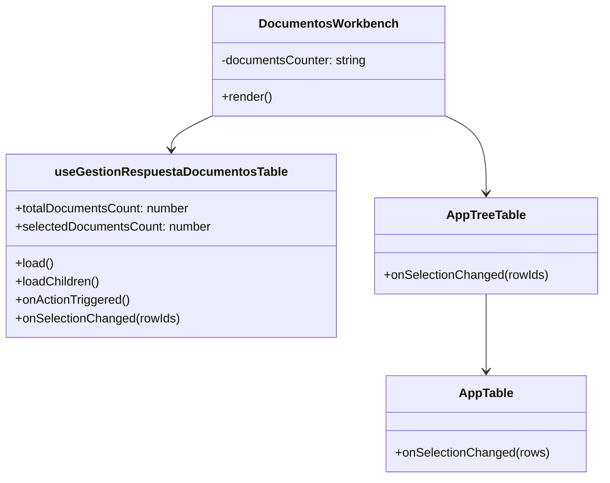
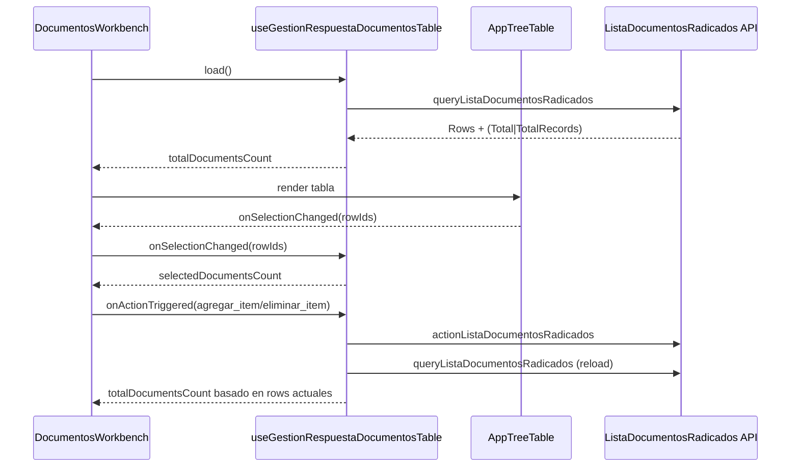
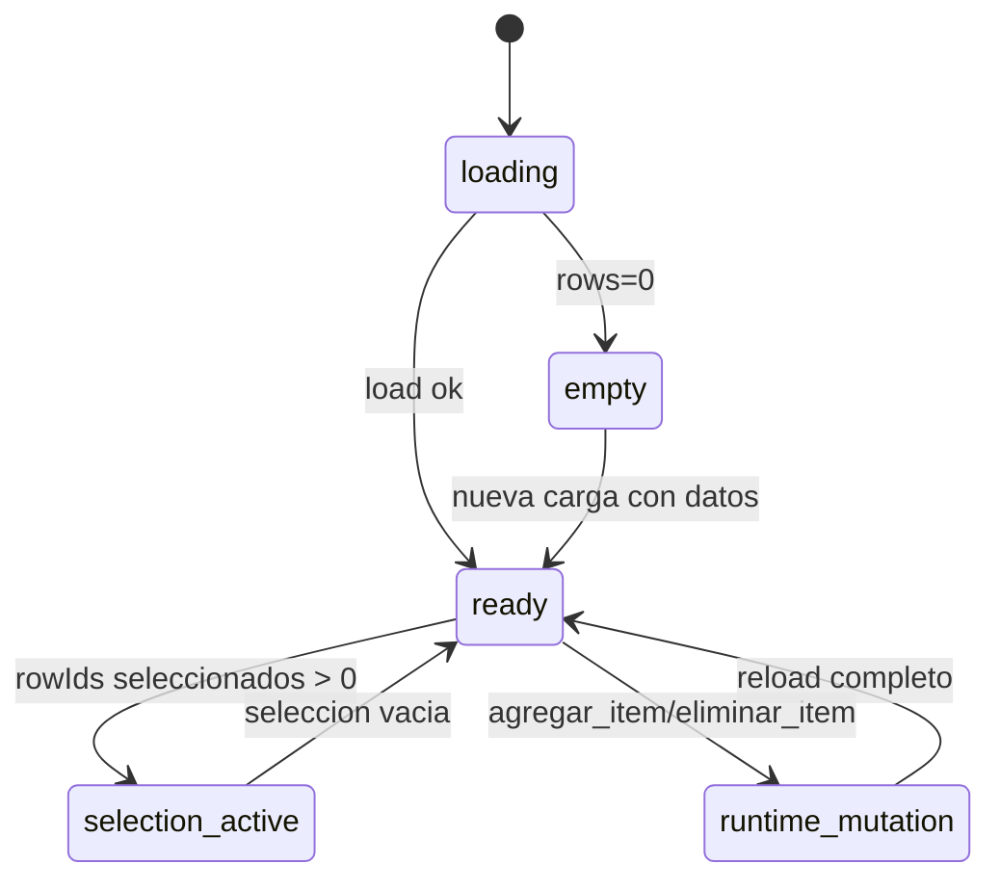

# SCRUMCORE-224 - Arquitectura

## 1. Resumen arquitectonico

### Objetivo tecnico
Implementar un contador documental contextual en `DocumentosWorkbench` derivado automaticamente del estado actual de la lista y de la seleccion, sin logica mutable manual y sin impacto global en `AppTable`/`AppTreeTable`.

### Decisiones
- Se deriva `totalDocumentsCount` y `selectedDocumentsCount` en `useGestionRespuestaDocumentosTable`.
- Se prioriza `Total -> TotalRecords -> rows.length` en carga inicial.
- Tras mutaciones runtime (`agregar_item`, `eliminar_item`) se prioriza conteo por `rows/treeRows` actuales.
- Se agrega callback opcional `onSelectionChanged` en `AppTreeTable` (backward-compatible).

### Restricciones
- Sin cambios backend, endpoints ni contratos.
- Sin cambios globales de comportamiento en AppTable/AppTreeTable.
- Sin cambios de flujo Dynamic UI, documento activo ni acciones.

## 2. Vista estatica

Capas:
- `components`: `DocumentosWorkbench` renderiza contador contextual.
- `hooks`: `useGestionRespuestaDocumentosTable` calcula estado derivado.
- `AppTreeTable`: expone seleccion actual al consumidor mediante callback opcional.
- `AppTable`: conserva logica de seleccion AG Grid existente.
- `styles`: estilos locales del panel de lista.

## 3. Diagrama de clases

## 4. Diagrama de secuencia

## 5. Diagrama de estados

## 6. ADRs resumidas
- ADR-1: Derivacion automatica en hook para evitar contadores mutables.
- ADR-2: Prioridad de fallback backend en carga inicial, con preferencia runtime post-mutacion.
- ADR-3: Extension minima y opcional de `AppTreeTable` para exponer seleccion sin romper consumidores.

## 7. Riesgos tecnicos y mitigaciones
- Riesgo: desincronizacion entre seleccion y datos recargados.
  - Mitigacion: filtrado automatico de `selectedRowIds` contra `latestRowRef`.
- Riesgo: impacto global en componentes tabla.
  - Mitigacion: API nueva opcional (`onSelectionChanged`) y sin cambios default.
- Riesgo: regresion en documento activo.
  - Mitigacion: no se modifica flujo `onSelectRow` ni `onActionTriggered` existente.

## 8. Trazabilidad a codigo
- `src/modules/gestionCorrespondencia/hooks/useGestionRespuestaDocumentosTable.ts`
- `src/modules/gestionCorrespondencia/components/documentosWorkbench/DocumentosWorkbench.tsx`
- `src/modules/gestionCorrespondencia/components/documentosWorkbench/DocumentosWorkbench.module.css`
- `src/app/Components/UI/AppTreeTable/AppTreeTable.tsx`
- `src/app/Components/UI/AppTreeTable/types.ts`
