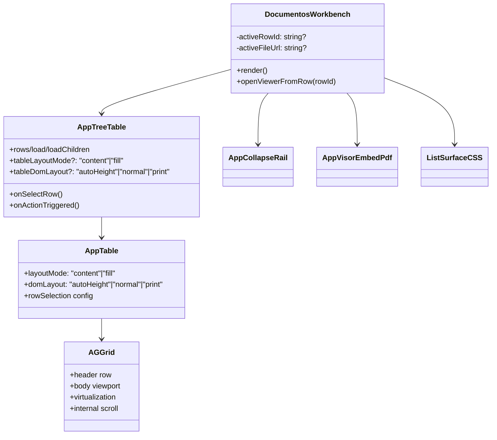
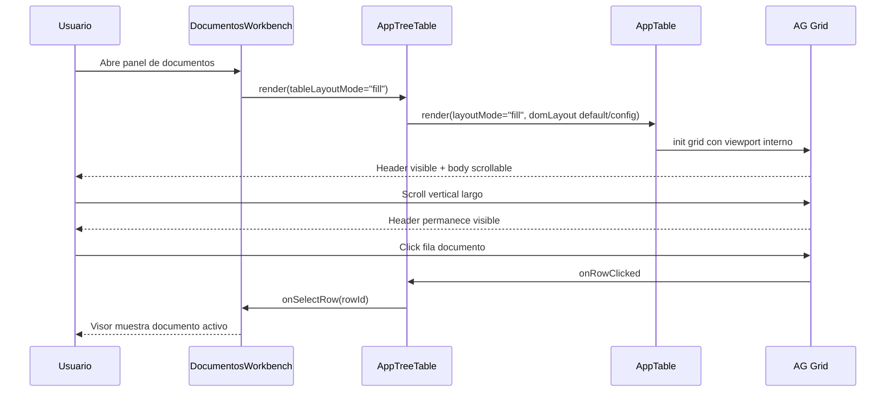
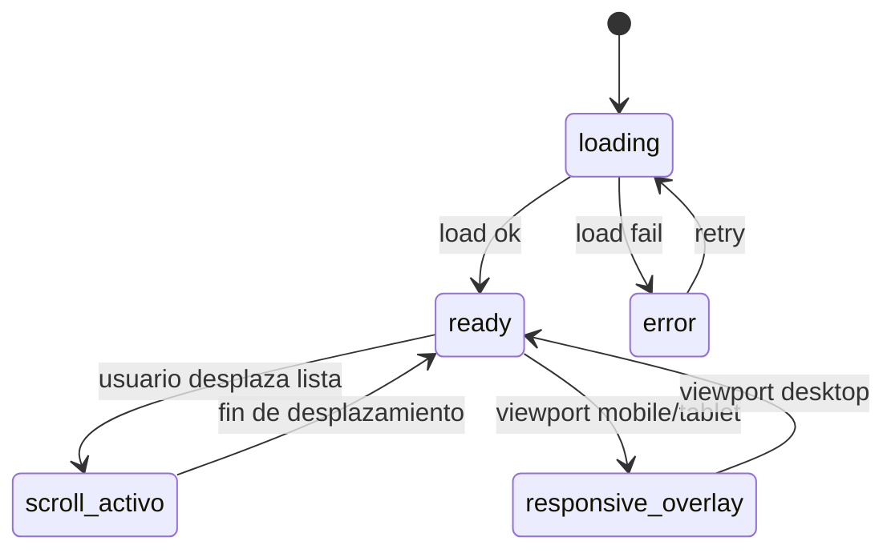

# SCRUMCORE-223 - Arquitectura

## 1. Resumen arquitectonico

### Objetivo tecnico
Resolver de forma robusta y localizada la perdida de header durante scroll vertical en el listado documental de `DocumentosWorkbench`, migrando a scroll interno del grid sin impacto global sobre `AppTable` o `AppTreeTable`.

### Decisiones
- Se adopta `tableLayoutMode="fill"` en `DocumentosWorkbench` para que el grid renderice con viewport interno y header visible.
- Se mantiene `tableDomLayout` configurable en `AppTreeTable` con default backward-compatible (`autoHeight`).
- Se elimina scroll vertical externo del contenedor de lista en el workbench para evitar doble scroll.
- Se conserva separacion funcional entre documento activo (click) y seleccion multiple (checkbox).

### Restricciones
- Sin cambios en backend, endpoints ni contratos.
- Sin cambios globales de comportamiento en `AppTable`.
- Sin cambios de logica Dynamic UI ni flujo de acciones.
- Sin `any` ni estilos globales.

## 2. Vista estatica

Capas y responsabilidades:
- `DocumentosWorkbench`: orquesta layout visor + rail + tabla; define estrategia de scroll local.
- `AppTreeTable`: wrapper de arbol sobre `AppTable`; expone configuracion de layout en forma opcional.
- `AppTable`: wrapper de presentacion grid/cards; mantiene comportamiento global.
- `AG Grid`: rendering/virtualizacion/scroll interno/header.
- `AppVisorEmbedPdf`: visualizacion documental activa.
- `AppCollapseRail`: contenedor lateral/overlay del listado.
- `DocumentosWorkbench.module.css`: sizing + overflow local para el panel de documentos.

## 3. Diagramas de clases

## 4. Diagramas de secuencia

## 5. Diagramas de estados

## 6. ADRs resumidas

- ADR-223-01: Scroll interno localizado en `DocumentosWorkbench`.
  - Motivo: header persistente robusto sin hacks globales.
- ADR-223-02: Evitar `autoHeight` en el contexto documental persistente.
  - Motivo: `autoHeight` delega scroll fuera del grid y pierde header en listas largas.
- ADR-223-03: Mantener `AppTreeTable` backward-compatible.
  - Motivo: evitar regresiones en otros consumidores.

## 7. Riesgos tecnicos y mitigaciones

- Riesgo: doble scroll (contenedor + grid).
  - Mitigacion: `listSurface` con `overflow: hidden` y sizing en flex.
- Riesgo: impacto global en `AppTable`.
  - Mitigacion: cambios de estrategia aplicados solo desde `DocumentosWorkbench`.
- Riesgo: regresion de interacciones (seleccion/acciones).
  - Mitigacion: pruebas de `DocumentosWorkbench` y `AppTreeTable` actualizadas.
- Riesgo: degradacion de virtualizacion.
  - Mitigacion: uso de viewport interno AG Grid (`layoutMode="fill"`).

## 8. Trazabilidad a codigo

Archivos principales:
- `src/modules/gestionCorrespondencia/components/documentosWorkbench/DocumentosWorkbench.tsx`
- `src/modules/gestionCorrespondencia/components/documentosWorkbench/DocumentosWorkbench.module.css`
- `src/app/Components/UI/AppTreeTable/AppTreeTable.tsx`
- `src/app/Components/UI/AppTreeTable/types.ts`
- `src/app/Components/UI/AppTreeTable/AppTreeTable.module.css`
- `src/modules/gestionCorrespondencia/tests/DocumentosWorkbench.test.tsx`
- `src/app/Components/UI/AppTreeTable/AppTreeTable.test.tsx`

Confirmaciones:
- Backend no modificado.
- Endpoints no modificados.
- Contratos backend no modificados.
- `AppTable` global no impactado en comportamiento por defecto.
