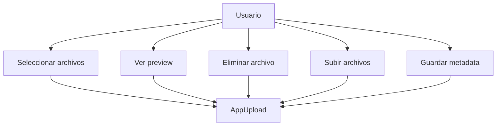
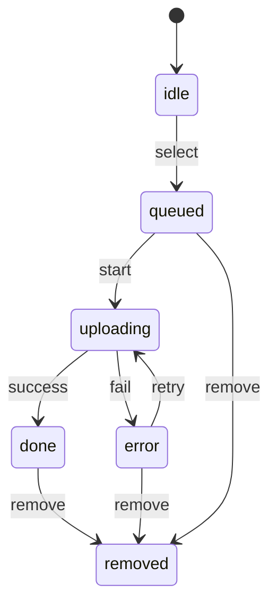
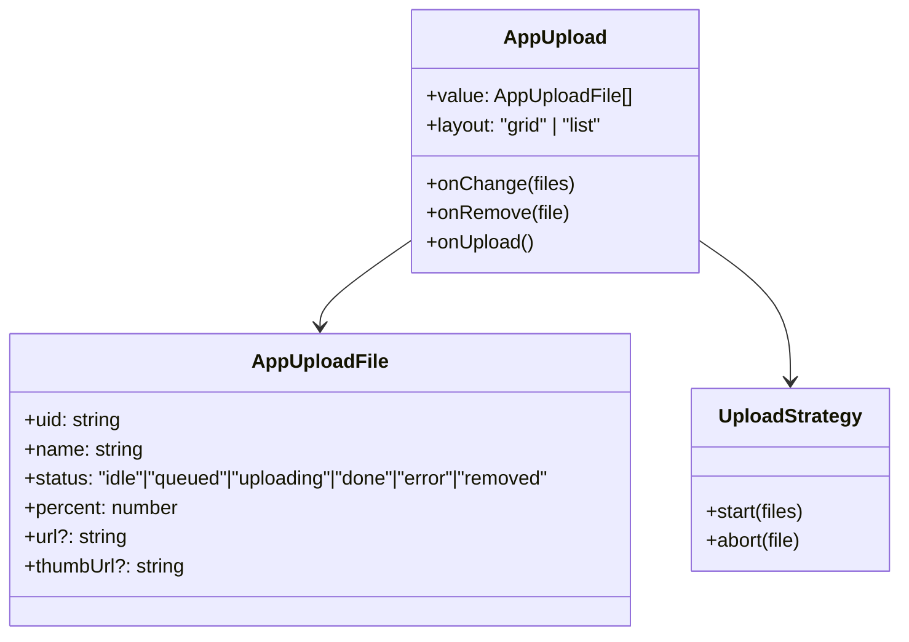
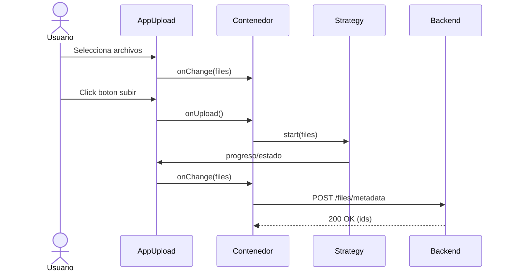

# Arquitectura Maestra: AppUpload (AntD Upload Wrapper + Estrategias)

## Objetivo

Definir una arquitectura reusable para `AppUpload` que abstraiga Ant Design `Upload` y estandarice multiples estrategias de carga (auto, manual, customRequest, pre-validacion, multiples archivos), sin acoplarse a modulos concretos.

## Alcance

Aplica a:

- AppUpload como control reusable
- pantallas que requieren carga de archivos
- contenedores que orquestan subida (formularios, wizards, steps)

No aplica a:

- diseno visual general del sistema
- definicion de endpoints de negocio o storage especifico

## Resumen de arquitectura

Frontend

- AppUpload: UI + semantica de eventos
- Estrategia de carga: comportamiento configurable (auto/manual/custom)
- Contenedor: decide cuando subir, validar y persistir

Backend

- endpoints de carga (segun modulo)
- validaciones de seguridad y almacenamiento
- endpoint futuro para guardar metadata en backend

## Principios

- Control reusable, no acoplado
- Estrategias declarativas por props
- Validaciones antes de subir (tipo, tamanio, cantidad)
- Soporte para lista de archivos y estados por archivo
- UX consistente (progreso, errores, reintento)

## Contrato base

- value: lista de archivos (controlado)
- onChange: cambios en la lista y estados
- onUpload: dispara subida (manual)
- onRemove: elimina archivo
- onError: error por archivo o global
- beforeUpload: validacion previa (sin acoplarse)

## Estrategias soportadas

- auto: subida inmediata al seleccionar
- manual: requiere confirmacion externa
- customRequest: integracion con SDK o endpoints propios
- presigned: obtiene URL y luego sube
- persistencia: guarda metadata post-carga en backend (futuro)

## UX clave

- progreso visible por archivo
- estados: uploading | done | error | removed
- reintento opcional por archivo
- soporte drag & drop
- preview visual tipo galeria
- control total del estado desde el contenedor
- extensibilidad visual via slots / render props

## CSS y tamanos

- alinear con AppInput (border radius 12px, sombras, focus, error, disabled)
- variantes size: sm | md | lg
- variante compacta para tablas y formularios

## Especificaciones funcionales

- Wrapper desacoplado de Ant Design Upload
- Renderizar archivos con preview visual (galeria)
- Mostrar estado de carga por archivo
- Permitir eliminar archivos
- Mostrar boton de carga
- Controlar layout (grid | lista)
- Exponer eventos `onChange` y `onRemove`
- Límite de archivos: ocultar boton cuando se alcance

## Interacciones y comportamiento

- Hover: acciones visibles
- Click: preview (opcional, configurable)
- Remove: boton overlay (X) sobre el preview

## Responsive

- Desktop: 46 columnas
- Tablet: 23 columnas
- Mobile: 2 columnas
- Padding reducido en mobile
- Imagenes mas compactas en mobile

## Diagramas

Diagrama de uso (casos de uso principales)

Diagrama de estados (archivo)

Diagrama de clases (simplificado)

Diagrama de secuencia (carga manual)

## Endpoint futuro (metadata)

- POST `/files/metadata`
- Proposito: persistir metadata tras la carga (nombre, size, type, url, hash, owner, tags)
- Entrada: lista de archivos cargados + contexto de negocio
- Salida: ids de persistencia + estado

## Plan sugerido

1. Definir contrato y props
2. Base UI con AntD Upload + Dragger (opcional)
3. Implementar estrategias (auto/manual/custom/presigned)
4. Integrar validaciones previas y estados por archivo
5. Estilos y tamanos alineados a AppInput
6. Pruebas unitarias e integracion
