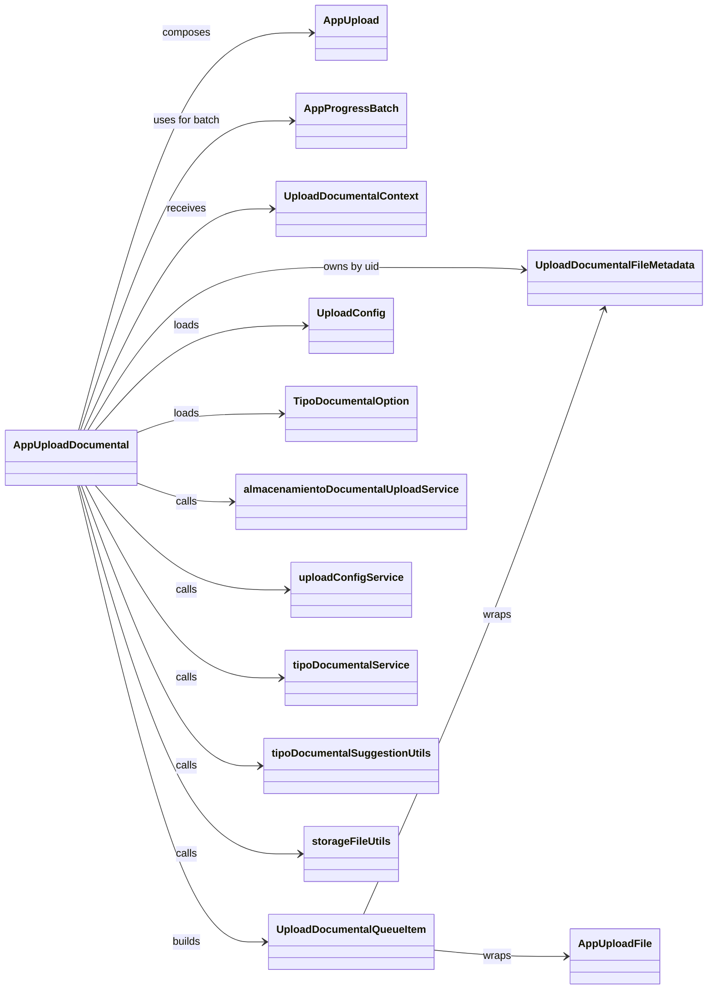

# AppUploadDocumental - Diagrama de clases

## Proposito

Representar el contrato del adaptador documental, sus tipos de metadata y las capas de servicio/utilidad que participan en la migracion desde `FileUploadHandler.js`.

## Lectura

- `AppUploadDocumental` es el adaptador de negocio, no el motor visual base.
- `AppUpload` conserva la responsabilidad de seleccion y lista de archivos.
- `AppProgressBatch` conserva la responsabilidad de proceso secuencial y cancelacion.
- La API nueva queda encapsulada en servicios, no en el componente visual.
