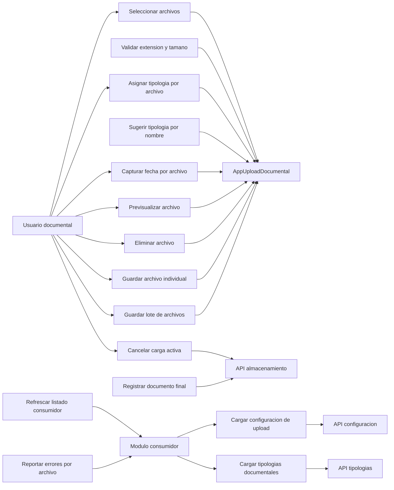

# AppUploadDocumental - Casos de uso

## Proposito

Describir las capacidades que el componente documental debe ofrecer al usuario y al modulo consumidor.

## Detalle de casos

| Caso | Actor principal | Descripcion | Resultado esperado |
| --- | --- | --- | --- |
| Cargar configuracion de upload | Modulo consumidor | Consulta reglas por proceso. | `accept`, `maxSize`, multiple y reglas quedan disponibles. |
| Cargar tipologias documentales | Modulo consumidor | Consulta opciones para el contexto. | Selectores por archivo pueden renderizarse. |
| Seleccionar archivos | Usuario | Agrega uno o varios documentos. | Se crea cola de `AppUploadFile`. |
| Validar extension y tamano | Componente | Aplica reglas cargadas desde API. | Archivo rechazado o marcado con error segun `validationMode`. |
| Asignar tipologia por archivo | Usuario | Selecciona o corrige tipologia individual. | Metadata por `uid` queda actualizada. |
| Sugerir tipologia por nombre | Componente | Compara nombre de archivo contra tipologias. | Se preselecciona mejor coincidencia. |
| Capturar fecha por archivo | Usuario | Ingresa fecha si el proceso lo requiere. | Fecha validada y guardada como metadata. |
| Previsualizar archivo | Usuario | Abre preview del archivo. | Preview visual sin subir a backend. |
| Eliminar archivo | Usuario | Quita archivo de la cola. | Se elimina archivo y metadata asociada. |
| Guardar archivo individual | Usuario | Procesa un unico archivo. | Se sube y registra solo ese documento. |
| Guardar lote de archivos | Usuario | Procesa la cola secuencialmente. | Se usa `AppProgressBatch`. |
| Cancelar carga activa | Usuario | Cancela proceso en curso. | Se aborta localmente y se intenta `DELETE upload-temporal`. |
| Registrar documento final | Componente | Envia POST final por archivo. | Se recibe `AlmacenarDocumentoResponse`. |
| Refrescar listado consumidor | Modulo consumidor | Reacciona a `onStored` o `onBatchComplete`. | Tabla/listado/visor se actualiza por estado React. |
| Reportar errores por archivo | Componente | Clasifica y expone errores. | Usuario y modulo conocen el fallo concreto. |

