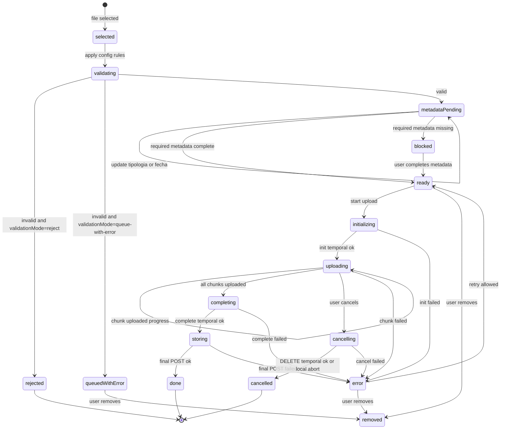

# AppUploadDocumental - Diagrama de estados

## Proposito

Modelar los estados de un archivo dentro del flujo documental, desde seleccion hasta registro final.

## Estados

| Estado | Significado |
| --- | --- |
| `selected` | Archivo recibido desde `AppUpload`. |
| `validating` | Se aplican extension, tamano y reglas del proceso. |
| `rejected` | El archivo no entra a la cola. |
| `queuedWithError` | El archivo queda visible con error y no puede guardarse. |
| `metadataPending` | Faltan tipologia, fecha u otra metadata requerida. |
| `blocked` | El usuario intento guardar sin metadata obligatoria. |
| `ready` | Archivo valido y listo para subir. |
| `initializing` | Llamando `upload-temporal/init`. |
| `uploading` | Subiendo chunks. |
| `completing` | Llamando `complete`. |
| `storing` | Registrando documento final. |
| `done` | Archivo almacenado correctamente. |
| `cancelling` | Cancelacion local/backend en curso. |
| `cancelled` | Cancelacion resuelta. |
| `error` | Fallo recuperable o terminal segun estrategia. |
| `removed` | Archivo removido de la cola. |

## Reglas

- No se puede pasar a `initializing` si hay metadata obligatoria incompleta.
- `trd` se resuelve por archivo justo antes del POST final.
- Si hay multiples archivos, cada archivo transita estos estados de forma independiente, mientras `AppProgressBatch` controla el progreso global.
