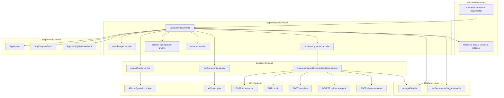

# AppUploadDocumental - Diagrama de componentes

## Proposito

Mostrar la separacion entre UI, adaptador documental, servicios HTTP y utilidades puras.

## Principios

- El componente no llama endpoints directamente; usa servicios.
- El modulo consumidor decide donde se renderiza el componente y como refrescar datos.
- Las reglas testeables viven fuera del JSX.
- `AppUploadDocumental` no reemplaza `AppUpload`; lo especializa para negocio documental.
