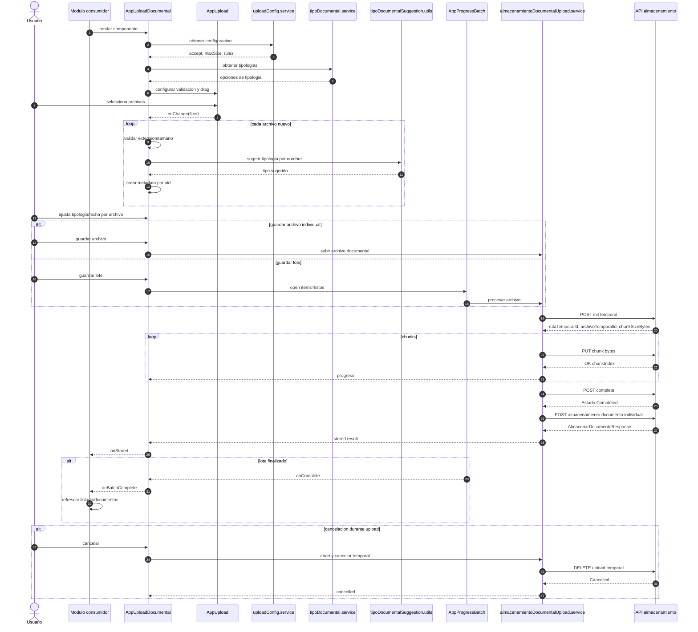

# AppUploadDocumental - Diagrama de secuencia

## Proposito

Describir el flujo completo: configuracion, seleccion, metadata por archivo, upload por chunks, registro final y refresco del consumidor.

## Puntos criticos

- La configuracion se carga antes de habilitar seleccion.
- La tipologia es metadata por archivo, no global.
- El POST final se ejecuta una vez por archivo para respetar tipologia individual sin cambiar backend.
- `onStored` y `onBatchComplete` reemplazan callbacks globales legacy.
