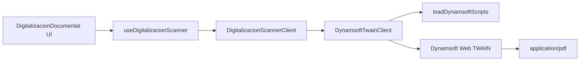

# SCRUMCORE-240 - Arquitectura Dynamsoft Adapter

## Objetivo

Encapsular Dynamsoft Web TWAIN detras de `DigitalizacionScannerClient` para que `DigitalizacionDocumental` nunca consuma `DWObject` ni APIs del SDK desde UI.

## Flujo

## Decisiones

- La salida final permitida es solo PDF.
- Las paginas capturadas (`ScanPage[]`) son la unica fuente valida para `generatePdf`.
- El adapter opera por `pageId`, no por referencias DOM ni posiciones visuales.
- El loader de scripts es idempotente para evitar cargas multiples.
- Las operaciones tardias se invalidan con generacion interna al ejecutar `dispose`.

## Concurrencia

`scan` y `generatePdf` usan un candado interno de operacion activa. Si una operacion esta en curso, el adapter retorna `SCAN_IN_PROGRESS`.
