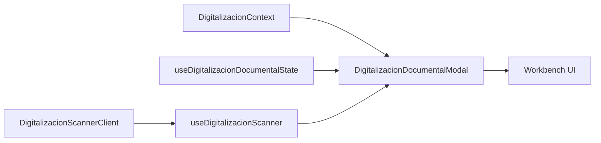

# SCRUMCORE-241 Arquitectura

## Objetivo

SCRUMCORE-241 implementa la interfaz principal de captura para `DigitalizacionDocumental`: toolbar de scanner, miniaturas, preview, metadata y footer de operacion. La fase se mantiene frontend-only y preparada para persistencia posterior.

## Source Of Truth

- Contexto documental: `DigitalizacionContext`.
- Validacion y metadata: `useDigitalizacionDocumentalState`.
- Scanner, paginas y PDF: `useDigitalizacionScanner`.
- Estado UI local: solo `selectedPageId`.

## Estados

El badge operacional deriva de contexto, scanner, paginas y PDF:

- `contextInvalid`
- `initializingScanner`
- `noScanner`
- `readyEmpty`
- `scanning`
- `pagesCaptured`
- `generatingPdf`
- `success`
- `error`

## Ownership

- El workbench no reconstruye paginas ni PDF.
- El workbench no persiste thumbnails ni crea `object URLs`.
- El cliente scanner se inyecta con `scannerClient` para runtime real o fake de pruebas.
- La seleccion de pagina no cambia el contrato documental.

## Riesgos

- Persistencia backend queda para una fase posterior.
- Metadata avanzada queda como placeholder compatible con el estado actual.
- Si un adapter futuro genera blobs temporales, debe hacerse responsable de liberar URLs.
