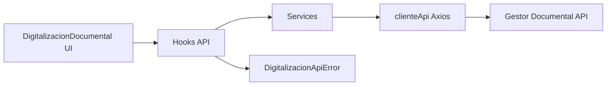
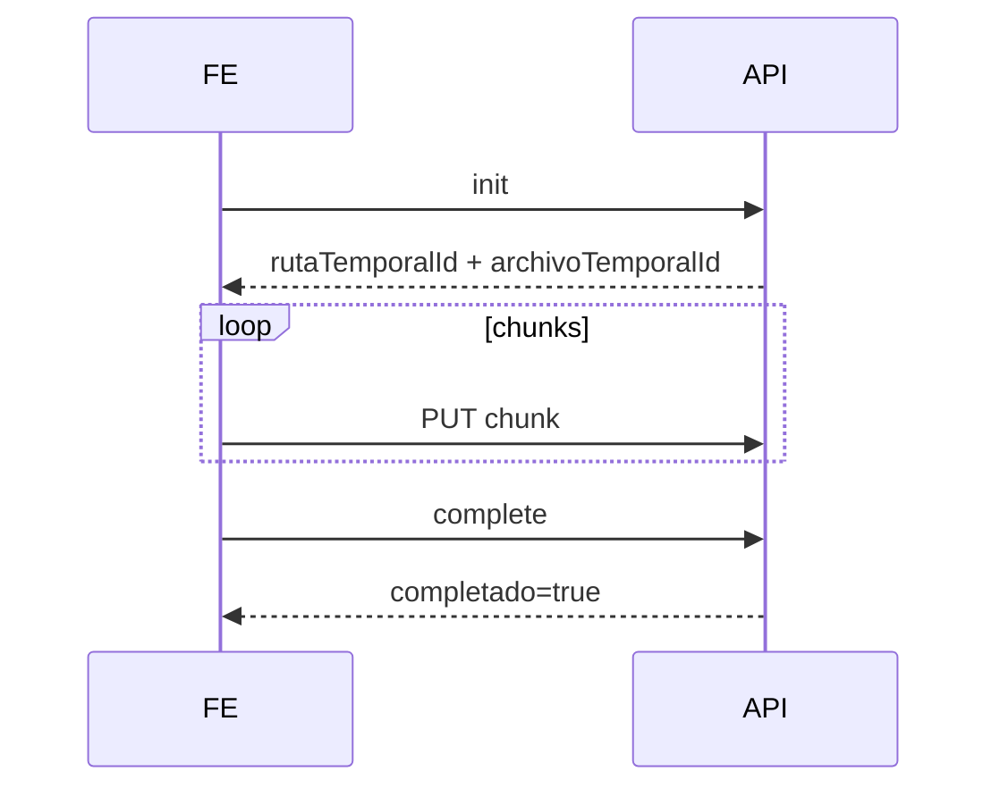

# SCRUMCORE-242 Arquitectura

## Objetivo

Implementar la capa API frontend de `DigitalizacionDocumental` para configuracion, lista de chequeo, metadata, upload temporal, crear documento y adjuntar digitalizacion.

## Diagrama

## Source Of Truth

- `DigitalizacionContext` provee modo, gabinete, radicado, workflow y documento destino.
- Scanner/PDF siguen perteneciendo a `useDigitalizacionScanner`.
- Upload state pertenece a `useUploadTemporalPdf`.
- Create/attach state pertenece a sus hooks especificos.

## Upload Lifecycle

## Concurrencia

Los hooks bloquean operaciones concurrentes con codigos como `UPLOAD_ALREADY_IN_PROGRESS`, `CREATE_ALREADY_IN_PROGRESS` y `ATTACH_ALREADY_IN_PROGRESS`.

## Stale Protection

Cada operacion usa generation ref y `AbortController`. Si se cancela o desmonta, se aborta el request y se ignoran respuestas de generaciones anteriores.
