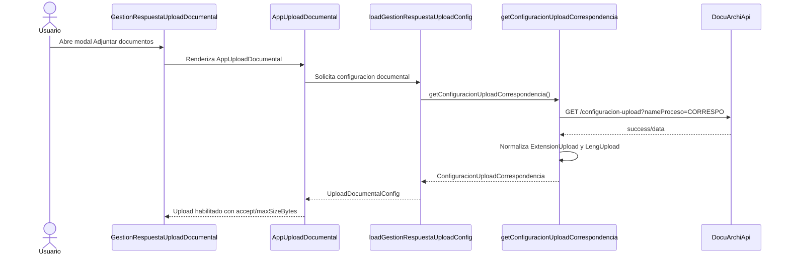
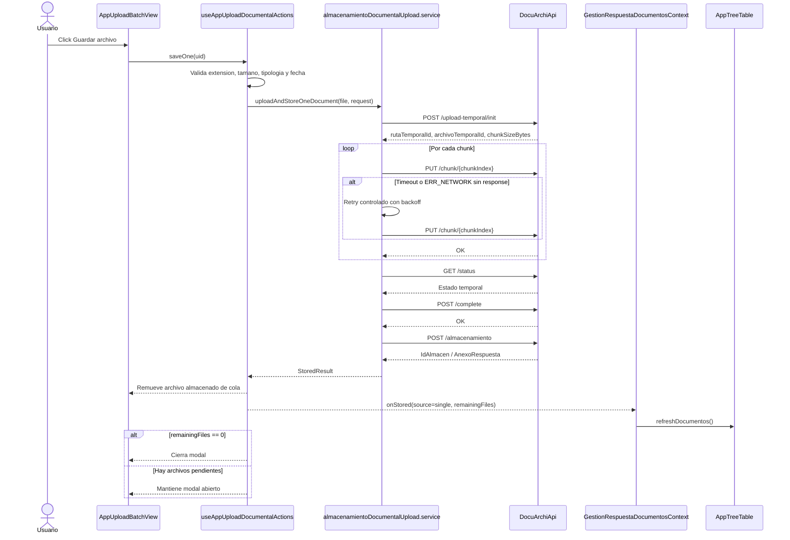
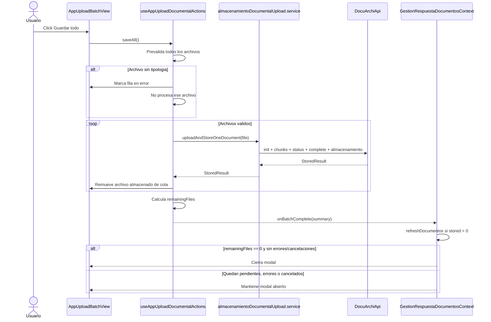
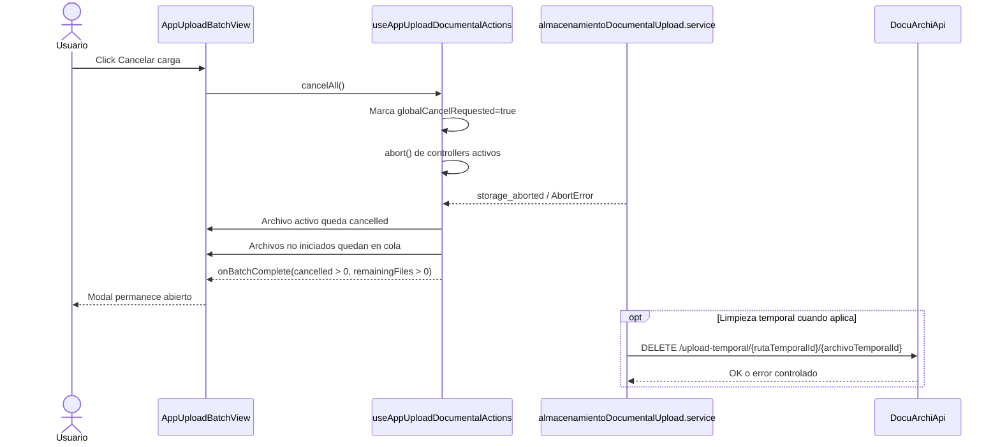
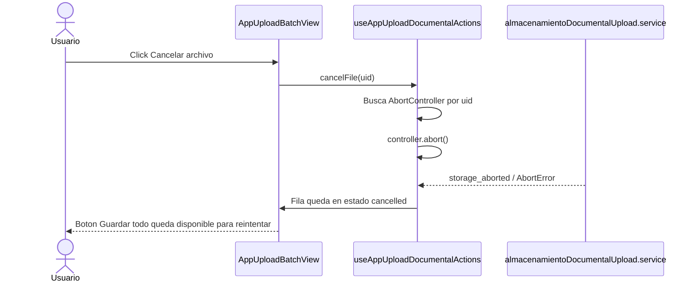
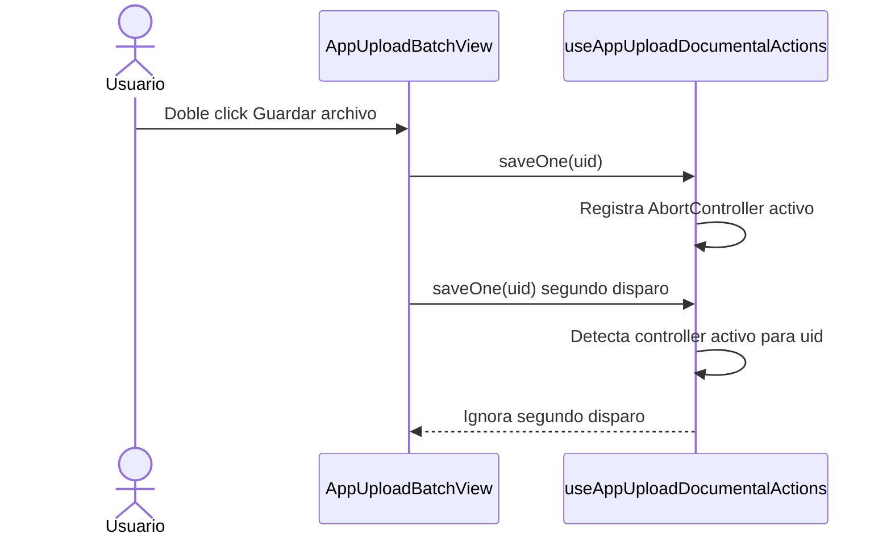

# SCRUMCORE-287 - Diagrama De Secuencia

## Carga De Configuracion Upload

## Guardar Un Archivo

## Guardar Todo Con Archivo Grande Y Pendientes

## Cancelacion Global

## Cancelacion Unitaria

## Manejo De Doble Click En Guardar Archivo

