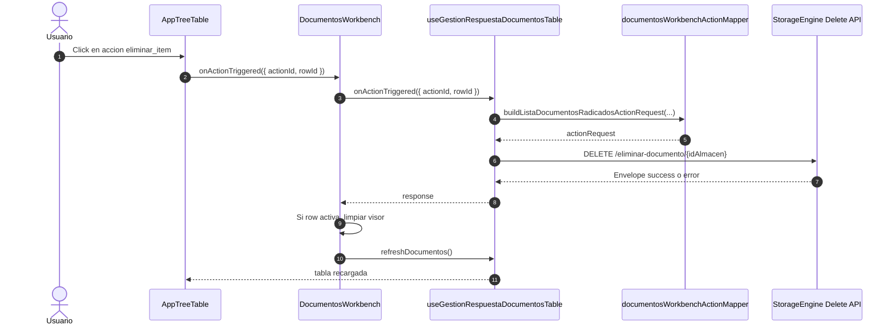
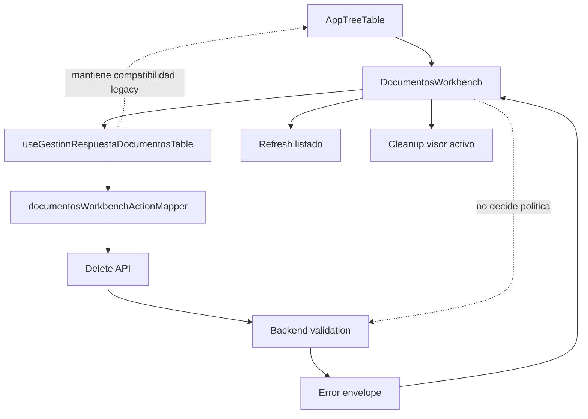

# SCRUMCORE-294 - Arquitectura

## Objetivo

Alinear el workbench documental de Gestion Respuesta con el contrato de borrado persistido del StorageEngine sin romper el flujo de visualizacion ni el refresh del listado.

## Responsabilidades

- `AppTreeTable`: expone acciones de fila y dispara `onActionTriggered`.
- `DocumentosWorkbench`: orquesta la accion `eliminar_item`, limpia el visor si aplica y refresca el listado.
- `useGestionRespuestaDocumentosTable`: resuelve la tabla, el contexto de fila y el action request base.
- `documentosWorkbenchActionMapper`: arma el payload de tabla para la accion de delete.
- Backend: valida autorizacion, ownership, reglas de negocio y estado del documento.

## Flujo

## Diagrama de responsabilidades

## ADRs

### ADR-294-01: `eliminar_item` como entrada funcional

La accion de borrado se consume desde la tabla dinamica existente. No se crea un boton paralelo fuera del workbench.

### ADR-294-02: `CanDelete` como guardrail

La UI puede ocultar o deshabilitar la accion cuando el backend expone `CanDelete=false`, pero el backend sigue siendo la ultima autoridad.

### ADR-294-03: `WORKFLOW` como `sourceModule`

Gestion Respuesta pertenece a la ruta workflow, por lo que este contrato se documenta con `sourceModule=WORKFLOW`.

### ADR-294-04: Precedencia estricta de mensajes

La experiencia de usuario usa `UserMessage` primero, luego `Message`, luego `message`, y solo despues un fallback local.
