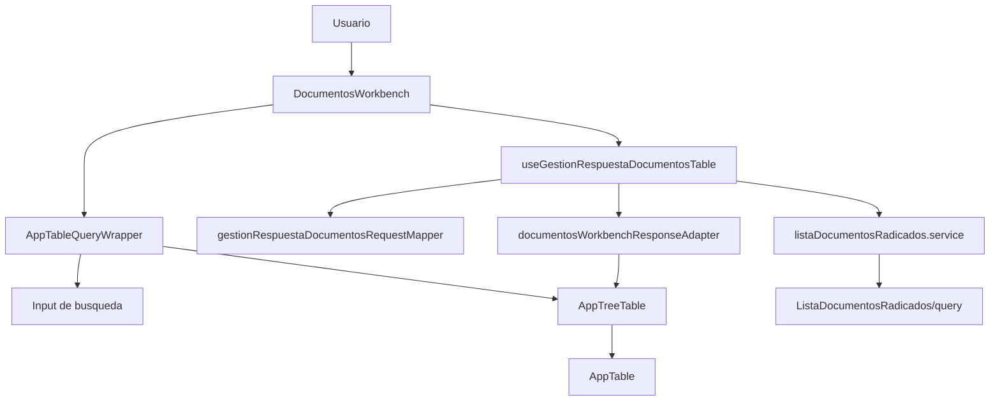
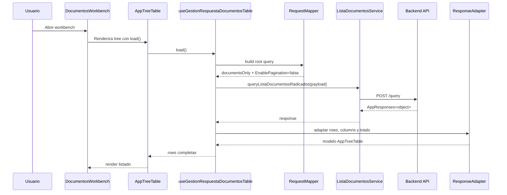
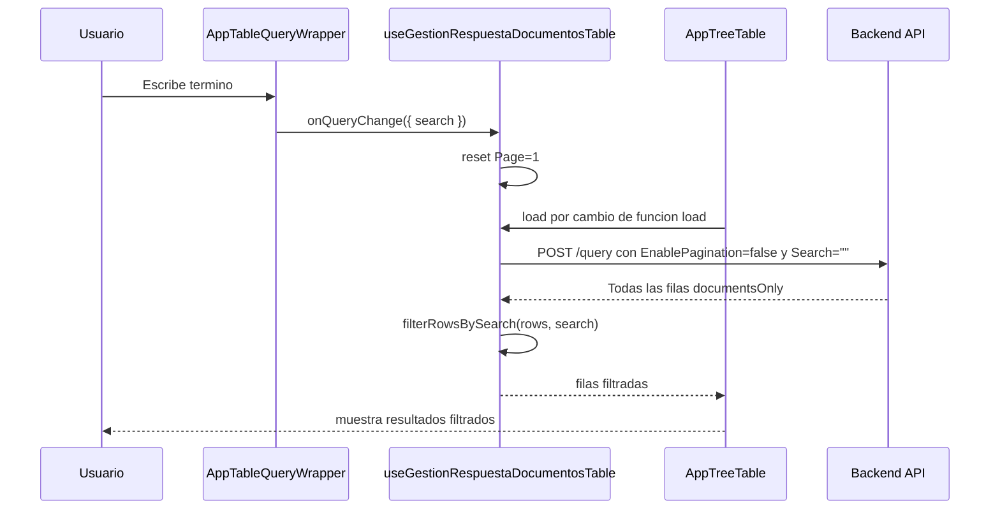
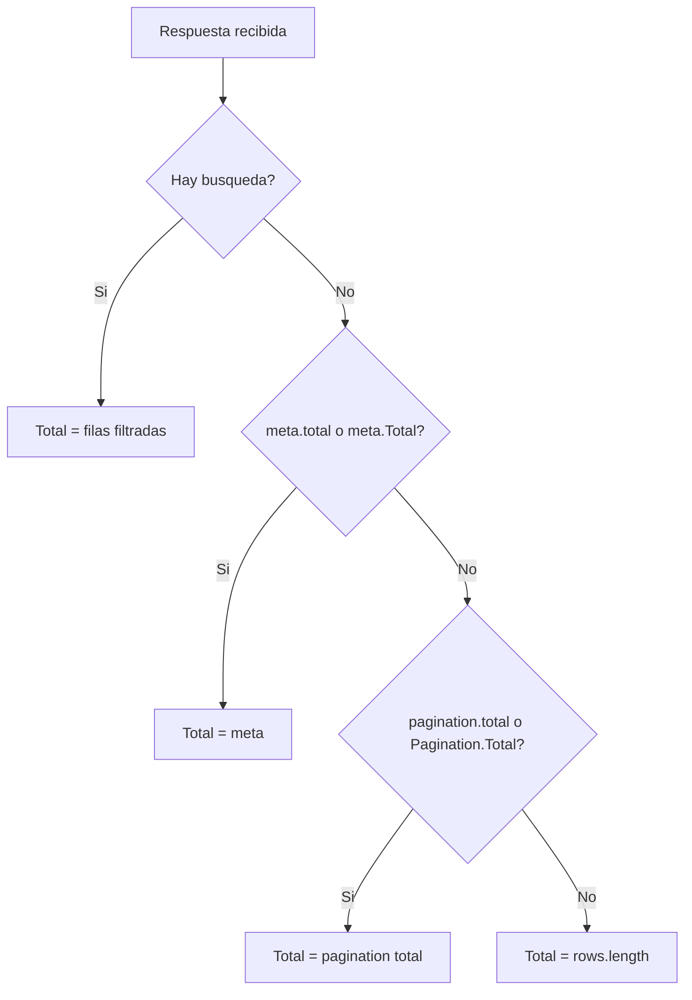
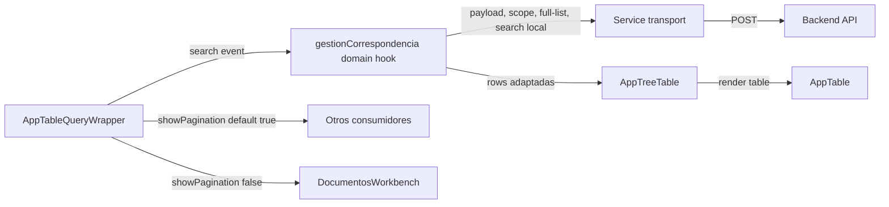

# SCRUMCORE-295 - Diagramas

## Componentes

```mermaid
flowchart TD
  User[Usuario] --> Workbench[DocumentosWorkbench]
  Workbench --> QueryWrapper[AppTableQueryWrapper]
  QueryWrapper --> Search[Input de busqueda]
  QueryWrapper --> Tree[AppTreeTable]
  Tree --> AppTable[AppTable]
  Workbench --> Hook[useGestionRespuestaDocumentosTable]
  Hook --> Mapper[gestionRespuestaDocumentosRequestMapper]
  Hook --> Service[listaDocumentosRadicados.service]
  Service --> Api[ListaDocumentosRadicados/query]
  Hook --> Adapter[documentosWorkbenchResponseAdapter]
  Adapter --> Tree
```

## Carga Inicial

```mermaid
sequenceDiagram
  participant U as Usuario
  participant W as DocumentosWorkbench
  participant T as AppTreeTable
  participant H as useGestionRespuestaDocumentosTable
  participant M as RequestMapper
  participant S as ListaDocumentosService
  participant B as Backend API
  participant A as ResponseAdapter

  U->>W: Abre workbench
  W->>T: Renderiza tree con load()
  T->>H: load()
  H->>M: build root query
  M-->>H: documentsOnly + EnablePagination=false
  H->>S: queryListaDocumentosRadicados(payload)
  S->>B: POST /query
  B-->>S: AppResponses<object>
  S-->>H: response
  H->>A: adaptar rows, columns y totals
  A-->>H: modelo AppTreeTable
  H-->>T: rows completas
  T-->>W: render listado
```

## Busqueda Local

```mermaid
sequenceDiagram
  participant U as Usuario
  participant Q as AppTableQueryWrapper
  participant H as useGestionRespuestaDocumentosTable
  participant T as AppTreeTable
  participant B as Backend API

  U->>Q: Escribe termino
  Q->>H: onQueryChange({ search })
  H->>H: reset Page=1
  T->>H: load por cambio de funcion load
  H->>B: POST /query con EnablePagination=false y Search=""
  B-->>H: Todas las filas documentsOnly
  H->>H: filterRowsBySearch(rows, search)
  H-->>T: filas filtradas
  T-->>U: muestra resultados filtrados
```

## Decision De Total

```mermaid
flowchart TD
  Start[Respuesta recibida] --> HasSearch{Hay busqueda?}
  HasSearch -->|Si| Filtered[Total = filas filtradas]
  HasSearch -->|No| MetaTotal{meta.total o meta.Total?}
  MetaTotal -->|Si| Meta[Total = meta]
  MetaTotal -->|No| Pagination{pagination.total o Pagination.Total?}
  Pagination -->|Si| Pg[Total = pagination total]
  Pagination -->|No| Rows[Total = rows.length]
```

## Limites De Responsabilidad

```mermaid
flowchart LR
  Domain[gestionCorrespondencia domain hook] -->|payload, scope, full-list, search local| Service[Service transport]
  Service -->|POST| Backend[Backend API]
  Domain -->|rows adaptadas| Tree[AppTreeTable]
  Tree -->|render table| Table[AppTable]
  Wrapper[AppTableQueryWrapper] -->|search event| Domain
  Wrapper -->|showPagination default true| Other[Otros consumidores]
  Wrapper -->|showPagination false| Workbench[DocumentosWorkbench]
```
