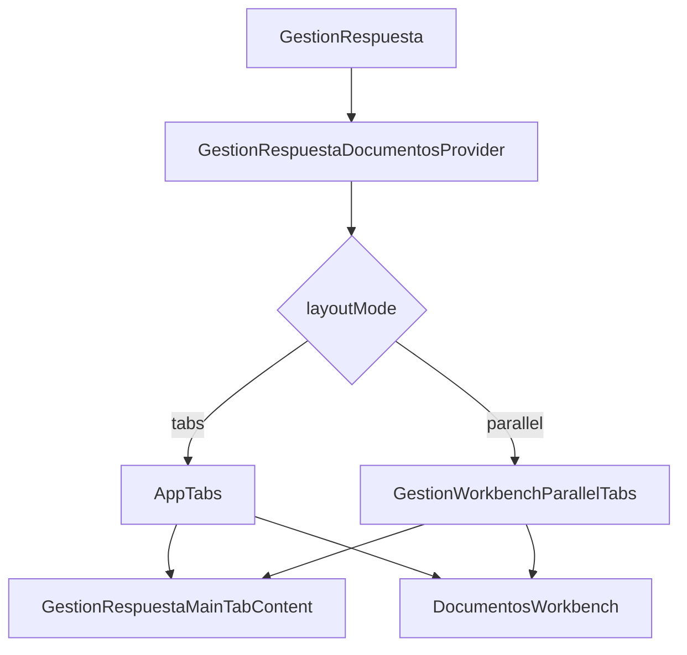

# SCRUMCORE-251 - Arquitectura

## Objetivo

Agregar una opcion opt-in para trabajar en paralelo los tabs `Gestion` y `Documentos` del Workbench de Gestion Correspondencia usando `react-resizable-panels`, sin cambiar la logica actual de negocio ni los contratos backend.

## Problema

El usuario operativo debe alternar entre `Gestion` y `Documentos` para redactar, revisar contexto documental y comparar informacion. Ese cambio de tab reduce continuidad operativa cuando necesita ver ambos contextos al mismo tiempo.

## Solucion

La solucion agrega una capa de layout en `GestionRespuesta.tsx`:

- Modo por defecto: tabs normales mediante `AppTabs`.
- Modo opt-in: vista paralela con `GestionWorkbenchParallelTabs`.
- Toggle visible como switch: `Vista paralela` / `Vista normal`.
- Provider compartido: `GestionRespuestaDocumentosProvider` sigue envolviendo ambos modos.
- No se duplican providers ni se agregan services.

## Decision tecnica

Se usa `react-resizable-panels` porque resuelve resizing, constraints y accesibilidad basica del divisor sin implementar drag manual. La version instalada exporta `Group`, `Panel` y `Separator`; en el componente se importan con aliases semanticos `PanelGroup` y `PanelResizeHandle` para mantener legibilidad alineada al contrato del ticket.

## Diagrama

## Flujo

1. El usuario abre Gestion Correspondencia.
2. `GestionRespuesta` inicia en modo `tabs`.
3. El usuario puede activar `Vista paralela` si el ancho disponible lo permite.
4. En modo paralelo se renderizan `Gestion` y `Documentos` lado a lado.
5. El usuario puede redimensionar ambos paneles.
6. Al desactivar, vuelve a `AppTabs` sin cambiar providers ni reglas de negocio.

## Responsive

La vista paralela se habilita solo desde `901px` de ancho. En anchos menores el boton queda deshabilitado y se mantiene el modo normal de tabs. Esta decision evita forzar dos columnas inutiles en mobile y protege la experiencia de `DocumentosWorkbench`, visor PDF y editor.

## Restricciones respetadas

- No se modifican endpoints.
- No se modifican services backend.
- No se toca la logica de firma ni reemplazo de paginas anotadas.
- No se toca `DocumentosWorkbench` ni `GestionRespuestaMainTabContent`.
- No se persiste estado en storage.
- No se implementa resizing manual.

## Riesgos residuales

- Al entrar en modo paralelo se montan simultaneamente los contenidos de ambos tabs. El provider compartido reduce riesgo de estado divergente, pero QA debe observar que no haya doble carga inesperada.
- `DocumentosWorkbench` tiene layouts internos complejos; por eso el contenedor usa `min-height: 0`, `height: 100%` y overflow controlado.
