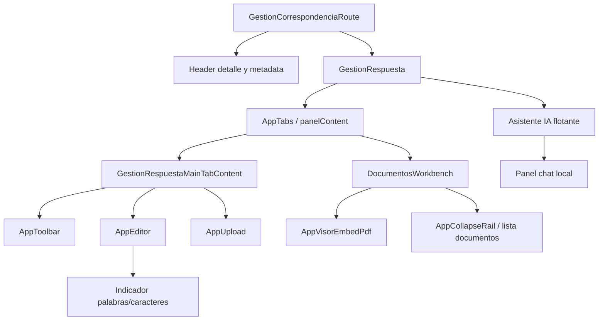

# SCRUMCORE-251 - Arquitectura

## Objetivo

SCRUMCORE-251 mejora el workbench de Gestion Correspondencia para permitir trabajo operativo mas fluido entre `Gestion` y `Documentos`, y endurece la respuesta visual de esa superficie en desktop pequeno, tablets y mobile.

El alcance inicial del ticket fue la vista paralela con `react-resizable-panels`. El bloque actual documentado aqui corresponde al hardening UI posterior: compactacion del tab Gestion, adjuntos compactos, metadatos legibles, altura responsive del tab Documentos y ajuste coordinado del visor PDF.

## Capas involucradas

## Principios de diseno preservados

- No se modifican endpoints, DTOs, services ni contratos backend.
- No se cambia la logica de negocio de Gestion Correspondencia.
- Los componentes shared (`AppToolbar`, `AppUpload`, `AppTabs`, `AppVisorEmbedPdf`) reciben ajustes compatibles hacia atras.
- Los ajustes visuales especificos de Gestion se encapsulan con clases CSS module del modulo.
- La UI se mantiene enterprise: baja decoracion, alta densidad, controles visibles, foco y labels preservados.

## Decisiones arquitectonicas

### ADR-251-01: Densidad controlada en AppToolbar

Se agrego `density?: "default" | "compact"` en `AppToolbar`.

Justificacion:

- El toolbar de Gestion necesitaba reducir altura sin afectar toolbars del resto del producto.
- Un prop explicito evita acoplar el comportamiento a un ancho global.
- El componente mantiene su media query interna para `compact`, pero `compactDensity` permite compactacion visual controlada por consumidor.

Impacto:

- `GestionRespuestaMainTabContent` usa `density="compact"`.
- El test de AppToolbar valida que desktop no aplique clase `compact` por accidente.

### ADR-251-02: AppUpload extensible por className y estado estable por ref

Se agrego `className` a `AppUpload` y se introdujo `filesRef`.

Justificacion:

- Gestion necesita compactar cards de adjuntos sin cambiar la apariencia global de upload.
- `filesRef` evita que actualizaciones async de estrategia `auto` lean arrays obsoletos y desaparezcan archivos cargados.
- `role="listitem"` facilita estilos scoped y mejora semantica de listas.

Impacto:

- Upload mantiene API existente.
- Se agrego cobertura para archivo visible en estrategia `auto`.
- En Gestion se reemplaza la accion visual por un unico boton de eliminar.

### ADR-251-03: Alturas responsive coordinadas por contenedor y visor

Documentos tiene tres capas que pueden imponer altura:

- `AppTabs.module.css` via `.panelContent`.
- `DocumentosWorkbench.module.css` via `.workbenchBody` y `.viewer`.
- `AppVisorEmbedPdf.module.css` via `.root`.

Decision:

- Mantener sincronizadas las alturas del workbench y el root del visor en los breakpoints mobile.
- Usar `:has([data-testid="documentos-workbench"])` en `AppTabs` para que los ajustes de panel solo afecten Documentos.
- Colocar el override de iPad Mini al final para evitar que el bloque mobile general lo sobrescriba.

Justificacion:

- El usuario reporto diferencias visuales por dispositivo. El problema real era que capas distintas imponian altos distintos.
- La solucion sincroniza el alto visible del visor con el alto del contenedor que lo hospeda.

### ADR-251-04: Metadata compacta con informacion completa

La metadata del detalle se reubica y compacta en mobile, manteniendo `title` completo.

Justificacion:

- El usuario necesita ver `Radicado`, `Remitente` y `Tramite` en mobile sin perder contexto.
- En pantallas estrechas se prioriza alineacion a la derecha y wrapping antes que truncamiento irreversible.

### ADR-251-05: Asistente IA flotante como capa UI local del Workbench

Se agrego una capa flotante persistente dentro de `GestionRespuesta` para exponer un boton de IA y un panel tipo chat sobre los tabs `Gestion` y `Documentos`.

Decision:

- Implementar el asistente como UI local del workbench, sin extension de navegador, dependencia externa ni backend.
- Montarlo dentro de `GestionRespuesta` para que comparta el mismo ciclo visual de los tabs y de la vista paralela.
- Usar `position: fixed` para garantizar persistencia al navegar entre tabs y al hacer scroll interno.
- Mantener `pointer-events: none` en la capa y `pointer-events: auto` en el boton/panel para no bloquear el editor ni el visor.
- Usar iconografia existente de Ant Design (`RobotOutlined`, `CloseOutlined`, `SendOutlined`) sin SVG manual.
- Mantener el chat como shell conversacional local: renderiza mensajes de usuario y una respuesta placeholder. No invoca servicios ni IA real.

Justificacion:

- El usuario pidio un boton flotante azul, persistente, visible en ambos tabs, con apertura tipo chat.
- No era necesaria una extension para resolver la capa visual. La integracion con IA real queda como evolucion posterior mediante endpoint/API conversacional.
- La solucion evita acoplar `AppEditor`, `DocumentosWorkbench` o `AppTabs` a responsabilidades de asistencia conversacional.

Detalles de interaccion:

- El boton muestra `IA` con icono de robot cuando el chat esta cerrado.
- Al abrir el chat, el boton conserva el espacio flotante y muestra `CloseOutlined` como accion de cierre.
- La animacion del panel usa expansion desde el origen inferior derecho, simulando que el panel sale del FAB.
- El cierre conserva el panel montado brevemente mediante estado `isAssistantClosing` para animar el retorno hacia el boton antes de desmontar.
- El boton mantiene una senal de atencion sobria con halo discreto y brillo muy leve, sin rebotes exagerados.
- El panel usa una anchura compacta enterprise: `clamp(276px, 28vw, 342px)` y mobile `min(330px, calc(100vw - 1.75rem))`.

Detalles de foco y teclado:

- El input del chat es un `input` normal de una linea, no `textarea`, por requerimiento final del usuario.
- El input no es controlado por React; usa `useRef<HTMLInputElement | null>` para evitar re-render del workbench en cada caracter.
- El envio se dispara con `Enter` desde `onKeyDownCapture` del panel cuando el target es el input.
- Los eventos de teclado, keyup y pointer se detienen en captura dentro del panel para que `AppEditor` no recupere foco ni intercepte atajos.
- Al enviar, se lee `assistantInputRef.current.value`, se agrega el mensaje, se limpia el input y se devuelve el foco al mismo control.
- El boton interno de limpiar (`CloseOutlined`) borra el valor sin convertir el input en controlado.

Impacto sobre AppEditor:

- Se movio el indicador flotante de palabras/caracteres de `AppEditor` desde `right: 1rem` a `right: 8rem`.
- Motivo: evitar solapamiento visual con el FAB de IA en la zona inferior derecha.
- No se cambia la logica de conteo, calculo de paginas, seleccion, toolbar ni contenido editable de `AppEditor`.

Restricciones de alcance:

- No se agrego backend.
- No se agrego streaming, historial persistente, autenticacion, contexto documental ni consumo de modelos IA.
- No se modificaron contratos de `GestionRespuestaDocumentosProvider`, `DocumentosWorkbench`, `AppUpload`, `AppTabs` ni `AppEditor`.
- El mensaje automatico actual es placeholder local y debe reemplazarse por integracion real en un ticket posterior.

## Breakpoints documentados

### Mobile general

- `max-width: 768px`
- Documentos:
  - `workbenchBody`: `clamp(540px, 72dvh, 680px)`
  - `AppVisorEmbedPdf.root`: `min-height: 540px`
  - `panelContent`: `min-height: clamp(560px, 76dvh, 680px)`

### iPhone SE y pantallas bajas

- `max-width: 430px` y `max-height: 740px`
- Documentos y visor:
  - `clamp(410px, 65dvh, 490px)`

### Samsung Galaxy S8+

- `min-width: 350px`, `max-width: 380px`, `min-height: 720px`, `max-height: 760px`
- Documentos y visor:
  - `clamp(425px, 68dvh, 515px)`

### iPhone 12 Pro / familia 390x844 aproximada

- `max-width: 430px` y `min-height: 741px`
- Documentos y visor:
  - `clamp(575px, 73dvh, 650px)`

### iPhone XR / 14 Pro Max y pantallas altas

- Base alta:
  - `max-width: 430px` y `min-height: 880px`
  - `clamp(660px, 76dvh, 720px)`
- XR override:
  - `min-width: 400px`, `max-width: 430px`, `min-height: 840px`, `max-height: 920px`
  - `clamp(645px, 74dvh, 695px)`
  - `panelContent`: `clamp(660px, 76dvh, 710px)`

### iPad Mini

- `min-width: 744px`, `max-width: 834px`, `min-height: 1000px`, `max-height: 1150px`
- `panelContent`: `calc(100vh - 190px)`
- `DocumentosWorkbench.workbenchBody`: `calc(100vh - 215px)`
- `DocumentosWorkbench.viewer`: `calc(100vh - 215px)`
- `AppVisorEmbedPdf.root`: `calc(100vh - 215px)`

## Flujo visual resultante

1. El usuario entra al detalle de Gestion Correspondencia.
2. En el tab Gestion, la toolbar superior se muestra compacta y sin sticky.
3. El AppEditor ocupa una altura adaptada al viewport.
4. Adjuntos se mantienen debajo del editor con upload a lo ancho y cards pequenas agrupadas.
5. En el tab Documentos, el contenedor principal y el visor PDF comparten una altura coherente por dispositivo.
6. En mobile, el rail de documentos permanece disponible como overlay/rail lateral.
7. La metadata del detalle permanece accesible con tooltip nativo.
8. El boton flotante `IA` permanece visible en la esquina inferior derecha del workbench.
9. Al hacer click en `IA`, el chat se expande desde el boton, permite escribir un mensaje, enviarlo con Enter o con el boton enviar, limpiar el texto con una X interna y cerrar el panel con el FAB o el header.

## Restricciones respetadas

- No se introducen nuevos hooks de negocio.
- No se persiste estado responsive.
- No se usa JavaScript para medir viewport.
- No se agregan dependencias nuevas en este bloque.
- No se toca la seleccion, firma, exportacion, permisos ni reemplazo de paginas del visor PDF.
- No se cambia la estructura de servicios de documentos.
- El asistente IA queda implementado como UI shell local y no como servicio conversacional productivo.

## Riesgos y mitigaciones

- Riesgo: reglas por dispositivo aumentan costo de mantenimiento.
  - Mitigacion: los rangos quedan documentados y scoped al workbench de documentos.
- Riesgo: `:has()` no soportado en navegadores antiguos.
  - Mitigacion: producto apunta a navegadores modernos; selector queda aislado y no rompe funcionalidad core.
- Riesgo: cambios en viewport real de navegador pueden variar respecto a DevTools.
  - Mitigacion: QA debe validar matriz final en dispositivos/emuladores.
- Riesgo: cards de upload demasiado compactas en nombres largos.
  - Mitigacion: `title` en nombre, truncamiento controlado y accion de eliminar visible.
- Riesgo: el input del chat puede competir con listeners del AppEditor.
  - Mitigacion: input no controlado por ref y aislamiento de eventos en captura dentro del panel.
- Riesgo: el panel de IA puede solaparse con overlays existentes.
  - Mitigacion: se compacta anchura, se mantiene z-index acotado al workbench y se mueve el indicador de caracteres del AppEditor.
- Riesgo: expectativa de IA real.
  - Mitigacion: la documentacion explicita que es shell local y requiere integracion posterior con API conversacional.
