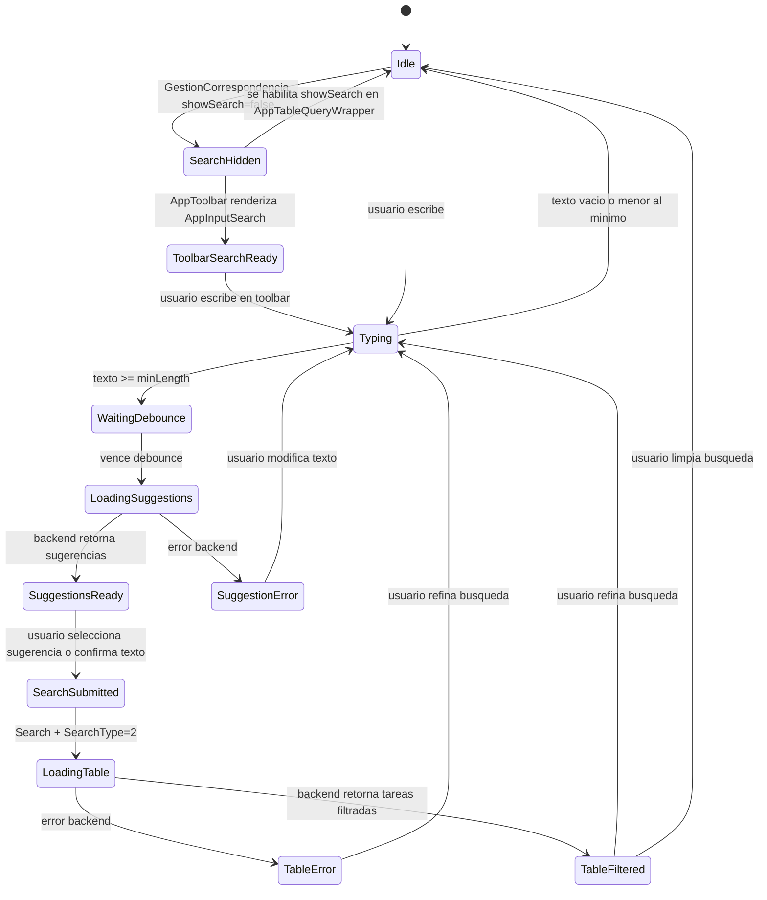
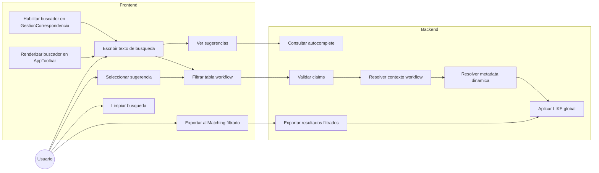
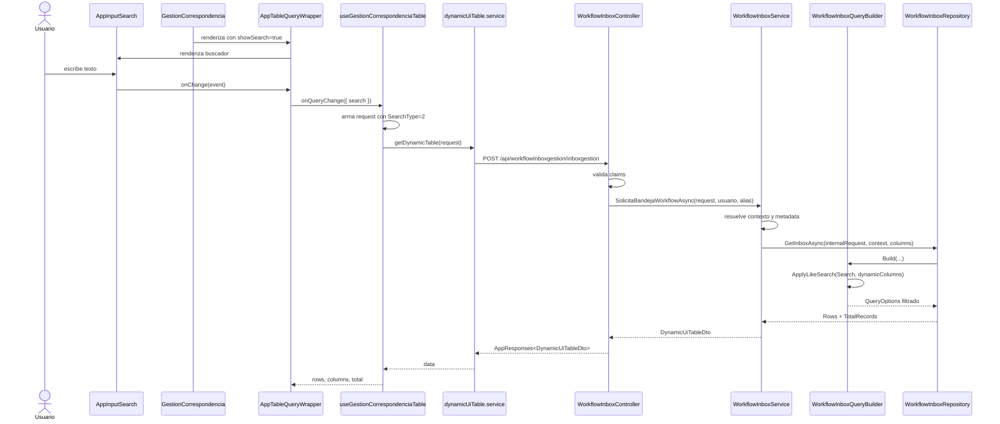
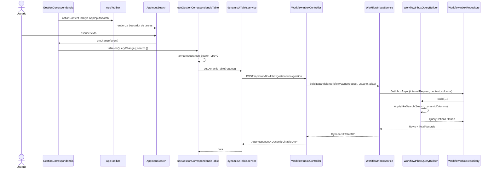
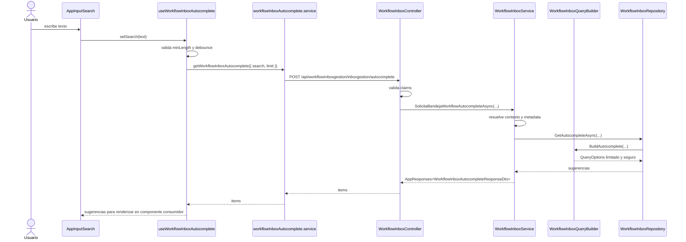
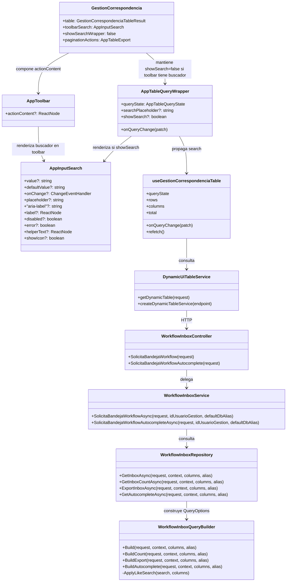

# Arquitectura: Busqueda Global y Autocomplete para Workflow Inbox Gestion Correspondencia

## Objetivo

Definir una arquitectura para evolucionar la consulta de tareas workflow de gestion de correspondencia, expuesta por `SolicitaBandejaWorkflow`, hacia un modelo que soporte:

- busqueda global tipo `LIKE` sobre campos textuales filtrables
- consulta paginada de tareas workflow filtrada por el texto buscado
- autocomplete de sugerencias para acelerar la busqueda
- reutilizacion del estado de consulta ya existente en `AppTableQueryWrapper`
- separacion estricta entre componente UI, hook de conexion y servicio backend

Este documento busca reducir ambiguedad y servir como fuente de referencia para:

- prompts de IA
- tickets Jira
- implementacion backend
- implementacion frontend
- pruebas de regresion
- validacion de seguridad y rendimiento

## Alcance

Aplica a:

- `WorkflowInboxController.SolicitaBandejaWorkflow`
- `WorkflowInboxService.SolicitaBandejaWorkflowAsync`
- `WorkflowInboxQueryBuilder`
- `workflowInboxgestion`
- `GestionCorrespondencia`
- `AppTableQueryWrapper`
- `AppInputSearch`
- hooks y servicios frontend que conectan la tabla con el endpoint workflow

No aplica a:

- rediseño visual general de `AppInputSearch`
- convertir `AppInputSearch` en un componente conectado a backend
- busqueda avanzada libre por expresiones SQL en UI
- reemplazo de `AppTable`
- cambios de autorizacion fuera de los claims ya usados por el controller
- busqueda global sobre campos binarios, colecciones o datos no representables de forma segura como texto

## Estado actual

### Frontend

`AppInputSearch` es un componente presentacional.

Responsabilidades actuales:

- renderizar un input de busqueda basado en `AppInput`
- exponer `value`, `onChange`, `placeholder`, `aria-label` y estados de input
- renderizar icono decorativo de busqueda
- no administrar estado interno de busqueda
- no conocer endpoints ni payloads backend

`AppTableQueryWrapper` puede consumir `AppInputSearch` y emitir:

```tsx
onQueryChange({ search: event.target.value })
```

En el estado actual de `GestionCorrespondencia`, el wrapper se consume con:

```tsx
showSearch={false}
```

Por tanto, aunque `AppTableQueryWrapper` ya tiene la capacidad visual de busqueda, la pantalla de gestion de correspondencia no muestra el control de busqueda dentro del wrapper. Cualquier implementacion de filtro por texto para esta pantalla debe habilitar explicitamente ese punto de UI o proveer un buscador equivalente conectado al mismo `queryState`.

La pantalla ya usa `AppToolbar` con `actionContent` para acciones operativas:

```tsx
<AppToolbar
  className={styles.toolbar}
  actionContent={
    <div className={styles.toolbarActionGroup}>
      ...
    </div>
  }
/>
```

Ese slot es un punto viable para ubicar `AppInputSearch` si la decision visual es que la busqueda viva en la barra superior de la pantalla y no dentro de la banda de controles del `AppTableQueryWrapper`.

`useGestionCorrespondenciaTable` conecta la tabla con el endpoint dinamico usando:

- `queryState.search`
- `queryState.searchType`
- `useDynamicUiTableQuery`
- `mapGestionCorrespondenciaTableRequest`
- `getDynamicTable`

La solicitud frontend llega al backend como:

```ts
{
  TableId: "workflowInboxgestion",
  Page: number,
  PageSize: number,
  Search?: string,
  SearchType?: number,
  StructuredFilters?: ...
}
```

### Backend

El controller:

```csharp
POST /api/workflowInboxgestion/inboxgestion
```

expone:

```csharp
SolicitaBandejaWorkflow([FromBody] WorkflowInboxApiRequestDto request)
```

El controller:

- valida claim `defaulalias`
- valida claim `usuarioid`
- convierte `usuarioid` a `idUsuarioGestion`
- delega a `IWorkflowInboxService.SolicitaBandejaWorkflowAsync`

El filtrado real no ocurre en el controller, sino en:

```csharp
WorkflowInboxQueryBuilder.BuildRawConditions(...)
```

El query builder ya tiene soporte de busqueda por `LIKE` para:

```csharp
TipoConsulta == 2
```

El metodo relevante es:

```csharp
ApplyLikeSearch(search, dynamicColumns)
```

La busqueda actual aplica sobre columnas dinamicas:

- visibles
- filtrables
- con tipo de dato texto

La condicion generada sigue el patron:

```sql
AND (columna1 LIKE '%texto%' OR columna2 LIKE '%texto%' OR ...)
```

## Problema a resolver

Se requiere que el usuario pueda escribir texto en la bandeja de gestion de correspondencia y obtener la lista de tareas workflow filtrada.

Adicionalmente, se plantea una experiencia de autocomplete que sugiera coincidencias sin traer toda la tabla ni acoplar el input al backend.

El riesgo principal es mezclar responsabilidades:

- `AppInputSearch` no debe conocer endpoints
- el controller no debe contener logica de SQL
- el frontend no debe asumir que todos los campos son aptos para `LIKE`
- el backend no debe hacer `LIKE` indiscriminado sobre columnas no textuales o no filtrables

## Principios de arquitectura

### 1. AppInputSearch sigue siendo presentacional

`AppInputSearch` debe seguir siendo un componente UI.

Responsabilidades:

- renderizar campo de busqueda
- propagar cambios de texto
- conservar accesibilidad
- mostrar icono decorativo

No debe asumir:

- endpoints
- payloads
- `SearchType`
- debounce
- cache
- autenticacion
- `clienteApi`
- TanStack Query

Regla:

```txt
AppInputSearch = input visual + evento onChange
```

No debe convertirse en:

```txt
AppInputSearch = input + HTTP + endpoints conocidos + mapping de dominio
```

### 2. La conexion vive en hooks o servicios de dominio

La conexion con backend debe vivir en:

- `useGestionCorrespondenciaTable`
- un hook nuevo de autocomplete del dominio
- un servicio frontend especifico para workflow inbox

Opciones recomendadas:

```txt
useWorkflowInboxAutocomplete
workflowInboxAutocomplete.service
```

o si queda estrictamente ligado al modulo:

```txt
useGestionCorrespondenciaAutocomplete
gestionCorrespondenciaAutocomplete.service
```

Regla:

- el hook arma query key, debounce, min length y llamada HTTP
- el servicio define endpoint y contrato de request/response
- el componente UI solo recibe `value`, `options`, `loading` o callbacks si en el futuro se crea una variante autocomplete

### 3. La busqueda LIKE global debe resolverse en backend

La busqueda global de la tabla debe resolverse en el query builder backend.

Ruta actual:

```txt
AppInputSearch
  -> AppTableQueryWrapper.onQueryChange({ search })
  -> useGestionCorrespondenciaTable
  -> mapGestionCorrespondenciaTableRequest
  -> POST /api/workflowInboxgestion/inboxgestion
  -> WorkflowInboxService
  -> WorkflowInboxQueryBuilder
  -> ApplyLikeSearch
```

Regla:

- si el usuario escribe busqueda general, la consulta debe llegar con `SearchType = 2`
- `SearchType = 2` debe significar busqueda `LIKE` global sobre columnas textuales filtrables
- `SearchType = 3` debe reservarse para busqueda avanzada si se mantiene ese contrato

### 4. No buscar sobre todos los campos fisicos por defecto

La expresion "todos los campos" debe interpretarse como:

```txt
todos los campos textuales visibles y filtrables del modelo dinamico
```

No debe interpretarse como:

```txt
todas las columnas fisicas de la tabla, sin distincion de tipo o metadata
```

Razon:

- aplicar `LIKE` a columnas numericas o fecha suele forzar conversiones costosas
- buscar en campos no visibles puede exponer datos no destinados a la bandeja
- buscar sobre columnas no filtrables contradice la metadata dinamica
- usar `CAST` indiscriminado puede degradar indices y rendimiento

### 5. Autocomplete debe tener endpoint propio

El autocomplete no debe reutilizar el endpoint paginado completo si solo necesita sugerencias.

Endpoint sugerido:

```http
POST /api/workflowInboxgestion/inboxgestion/autocomplete
```

Contrato sugerido:

```ts
type WorkflowInboxAutocompleteRequest = {
  tableId: "workflowInboxgestion";
  search: string;
  searchType?: 2;
  limit?: number;
  estadoTramite?: string;
  structuredFilters?: DynamicUiStructuredFilterRequest[];
};

type WorkflowInboxAutocompleteItem = {
  value: string;
  label: string;
  field?: string;
};

type WorkflowInboxAutocompleteResponse = {
  items: WorkflowInboxAutocompleteItem[];
};
```

Reglas:

- `search` debe requerir longitud minima, por ejemplo 2 o 3 caracteres
- `limit` debe tener maximo servidor, por ejemplo 10 o 20
- el endpoint debe usar los mismos claims y contexto workflow que `SolicitaBandejaWorkflow`
- las sugerencias deben salir de columnas textuales visibles y filtrables
- no debe retornar filas completas si solo se requieren sugerencias

## Arquitectura objetivo

```txt
Frontend
  AppInputSearch
    -> onChange(text)

  AppTableQueryWrapper
    -> onQueryChange({ search: text, searchType: 2 })

  useGestionCorrespondenciaTable
    -> arma request paginado
    -> getDynamicTable(request)

  useWorkflowInboxAutocomplete
    -> debounce + minLength
    -> workflowInboxAutocomplete.service

Backend
  WorkflowInboxController
    -> SolicitaBandejaWorkflow
    -> SolicitaBandejaWorkflowAutocomplete

  WorkflowInboxService
    -> resuelve contexto y metadata
    -> delega al repositorio

  WorkflowInboxQueryBuilder
    -> Build / BuildCount / BuildExport
    -> BuildAutocomplete
    -> ApplyLikeSearch
```

## Diseno backend

### Controller

Mantener `SolicitaBandejaWorkflow` como endpoint de tabla paginada.

Agregar solo si se implementa autocomplete real:

```csharp
[HttpPost("inboxgestion/autocomplete")]
public async Task<ActionResult<AppResponses<WorkflowInboxAutocompleteResponseDto>>> SolicitaBandejaWorkflowAutocomplete(
    [FromBody] WorkflowInboxAutocompleteRequestDto request)
```

El nuevo endpoint debe repetir o extraer la validacion comun de claims:

- `defaulalias`
- `usuarioid`
- `defaulaliaswf` si lo requiere el servicio

### Service

Agregar metodo si existe autocomplete:

```csharp
Task<AppResponses<WorkflowInboxAutocompleteResponseDto>> SolicitaBandejaWorkflowAutocompleteAsync(
    WorkflowInboxAutocompleteRequestDto request,
    int idUsuarioGestion,
    string defaultDbAlias);
```

Responsabilidades:

- validar request
- resolver contexto workflow
- resolver metadata de columnas dinamicas
- normalizar `limit`
- delegar al repositorio
- devolver sugerencias normalizadas

### Repository

Agregar metodo si existe autocomplete:

```csharp
Task<AppResponses<List<WorkflowInboxAutocompleteItemDto>>> GetAutocompleteAsync(
    WorkflowInboxAutocompleteRequestDto request,
    WorkflowInboxResolvedContextDto context,
    List<WorkflowDynamicColumnDefinitionDto> dynamicColumns,
    string defaultDbAliasWorkflow);
```

Responsabilidades:

- ejecutar query de sugerencias
- no materializar la tabla completa
- limitar resultados
- reutilizar filtros base de contexto workflow

### QueryBuilder

La busqueda paginada ya cuenta con:

```csharp
ApplyLikeSearch(search, dynamicColumns)
```

Para la consulta de tabla, la mejora minima es garantizar:

```txt
SearchType = 2 cuando hay busqueda general
```

Para autocomplete, se recomienda agregar una construccion separada:

```csharp
QueryOptions BuildAutocomplete(
    WorkflowInboxAutocompleteRequestDto request,
    WorkflowInboxResolvedContextDto context,
    List<WorkflowDynamicColumnDefinitionDto> dynamicColumns,
    string defaultDbAliasWorkflow)
```

Reglas del query builder:

- reutilizar filtros base de workflow
- reutilizar columnas textuales `IsVisible && IsFilterable`
- aplicar `LIKE` con valor escapado
- limitar por `TOP` o equivalente soportado por `QueryOptions`
- deduplicar sugerencias
- no aceptar nombres de columnas enviados por el cliente sin resolverlos contra metadata permitida

## Diseno frontend

### Acoplamiento con GestionCorrespondencia

El acoplamiento recomendado debe ser incremental y no invasivo.

Estado actual:

```tsx
<AppTableQueryWrapper
  queryState={table.queryState}
  onQueryChange={table.onQueryChange}
  total={table.total}
  loading={table.loading && table.hasLoadedOnce}
  showSearch={false}
  paginationActions={...}
>
```

Para activar la busqueda sin pisar codigo funcional, el ajuste de pantalla debe limitarse a:

```tsx
<AppTableQueryWrapper
  queryState={table.queryState}
  onQueryChange={table.onQueryChange}
  total={table.total}
  loading={table.loading && table.hasLoadedOnce}
  showSearch
  searchPlaceholder="Buscar tareas workflow"
  paginationActions={...}
>
```

Si la busqueda debe ubicarse dentro del `AppToolbar`, el ajuste recomendado es mantener `showSearch={false}` en `AppTableQueryWrapper` y agregar `AppInputSearch` en `actionContent`:

```tsx
<AppToolbar
  className={styles.toolbar}
  actionContent={
    <div className={styles.toolbarActionGroup}>
      <AppInputSearch
        className={styles.toolbarSearch}
        aria-label="Buscar tareas workflow"
        placeholder="Buscar tareas workflow"
        value={table.queryState.search}
        onChange={(event) => table.onQueryChange({ search: event.target.value })}
      />

      <AppButton
        className={styles.toolbarControl}
        variant="ghost"
        size="sm"
        leftIcon={<UndoOutlined />}
        loading={table.loading && table.hasLoadedOnce}
        fullWidth
        onClick={table.refetch}
      >
        Actualizar
      </AppButton>

      <AppButton
        className={styles.toolbarControl}
        variant="ghost"
        size="sm"
        leftIcon={<EyeFilled />}
        fullWidth
        onClick={() => navigate("respuesta")}
      >
        Abrir respuesta contextual
      </AppButton>
    </div>
  }
/>
```

Reglas:

- no modificar `AppInputSearch` para conectarlo a endpoints
- no mover la logica de consulta a `GestionCorrespondencia.tsx`
- no cambiar la configuracion de exportacion ni seleccion de filas
- no cambiar `AppTable` ni el contrato de columnas/rows
- mantener `paginationActions` como slot de exportacion existente
- mantener `onQueryChange` como unica via de actualizacion del estado de busqueda
- si se usa `AppToolbar`, el buscador debe compartir el mismo `table.queryState.search` y `table.onQueryChange`
- si se usa `AppToolbar`, `AppTableQueryWrapper` debe conservar `showSearch={false}` para evitar doble buscador
- agregar una clase local tipo `toolbarSearch` solo para layout/ancho del buscador en la barra

Flujo esperado si el buscador vive en `AppTableQueryWrapper`:

```txt
GestionCorrespondencia habilita showSearch
  -> AppTableQueryWrapper renderiza AppInputSearch
  -> onQueryChange({ search })
  -> useGestionCorrespondenciaTable arma request con SearchType=2
  -> backend filtra con ApplyLikeSearch
```

Flujo esperado si el buscador vive en `AppToolbar`:

```txt
GestionCorrespondencia renderiza AppInputSearch en AppToolbar.actionContent
  -> AppInputSearch emite onChange
  -> table.onQueryChange({ search })
  -> useGestionCorrespondenciaTable arma request con SearchType=2
  -> backend filtra con ApplyLikeSearch
```

### Tabla filtrada

Para que la busqueda general filtre la lista de tareas, el frontend debe garantizar que `SearchType` sea `2` cuando exista texto simple de busqueda.

Opciones:

1. Ajustar `useGestionCorrespondenciaTable`

```ts
searchType: queryState.search.trim() ? 2 : queryState.searchType,
```

2. Ajustar el estado inicial de `useAppTableQueryState` para este modulo:

```ts
searchType: 2,
```

Recomendacion:

- usar opcion 1 si se quiere preservar `undefined` cuando no hay busqueda
- usar opcion 2 si la busqueda general de esta bandeja siempre es tipo `LIKE`
- si se habilita `showSearch` en `GestionCorrespondencia`, acompanar ese cambio con pruebas que verifiquen que el input aparece y que `onQueryChange` conserva el contrato existente
- si se ubica `AppInputSearch` en `AppToolbar`, acompanar ese cambio con pruebas que verifiquen que no aparece doble buscador y que el input de toolbar actualiza `table.onQueryChange`
- no cambiar el comportamiento de `showSearch={false}` para otros consumidores de `AppTableQueryWrapper`

### Autocomplete

Si se implementa autocomplete real, crear un hook separado:

```ts
type WorkflowInboxAutocompleteItem = {
  value: string;
  label: string;
  field?: string;
};

function useWorkflowInboxAutocomplete(params: {
  search: string;
  enabled?: boolean;
  limit?: number;
}): {
  items: WorkflowInboxAutocompleteItem[];
  loading: boolean;
  error: Error | null;
}
```

Responsabilidades del hook:

- aplicar `minLength`
- aplicar debounce
- invocar servicio HTTP
- exponer loading/error
- no mutar el query state de tabla automaticamente

`AppInputSearch` puede seguir siendo usado como trigger visual, o en una fase posterior se puede crear un componente compuesto:

```txt
AppInputSearchAutocomplete
```

Ese componente compuesto podria recibir:

- `value`
- `onChange`
- `items`
- `loading`
- `onSelect`

Pero no deberia conocer endpoints directamente.

## Contrato sugerido de SearchType

```txt
1 = sin busqueda global o comportamiento legacy
2 = busqueda LIKE global sobre campos textuales visibles/filtrables
3 = busqueda avanzada por expresion controlada
```

Si negocio espera que `SearchType = 1` tambien busque por texto, hay dos opciones:

- cambiar backend para tratar `1` como `2` cuando `Search` no viene vacio
- cambiar frontend para enviar explicitamente `2`

Recomendacion:

- cambiar frontend para enviar `2` en busqueda simple
- documentar `1` como legacy/default sin filtro global
- evitar ambiguedad en backend

## Seguridad

Reglas obligatorias:

- no concatenar nombres de columnas enviados por el cliente
- resolver columnas unicamente desde metadata validada
- escapar literales de texto
- preferir parametros SQL si `QueryOptions` y `DapperCrudEngine` lo permiten
- bloquear tokens peligrosos en busqueda avanzada
- limitar autocomplete por longitud minima y `limit` maximo
- respetar claims y contexto workflow ya resueltos por backend

Riesgos:

- `LIKE '%texto%'` no usa indices normales de forma eficiente
- aplicar conversiones sobre columnas no texto degrada rendimiento
- autocomplete sin limite puede comportarse como exportacion accidental
- exponer sugerencias de campos no visibles puede filtrar informacion no autorizada

## Rendimiento

Recomendaciones:

- limitar busqueda global a columnas textuales filtrables
- aplicar paginacion siempre para la tabla
- aplicar `limit` fijo para autocomplete
- evaluar indices full-text si el volumen crece
- evitar `CAST` masivo sobre fechas/numeros
- evitar enviar request por cada tecla sin debounce

Valores iniciales recomendados:

```txt
Autocomplete minLength: 2 o 3
Autocomplete limit: 10 o 20
Debounce frontend: 250ms a 400ms
SearchType simple: 2
```

## Diagramas

### Diagrama de estado



Estados relevantes:

- `Idle`: sin texto de busqueda efectivo.
- `SearchHidden`: la pantalla no renderiza el buscador porque `showSearch` esta deshabilitado.
- `ToolbarSearchReady`: `GestionCorrespondencia` renderiza `AppInputSearch` en `AppToolbar.actionContent` y mantiene oculto el buscador del wrapper.
- `Typing`: el usuario esta editando el valor de `AppInputSearch`.
- `WaitingDebounce`: el hook de autocomplete espera antes de llamar backend.
- `LoadingSuggestions`: se consulta el endpoint de sugerencias.
- `SuggestionsReady`: existen sugerencias limitadas para mostrar.
- `SearchSubmitted`: el texto seleccionado o confirmado se propaga a la query de tabla.
- `LoadingTable`: `SolicitaBandejaWorkflow` consulta tareas con filtro.
- `TableFiltered`: la tabla muestra resultados filtrados.

### Diagrama de casos de uso



Casos principales:

- La pantalla habilita el buscador de forma explicita antes de depender del filtro textual.
- El buscador puede vivir en `AppToolbar.actionContent` si se mantiene conectado a `table.onQueryChange`.
- El usuario escribe texto y filtra la tabla.
- El usuario recibe sugerencias si existe endpoint de autocomplete.
- El usuario selecciona una sugerencia y la tabla se consulta con el mismo contrato de busqueda.
- El usuario exporta resultados filtrados y `allMatching` respeta el filtro activo.

### Diagrama de secuencia: busqueda LIKE en tabla



Regla del flujo:

- El componente no decide el endpoint.
- El wrapper no arma SQL.
- El hook y mapper arman request.
- El backend aplica el filtro usando metadata segura.

### Diagrama de secuencia: busqueda LIKE desde AppToolbar



Regla del flujo:

- `GestionCorrespondencia.tsx` solo compone UI y llama `table.onQueryChange`.
- `AppToolbar` solo aloja el control dentro de `actionContent`.
- La consulta, el endpoint y el `SearchType` siguen viviendo en el hook/servicio.

### Diagrama de secuencia: autocomplete



Regla del flujo:

- `AppInputSearch` puede ser el control visual, pero el hook de autocomplete es quien conecta con backend.
- El endpoint de autocomplete retorna sugerencias limitadas, no filas completas.

### Diagrama de clases



Nota:

- `SolicitaBandejaWorkflowAutocomplete`, `SolicitaBandejaWorkflowAutocompleteAsync`, `GetAutocompleteAsync` y `BuildAutocomplete` son piezas propuestas, no existentes en el estado actual.
- `SolicitaBandejaWorkflow`, `SolicitaBandejaWorkflowAsync`, `GetInboxAsync`, `Build`, `BuildCount`, `BuildExport` y `ApplyLikeSearch` ya existen.

## Pruebas requeridas

### Backend

Casos minimos:

- `SolicitaBandejaWorkflow` con `SearchType = 2` y `Search = "abc"` aplica `LIKE` sobre columnas textuales filtrables
- `SearchType = 2` sin columnas filtrables no rompe la consulta
- `SearchType = 1` conserva comportamiento legacy documentado
- `SearchType = 3` conserva busqueda avanzada existente
- autocomplete respeta `limit`
- autocomplete ignora busquedas menores al minimo definido
- autocomplete no usa columnas no visibles o no filtrables
- exportacion `allMatching` reutiliza el mismo filtro de busqueda

### Frontend

Casos minimos:

- `AppInputSearch` sigue siendo presentacional
- `GestionCorrespondencia` renderiza el buscador cuando se habilita la busqueda de tareas
- si el buscador vive en `AppToolbar`, `GestionCorrespondencia` mantiene `AppTableQueryWrapper.showSearch={false}` para evitar duplicidad
- `showSearch={false}` sigue ocultando el buscador en consumidores que lo pidan
- `AppTableQueryWrapper` emite `onQueryChange({ search })`
- `useGestionCorrespondenciaTable` envia `SearchType = 2` para busqueda simple
- la query se resetea a `page = 1` al cambiar busqueda
- si se agrega autocomplete, el hook aplica debounce/minLength y no toca endpoint desde `AppInputSearch`

## Criterios de aceptacion

- Al escribir texto en la busqueda de gestion de correspondencia, la tabla retorna tareas workflow filtradas desde backend.
- `GestionCorrespondencia` habilita explicitamente el buscador o define un control equivalente conectado a `table.onQueryChange`.
- Si se elige `AppToolbar`, el buscador se renderiza dentro de `actionContent` y no se duplica en `AppTableQueryWrapper`.
- La activacion del buscador no altera exportacion, seleccion, paginacion ni renderizado de `AppTable`.
- El request de busqueda simple usa `SearchType = 2` o un contrato backend equivalente documentado.
- La busqueda global solo aplica sobre columnas textuales visibles y filtrables.
- `AppInputSearch` no contiene llamadas HTTP ni mapeo de endpoints.
- Si se implementa autocomplete, existe endpoint/hook separado con limite de resultados.
- La exportacion `allMatching` respeta el mismo filtro aplicado en la tabla.
- Las pruebas cubren frontend, service/query builder backend y contratos de filtro.

## Decision recomendada

Para el alcance inmediato:

1. No modificar `AppInputSearch`.
2. Si el buscador debe vivir en la barra superior, agregar `AppInputSearch` dentro de `AppToolbar.actionContent` en `GestionCorrespondencia.tsx`.
3. Mantener `AppTableQueryWrapper showSearch={false}` cuando el buscador vive en `AppToolbar`, para evitar doble input.
4. Ajustar `useGestionCorrespondenciaTable` para enviar busqueda simple con `SearchType = 2`.
5. Mantener el `LIKE` global en `WorkflowInboxQueryBuilder.ApplyLikeSearch`.
6. Crear autocomplete como feature separada con endpoint y hook propios si el negocio necesita sugerencias.

Resumen:

```txt
Activar UI: GestionCorrespondencia debe renderizar el buscador en AppToolbar.actionContent o en AppTableQueryWrapper, no en ambos.
Filtrar tabla: usar Search + SearchType = 2 en endpoint existente.
Autocomplete: crear endpoint/hook separado.
AppInputSearch: mantenerlo presentacional.
```
