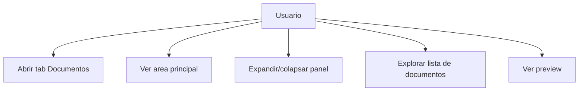
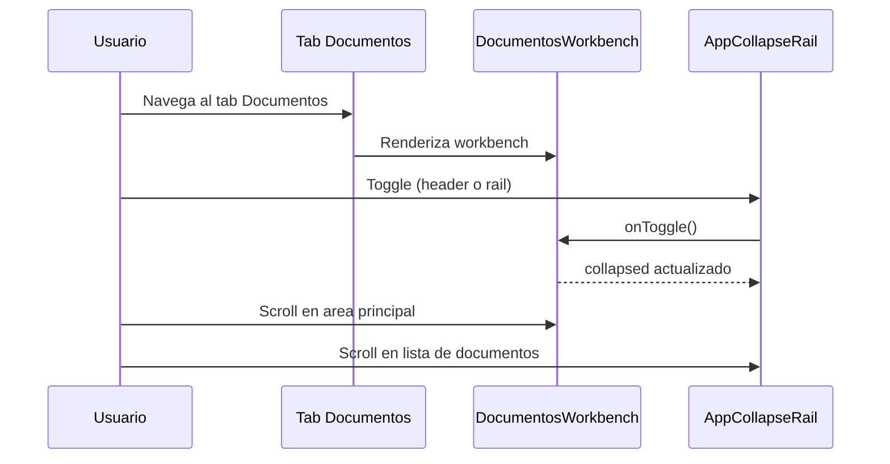
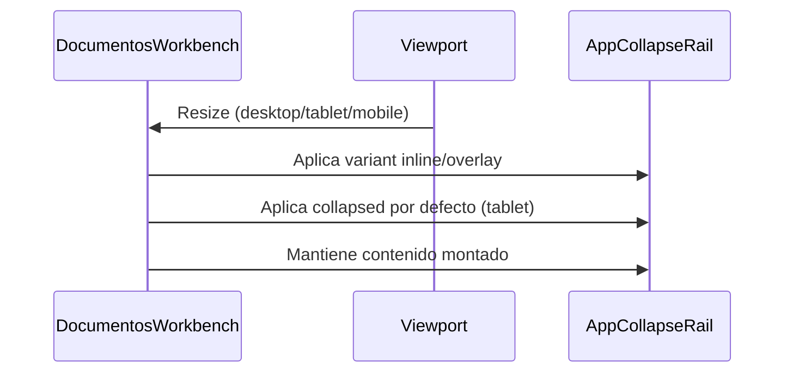
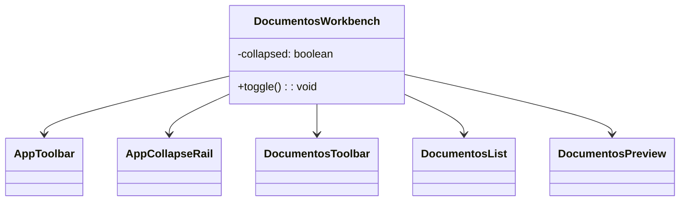

# Ticket 04 FE

## Titulo

Workbench sin Header ni Upload (con AppCollapseRail) en tab **Documentos**

## Objetivo

Construir una interfaz visual tipo workspace/editor horizontal en el tab **Documentos**
de GestionCorrespondencia, con foco en:

- Toolbar de acciones (AppToolbar).
- Area principal de trabajo (scrollable si es necesario).
- Panel lateral colapsable para **Visualizar documentos** (AppCollapseRail).

## Contexto existente

- UI enterprise con React 19 + TypeScript estricto.
- CSS Modules obligatorios.
- Design System existente.
- Componentes shared disponibles:
  - `AppToolbar`
  - `AppCollapseRail`
- Referencia visual: estructura del workbench actual en
  `src/modules/gestionCorrespondencia/components/gestionRespuestaMainTab`.

## Alcance (obligatorio)

- Implementacion **solo visual** dentro del tab **Documentos**.
- **No** incluye logica de negocio ni consumo de APIs.
- **No** incluye header informativo ni upload.
- No reemplazar ni alterar el tab **Gestion**.
- Mantener el contrato de tabs existente en `GestionRespuesta.tsx`.

## Layout esperado (obligatorio)

```
-----------------------------------------------------
| Toolbar                                          |
-----------------------------------------------------
| Main Area                    | Collapse Rail      |
| (Editor / Content)           | (visualizar docs)  |
-----------------------------------------------------
```

## Estructura tecnica (obligatorio)

Contenedor principal:

- `display: flex;`
- `flex-direction: column;`
- `height: 100%;`

Zona principal:

- `display: flex;`
- `flex: 1;`
- `overflow: hidden;`

Area principal:

- `flex: 1;`
- `overflow: auto;` (solo si el contenido excede)

Panel lateral:

- `AppCollapseRail` con contenido interno scrollable (`overflow-y: auto;`)
- No desmontar el contenido al colapsar.
- Separar layout en subcomponentes desacoplados.

## Estado y responsive (obligatorio)

- Estado `collapsed` controlado por el contenedor del tab **Documentos**.
- Desktop: `collapsed = false` por defecto.
- Tablet: `collapsed = true` por defecto.
- Mobile: `variant="overlay"` y rail visible como chip.

## Componentes obligatorios

### 1) Toolbar

- Usar `AppToolbar`.
- Ubicar en la parte superior.
- Acciones principales del workspace.
- Layout horizontal.

### 2) Area principal

- Ocupa todo el espacio disponible.
- Contiene editor o contenido principal (placeholder).
- Scrollable si es necesario.

### 3) Panel lateral (CRITICO)

Usar `AppCollapseRail` con configuracion exacta:

```tsx
<AppCollapseRail
  title="Visualizar documentos"
  collapsed={collapsed}
  onToggle={toggle}
  placement="right"
  variant="inline"
>
```

Notas:

- En mobile debe cambiar a `variant="overlay"`.
- Mantener soporte visual para `placement="left"` si se requiere.

Comportamiento:

- Expandido: panel visible con contenido.
- Colapsado: solo rail visible.
- **No** desmontar contenido.
- Toggle disponible desde header del panel y desde rail.

Contenido interno (simulado):

- Lista de documentos.
- Preview simple.
- Acciones basicas.
- `overflow-y: auto;`.

## Responsive (obligatorio)

Desktop:

- `AppCollapseRail` en modo `inline`.
- Layout horizontal completo.

Tablet:

- Rail visible.
- Panel colapsado por defecto (control desde contenedor).

Mobile:

- `AppCollapseRail` cambia a `variant="overlay"`.
- Panel tipo bottom-sheet.
- Altura 70-80%.
- Rail flotante abajo derecha.

## UI/UX (obligatorio)

- Diseno limpio tipo enterprise.
- Separacion clara entre panel y contenido.
- Sombras suaves.
- Bordes redondeados (12px - 16px).
- Hover y focus visibles.
- Iconos consistentes con el Design System.

## Accesibilidad (obligatorio)

- `aria-expanded` en toggle.
- `aria-controls` conectado.
- Navegacion por teclado.
- Foco visible.

## Reglas arquitectonicas

- Sin logica de negocio.
- No usar `any`.
- No acoplar a modulos.
- Componentes desacoplados.
- SoC estricto.
- Componentes UI presentacionales sin reglas de negocio.

## Pruebas (obligatorio)

- Render del layout.
- Toggle del panel lateral.
- Estado colapsado/expandido.
- Comportamiento responsive.
- `variant="overlay"` aplicado en mobile.
- `aria-expanded` y `aria-controls` validos.

## Entregables

- Componente principal (ej. `WorkspaceEditor`).
- Subcomponentes desacoplados.
- CSS Modules.
- Tipado completo.
- Ejemplo de uso dentro del tab **Documentos**.
- Archivo CSS Module dedicado al workbench del tab Documentos.

## Integracion en GestionRespuesta (obligatorio)

La implementacion debe vivir en una carpeta aparte (no dentro de `gestionRespuestaMainTab`)
pero alineada al mismo modulo:

- `src/modules/gestionCorrespondencia/components`

Sugerencia de acomodo (alineado al patron actual):

- `src/modules/gestionCorrespondencia/components/documentosWorkbench/`
- `src/modules/gestionCorrespondencia/components/documentosWorkbench/DocumentosWorkbench.tsx`
- `src/modules/gestionCorrespondencia/components/documentosWorkbench/DocumentosWorkbench.module.css`
- `src/modules/gestionCorrespondencia/components/documentosWorkbench/DocumentosToolbar.tsx`
- `src/modules/gestionCorrespondencia/components/documentosWorkbench/DocumentosList.tsx`
- `src/modules/gestionCorrespondencia/components/documentosWorkbench/DocumentosPreview.tsx`
- `src/modules/gestionCorrespondencia/components/documentosWorkbench/index.ts`

Uso desde el tab **Documentos**:

- `GestionRespuesta.tsx` debe renderizar `DocumentosWorkbench` dentro del contenido del tab **Documentos**,
  respetando el contrato actual del sistema de tabs y sin tocar el tab **Gestion**.

## Diagramas

### Diagrama de casos (alto nivel)



### Diagrama de uso (interaccion)



### Diagrama de secuencia (responsive)



### Diagrama de clases (componentes)


