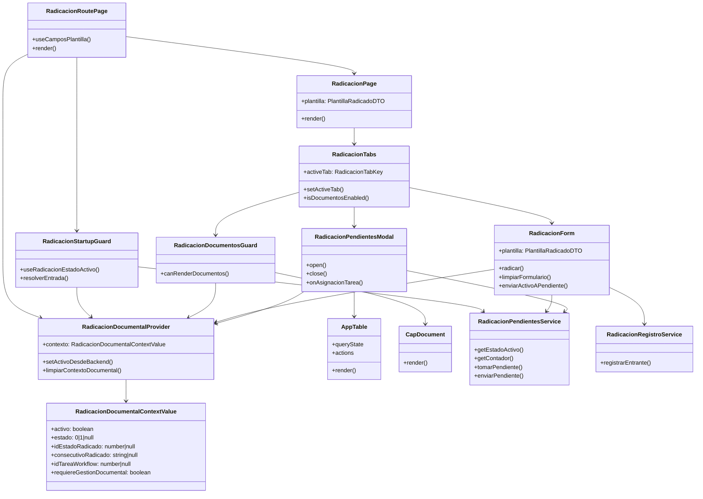

# Diagrama De Clases Frontend

## Vista General

## Notas De Diseno

| Relacion | Regla |
|---|---|
| `RadicacionForm -> RadicacionDocumentalProvider` | Solo escribe contexto despues de radicacion exitosa o envio a pendiente. |
| `RadicacionPendientesModal -> AppTable` | La tabla dispara `asignacion-tarea`; el modal no debe interpretar columnas manualmente si el contrato viene como `DynamicUiTableDto`. |
| `RadicacionDocumentosGuard -> CapDocument` | `CapDocument` no debe montarse sin contexto activo `estado = 0`. |
| `RadicacionStartupGuard -> RadicacionPendientesService` | La deteccion de activo sucede al inicio del modulo. |

