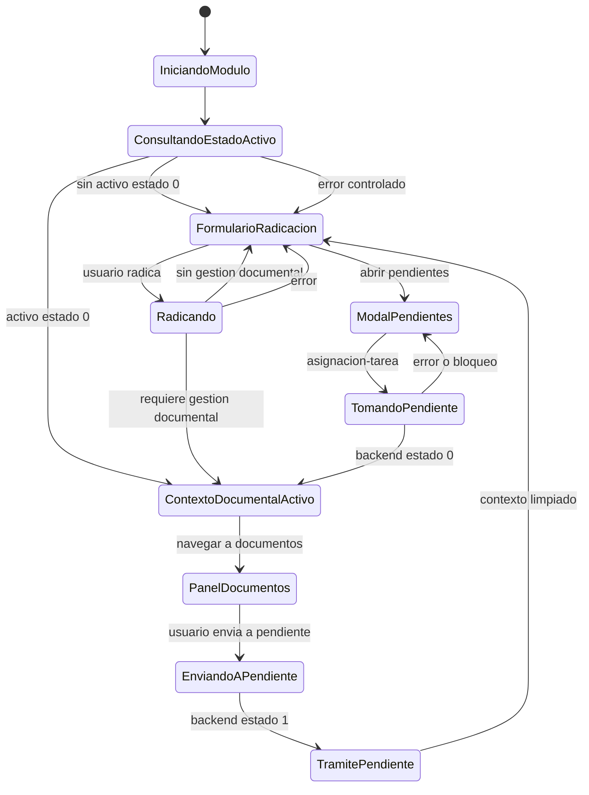
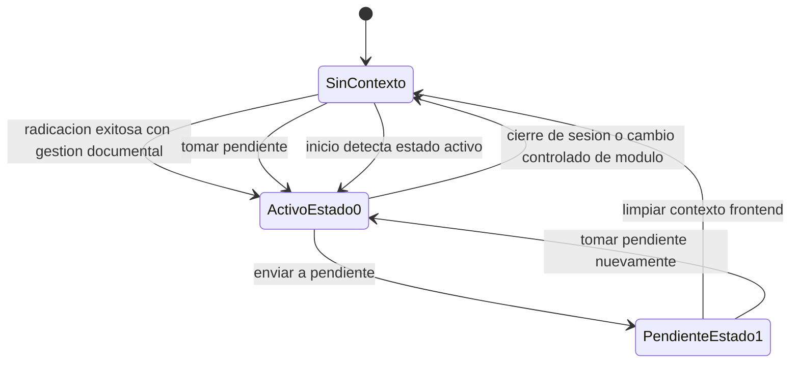
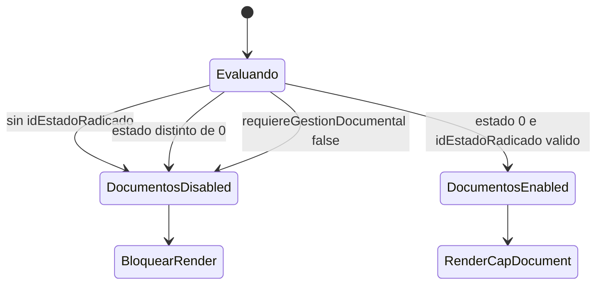

# Diagramas De Estado Frontend

## Estado Del Modulo

## Estado Documental

## Guard De Documentos

## Matriz De Habilitacion UI

| Estado frontend | Tab Documentos | Boton Enviar a Pendiente | Modal Pendientes | Accion Tomar |
|---|---|---|---|---|
| Sin contexto | Inactivo | Oculto/Inactivo | Activo | Activa |
| Activo `estado = 0` | Activo | Activo | Visible con bloqueo de toma | Inactiva o bloqueada |
| Pendiente `estado = 1` | Inactivo | Inactivo | Activo | Activa |
| Error de inicio | Inactivo | Inactivo | Activo si el modulo cargo | Activa con validacion backend |

