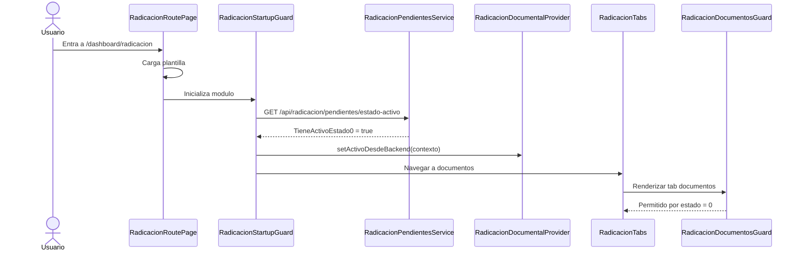
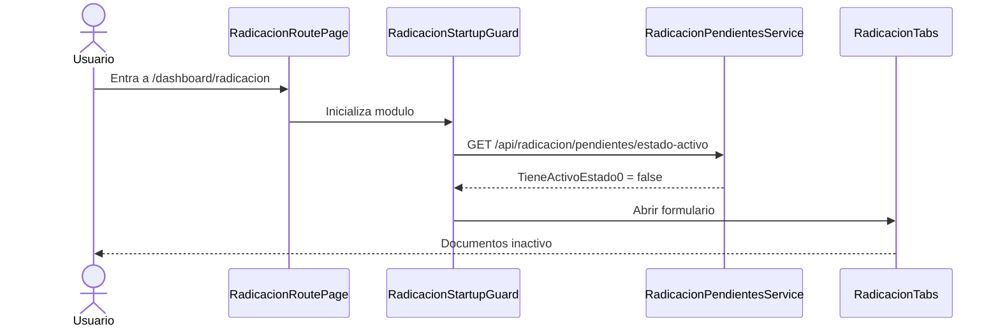
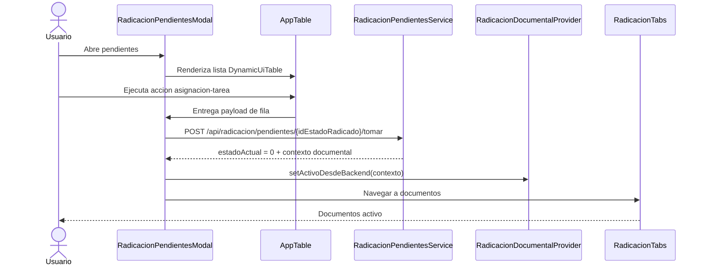
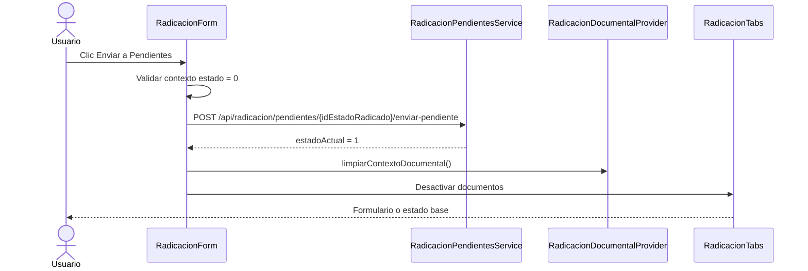
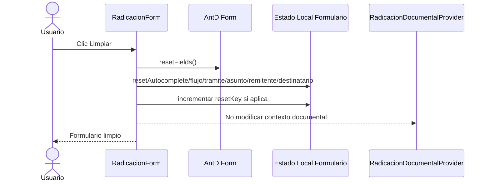

# Diagramas De Secuencia Frontend

## Inicio Del Modulo Con Estado Activo

## Inicio Del Modulo Sin Estado Activo

## Tomar Pendiente Desde AppTable

## Enviar Tramite Activo A Pendiente

## Limpiar Formulario Sin Borrar Contexto Documental

