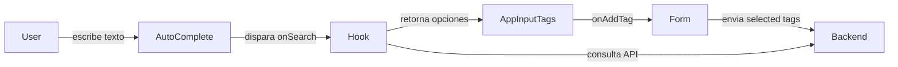
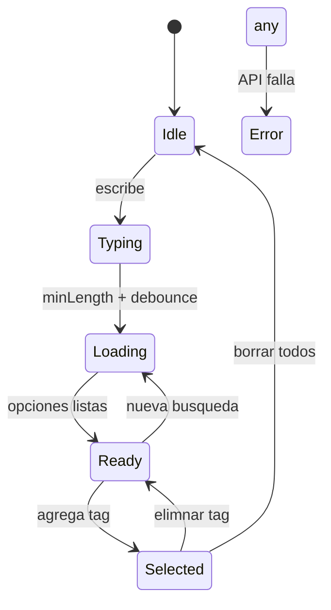
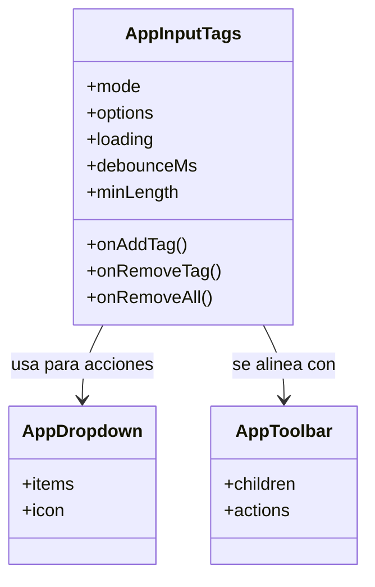
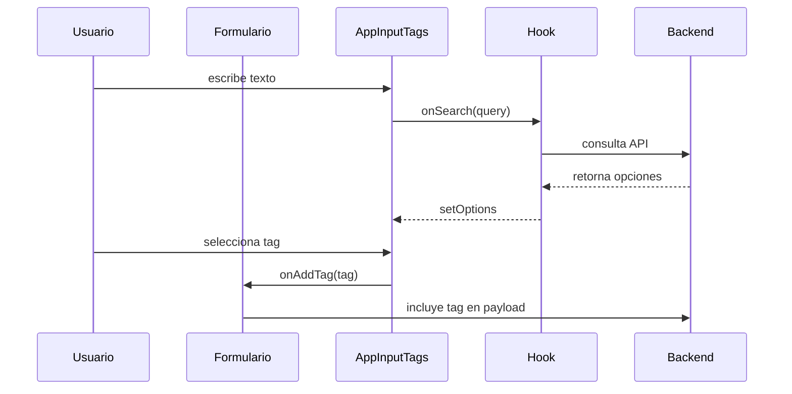

# Documento Técnico: Evolución a AppInputTags reusable con flujo mejorado

## Objetivo

Documentar los nuevos requerimientos del control `AppInputTags` (heredero del SelectDestinatario) que se apoya en Ant Design, AppToolbar y AppDropdown para ofrecer: etiquetas manuales, modos single/multiple, carga con loading, autocomplete con debounce y minLength configurable, eliminación masiva de tags y compatibilidad visual con AppToolbar.

## Contexto

- La base actual es `BaseSelectUsuarios` + `SelectDestinatario` en `RadicacionForm.tsx`.
- El negocio requiere un control más flexible que soporte tags manuales, eliminación manual y capas visuales consistentes con la librería UI (`AppToolbar`, `AppDropdown`).
- Este control debe reutilizarse dentro de `src/app/Components/UI` y consumirse desde formularios como `RadicacionForm` u otros.

## Requerimientos funcionales

1. Renombrar el activo a `AppInputTags` y colocarlo bajo `src/app/Components/UI/AppInputTags`.
2. Configurar dos modos de uso:
   - `mode = "single"` que solo permite un tag activo.
   - `mode = "multiple"` que permite múltiples etiquetas acumuladas.
3. Permitir agregar tags manuales sin depender de eventos `KeyPress`. El control debe exponer un API (`onAddTag`, `inputValue`) que se dispara solo cuando se confirma la etiqueta.
4. Permitir eliminar tags manualmente desde el dropdown o acciones fuera del input sin usar `KeyPress` (por ejemplo, botones dentro del dropdown o menú contextual de cada tag).
5. El control debe poder recibir un listado inicial y re-renderizarse sin capturar `KeyPress` (p.ej. `options` o `initialTags` prop).
6. Mostrar un indicador de `loading` en el dropdown o en el icono del campo cuando se consultan sugerencias.
7. Usar Ant Design (`Autocomplete`, `Dropdown`, `Tag`, `Space`, `Spin`, etc.) como base visual, aprovechando `AutoComplete` para las sugerencias de tags.
8. Incluir una acción de eliminación masiva dentro del select (p.ej. opción `Borrar todos` en el dropdown, o un botón visible cuando haya tags) que permita limpiar la lista en un solo gesto.
9. Estar contenido dentro de un `AppToolbar` o poseer una `toolbar` anexa que lo alinee con la UI general (botones, información contextual, etc.).
10. Utilizar `AppDropdown` para renderizar las acciones secundarias (modo masivo, filtros, etc.).
11. Permitirse la selección manual de tags sin capturar `KeyPress`, por ejemplo, exponiendo botones que llaman a `addTag(tag)`.
12. Integrar `AutoComplete` + debounce + `minLength` configurable para controlar cuándo se consulta la fuente de sugerencias. El debounce debe ser configurable vía prop `debounceMs`, y `minLength` debe detener las consultas cuando el texto no llega a ese umbral.

## Requerimientos no funcionales

- El control debe conservar accesibilidad (`aria-label`, roles adecuados) y los `data-ident` actuales.
- Debe permitir la integración con Form.Item de Ant Design mediante `name` y `rules`.
- La eliminación masiva no debe bloquear el input ni requerir recarga de la página.
- Las reglas visuales (border radius, sombras) deben seguir las establecidas en `AppInput` para mantener consistencia.

## Flujo recomendado

1. El componente renderiza un `Space.Compact` con un `AutoComplete` y un `Dropdown` (`AppDropdown`) para acciones.
2. El input se controla internamente, dispara `onChange`, y cuando se cumple `minLength + debounce`, invoca `onSearch` para poblar sugerencias.
3. Al seleccionar una sugerencia o confirmar un tag manual, se ejecuta `onAddTag`. Las tags se muestran con `Tag` y menú contextual para eliminar/información.
4. El `AppDropdown` incluye una opción `Eliminar todos` que limpia la lista y dispara `onRemoveAll`.
5. El componente puede renderizar un `Spin` dentro del suffix/icono durante la carga.
6. El modo single/multiple se controla con la prop `mode` y se respeta en `onChange` (reemplaza el tag único en single).

## Validaciones y pruebas

- Validar que el modo single no admite más de una etiqueta.
- Validar debounce y minLength con props configurables y que no se dispare antes del umbral.
- Validar que el loading se muestra durante las consultas.
- Validar que se pueden agregar/eliminar tags sin pulsar Enter (usando API manual y botones del dropdown).
- Validar la acción masiva y que borra el listado correctamente.
- Validar integración visual dentro de un `AppToolbar` (spacing, botones). 

## Siguientes pasos sugeridos

1. Documentar props nuevos (`mode`, `debounceMs`, `minLength`, `loading`, `options`, `onAddTag`, `onRemoveTag`, `onRemoveAll`).
2. Crear carpeta `src/app/Components/UI/AppInputTags/` con `AppInputTags.tsx`, estilos, y tests.
3. Sustituir la instancia actual en `RadicacionForm.tsx` por este control y pasarle los datos/handlers actuales (`opcionesUsuarios`, `abrirInformacion`, `rules`, `selectDisabled`).
4. Revisar que `AppToolbar` pueda envolverlo o que el control pueda renderizar sus propios botones alineados (por ejemplo, `AppDropdown` con acciones adicionales).

## Diagramas

### Casos de uso



### Diagrama de estados



### Diagrama de clases



### Diagrama de secuencia



### Ejemplo de implementación en `RadicacionForm.tsx`

```tsx
<AppInputTags
  mode="single"
  label={destinatarioLabelNode}
  name="destinatario"
  options={opcionesUsuarios}
  rules={
    destinatarioRequired ? [{ required: true, message: "Seleccione destinatario" }] : []
  }
  minLength={3}
  debounceMs={250}
  loading={isLoadingDestinatarios}
  onAddTag={(tag) => form.setFieldValue("destinatario", [tag])}
  onRemoveAll={() => form.resetFields(["destinatario"])}
  selectDisabled={destinatarioDisabled}
  abrirInformacion={abrirInformacion}
  toolbar={{
    render: () => (
      <AppDropdown items={[{ label: "Borrar todos", onClick: () => form.resetFields(["destinatario"]) }]} />
    ),
  }}
/>
```
