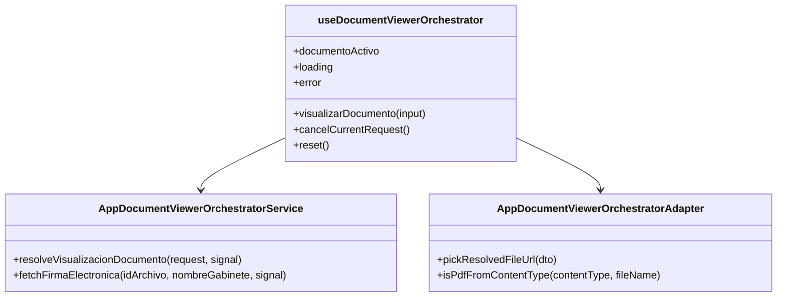
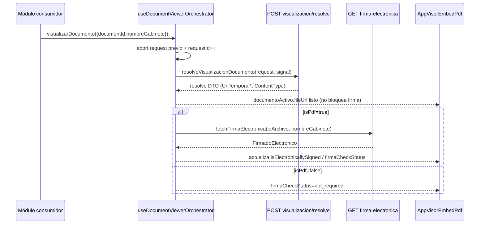
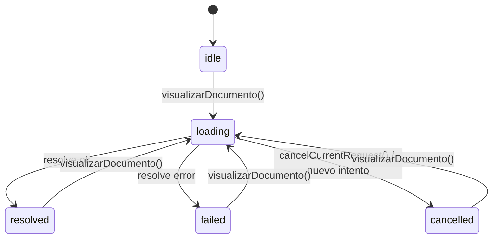

# SCRUMCORE-226 - Arquitectura

## Propósito

Definir el núcleo reusable `AppDocumentViewerOrchestrator` (sin UI) para orquestar:

- Resolve de visualización documental (`visualizacion/resolve`)
- Selección de URL final (prioridad `UrlTemporalAbsoluta`, fallback `UrlTemporal`)
- Detección de PDF
- Consulta de firma electrónica (solo si es PDF)
- Consolidación de estado runtime consumible por `AppVisorEmbedPdf`

## Problema que resuelve

Sin un orquestador reusable, la lógica de visualización documental tiende a duplicarse entre módulos, generando:

- Inconsistencias (diferentes reglas de URL/errores).
- Race conditions (clicks rápidos -> respuestas out-of-order).
- Manejo desigual de errores.
- Riesgo de perder el documento visible ante fallos.

El orquestador centraliza ese flujo, manteniendo contratos estables y comportamiento determinista.

## Alcance / Fuera de alcance

**Alcance**
- Resolve de visualización y selección de URL final del visor.
- Detección de PDF.
- Consulta de firma electrónica solo si es PDF (sin bloquear visualización).
- Consolidación de estado runtime y mecanismos anti-race.

**Fuera de alcance**
- UI/permisos/toolbar/edición/anotaciones.
- Persistencia de URLs temporales.
- Construcción de payloads desde DTOs de UI/rows o invocación `action/ver_documento`.
- Cambios de backend/endpoints.

## Principios (prompt)

- Sin UI, sin permisos, sin toolbar, sin edición/anotaciones.
- Sin cambios de backend/endpoints.
- Source of truth: `{ documentId, nombreGabinete }` (+ `context?` opcional solo trazabilidad).
- Anti-race: cancelación + ignorar respuestas stale.
- Estabilidad: ante fallas no se pierde el documento previamente visible.
- Seguridad: no persistir URLs temporales.

## Componentes

- `src/app/Components/UI/AppDocumentViewerOrchestrator/AppDocumentViewerOrchestrator.types.ts`
- `src/app/Components/UI/AppDocumentViewerOrchestrator/AppDocumentViewerOrchestrator.service.ts`
- `src/app/Components/UI/AppDocumentViewerOrchestrator/AppDocumentViewerOrchestrator.adapter.ts`
- `src/app/Components/UI/AppDocumentViewerOrchestrator/useDocumentViewerOrchestrator.ts`

## Responsabilidades / No-responsabilidades

**Responsabilidades (únicas)**
- Resolve documental.
- Selección de URL final para el visor.
- Consulta de firma electrónica solo para PDF (sin bloquear la visualización).
- Consolidación del estado runtime (contrato estable para consumidores).

**No-responsabilidades (prohibido)**
- Permisos del visor, toolbars, edición/anotaciones, lógica visual.
- Obtener o inferir `DocumentResolveRequest`, rows DTO, metadata de fila (pertenece al módulo consumidor).
- Invocar `action/ver_documento`.
- Persistir URLs temporales en `localStorage`, `sessionStorage`, `indexedDB` o caches persistentes.
- Cambiar backend/endpoints.

## Contratos (resumen)

Entrada canónica:

```ts
{ documentId: number; nombreGabinete: string; context?: { idTareaWorkflow?: number; radicado?: string; grafo?: object } }
```

Salida consolidada (estado runtime):

```ts
{
  documentId: number;
  nombreGabinete: string;
  fileUrl: string | null;
  contentType: string | null;
  isPdf: boolean;
  isElectronicallySigned: boolean | null;
  firmaCheckStatus: "not_required" | "resolved" | "failed";
  resolveStatus: "idle" | "loading" | "resolved" | "failed" | "cancelled";
  errors: string[];
}
```

## Concurrencia y estabilidad

- Se cancela la request previa al iniciar una nueva visualización.
- Se ignoran respuestas stale con `requestId` incremental (out-of-order safety).
- En fallas de resolve o firma, el documento previamente visible se mantiene (estabilidad del visor).

## Decisiones de diseño (por qué así)

- **Core sin UI**: permite que múltiples módulos reutilicen el flujo sin acoplar permisos/toolbar/UX.
- **Estado consolidado**: `AppVisorEmbedPdf` consume un contrato estable; los módulos no duplican lógica de resolve/firma.
- **Anti-race first-class**: clicks rápidos y navegación generan respuestas out-of-order; el `requestId` hace el comportamiento determinista.
- **AbortController**: corta requests en vuelo y reduce carga innecesaria.
- **No persistencia de URL**: URLs temporales son sensibles; se mantienen solo en memoria.

## ADRs / Decisiones arquitectónicas (resumen)

1. **Hook como API pública**: `useDocumentViewerOrchestrator()` es la frontera principal para consumidores (evita que UI replique lógica).
2. **Cancelación + requestId**: se combinan para asegurar determinismo ante concurrencia (cancelar reduce carga; requestId evita out-of-order incluso si no se cancela a tiempo).
3. **Firma no bloqueante**: el visor puede abrir al completar resolve; firma se consolida después.

## Riesgos técnicos y mitigaciones

- **ContentType inconsistente**: mitigado con fallback por extensión `FileName`.
- **Out-of-order responses**: mitigado con `requestId` incremental.
- **Errores transitorios de firma**: mitigado conservando `fileUrl` y marcando estado `failed` sin romper el visor.
- **Persistencia accidental de URL**: mitigado por regla explícita + verificación por búsqueda (sin storage/caches en el módulo).

## Arquitectura por capas (interna del módulo)

Dentro de `src/app/Components/UI/AppDocumentViewerOrchestrator/` se mantienen capas explícitas:

- **types**: contratos tipados y DTO mínimos (`AppDocumentViewerOrchestrator.types.ts`).
- **service**: llamadas HTTP a endpoints reales (`AppDocumentViewerOrchestrator.service.ts`).
- **adapter**: reglas puras de mapping/decisión (URL final, detección PDF) (`AppDocumentViewerOrchestrator.adapter.ts`).
- **hook**: orquestación de estado + concurrencia (sin UI) (`useDocumentViewerOrchestrator.ts`).
- **tests**: unit tests del adapter y del hook (`tests/`).

**Dependencias (dirección permitida)**
- `hook` -> `service` y `adapter` y `types`
- `service` -> `src/api/Clienteaxios.ts` (cliente HTTP standard del repo)
- `adapter` -> `types`
- `types` -> sin dependencias

Regla: evitar dependencias del orquestador hacia módulos funcionales (`src/modules/...`) o componentes de UI.

## Diagramas

### classDiagram (estructura del módulo)



### sequenceDiagram (flujo end-to-end del core)



### stateDiagram-v2 (estado runtime)


