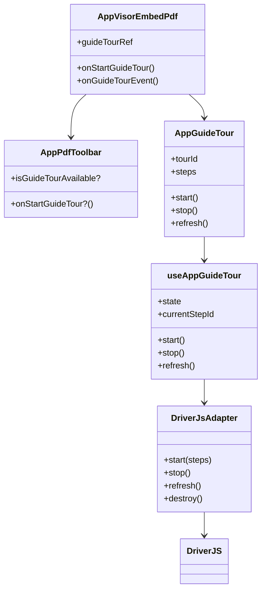
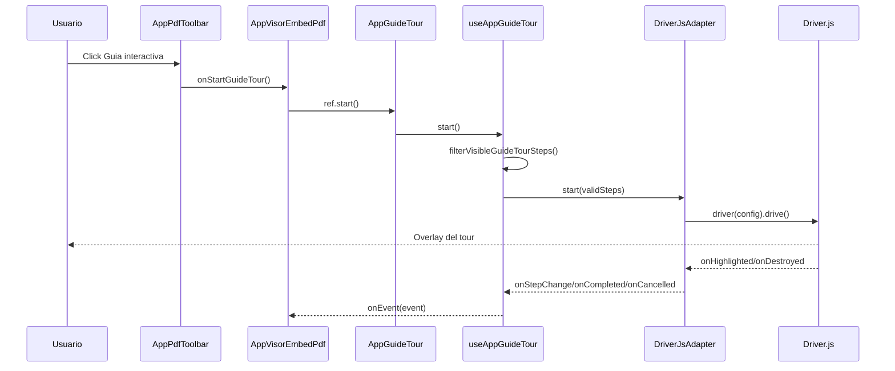
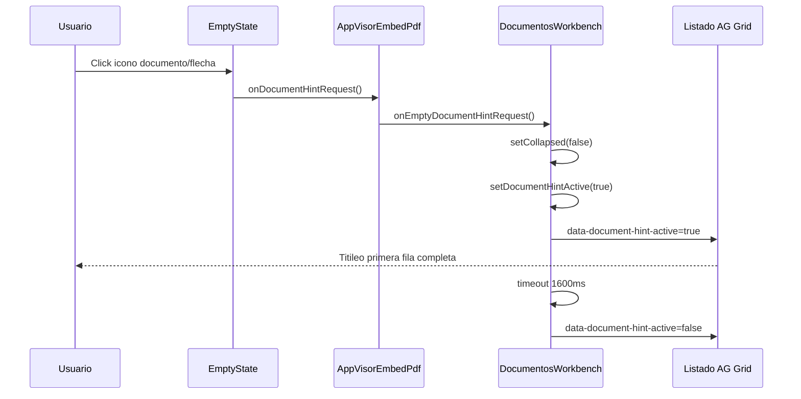
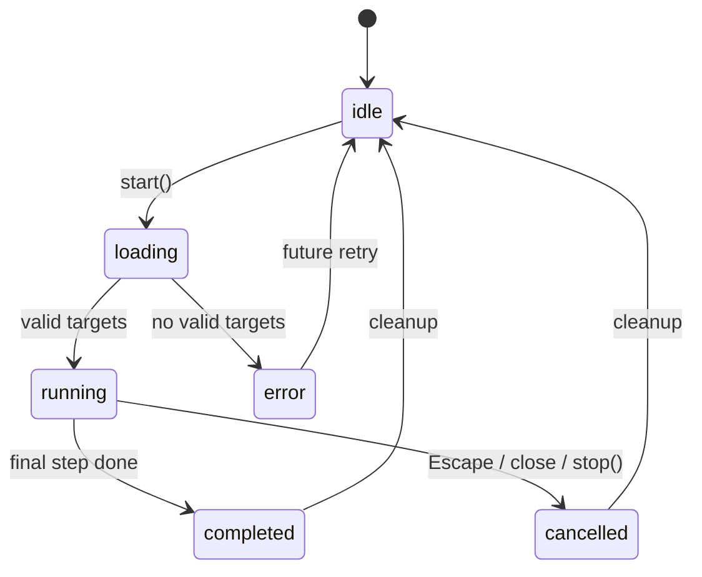

# SCRUMCORE-235 - AppGuideTour - Arquitectura

## Objetivo

`AppGuideTour` introduce una capa reusable de guia interactiva basada en Driver.js. La primera integracion real es `AppVisorEmbedPdf`, donde se agrega un boton de ayuda en `AppPdfToolbar` para iniciar un recorrido sobre controles existentes del visor.

El cambio mantiene Driver.js aislado del visor PDF. `AppVisorEmbedPdf` solo conoce el componente reusable, el ref publico y la lista de steps configurada.

## Componentes

| Elemento | Responsabilidad |
| --- | --- |
| `AppGuideTour` | Componente headless que expone `start`, `stop` y `refresh` por ref. |
| `useAppGuideTour` | State machine minima, filtrado de targets y emision de eventos. |
| `DriverJsAdapter` | Unico archivo que importa `driver.js` y su CSS. |
| `AppGuideTour.service` | Filtra steps con targets DOM faltantes y normaliza eventos. |
| `AppPdfToolbar` | Renderiza controles reales, atributos `data-guide-tour-id` y boton de ayuda opcional. |
| `AppVisorEmbedPdf.guideTour` | Configuracion de steps del visor PDF. |

## Flujo

1. El usuario activa el boton `Guia interactiva` en el toolbar.
2. `AppPdfToolbar` ejecuta `onStartGuideTour`.
3. `AppVisorEmbedPdf` llama `guideTourRef.current.start()`.
4. `AppGuideTour` delega en `useAppGuideTour`.
5. El hook filtra steps cuyos selectores no existan en el DOM.
6. `DriverJsAdapter` mapea los steps a Driver.js.
7. Driver.js renderiza el overlay y controla siguiente/anterior/finalizar/cierre.
8. El hook emite eventos no sensibles.

## classDiagram

## sequenceDiagram

## sequenceDiagram - Hint de seleccion de documento

## stateDiagram-v2

## Restricciones cumplidas

- Driver.js solo se importa en `src/app/Components/UI/AppGuideTour/drivers/DriverJsAdapter.ts`.
- El visor no modifica logica de zoom, rotate, print, export, firmas, thumbnails ni scroll.
- Los consumidores del toolbar siguen siendo compatibles porque las props de guia son opcionales.
- Search, Fit Width y Fit Page no se agregan porque no existen como botones actuales en `AppPdfToolbar`.
