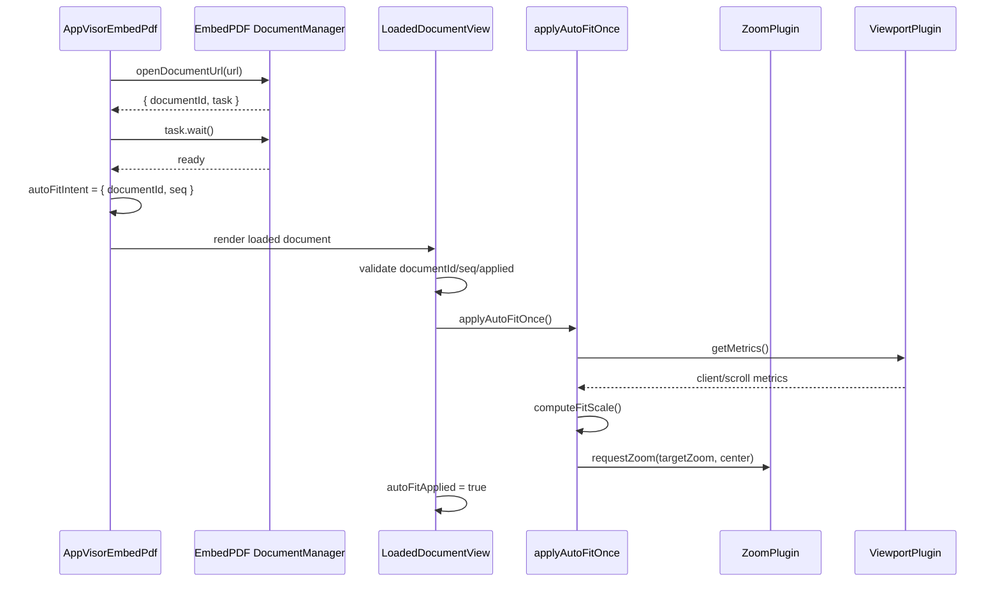
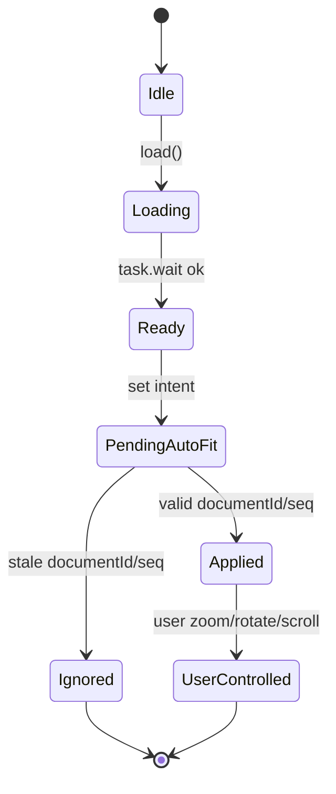
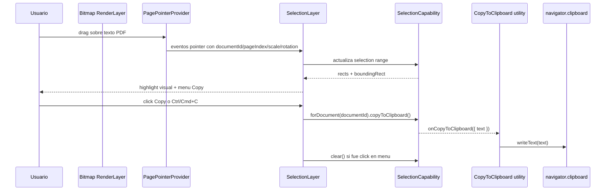

# SCRUMCORE-234 - Arquitectura

## 1) Modelo Mental

Auto-Fit es una capa local del visor PDF. No decide que documento cargar, no transforma el PDF y no inspecciona contenido visual. Solo calcula una escala objetivo y la aplica cuando el documento actual ya esta listo.

Flujo principal:

1. `AppVisorEmbedPdf.load()` inicia una carga y aumenta `loadSeq`.
2. EmbedPDF abre el documento.
3. El handshake `task.wait()` confirma que el documento esta listo.
4. El visor guarda una intencion de auto-fit `{ documentId, seq }`.
5. La vista loaded valida que la intencion siga vigente.
6. `applyAutoFitOnce()` lee metricas del viewport y solicita zoom.

## 2) Capas

### UI / Orquestacion

Archivo: `src/app/Components/UI/AppVisorEmbedPdf/AppVisorEmbedPdf.tsx`

Responsabilidades:

- Controlar `loadSeq`.
- Guardar `autoFitIntentRef`.
- Guardar `autoFitAppliedRef`.
- Ejecutar auto-fit despues de `documentId` ready.
- Mantener compatibilidad con zoom, rotate, thumbnails, seleccion, anotacion y firma.

### Math

Archivo: `src/app/Components/UI/AppVisorEmbedPdf/autoFit/autoFit.math.ts`

Responsabilidades:

- Definir `FitMode`.
- Definir contratos `ViewportSize` y `ContentSize`.
- Calcular escala para `width` y `page`.
- Aplicar guardrails de escala.

### Apply

Archivo: `src/app/Components/UI/AppVisorEmbedPdf/autoFit/autoFit.apply.ts`

Responsabilidades:

- Leer metricas de viewport.
- Derivar tamanio base del contenido a partir de `scrollWidth/scrollHeight` y `zoomLevel`.
- Ajustar dimensiones si la rotacion metadata equivale a 90/270.
- Solicitar zoom con centro de viewport.
- Registrar logs de diagnostico solo si `window.__DV_DEBUG__` esta activo.

### Selection / Interaction

Archivos:

- `src/app/Components/UI/AppVisorEmbedPdf/plugins/pluginRegistration.ts`
- `src/app/Components/UI/AppVisorEmbedPdf/AppVisorEmbedPdf.tsx`
- `src/app/Components/UI/AppVisorEmbedPdf/styles/AppVisorEmbedPdf.module.css`

Responsabilidades:

- Registrar `InteractionManagerPluginPackage` desde `@embedpdf/plugin-interaction-manager/react`.
- Registrar `SelectionPluginPackage` desde `@embedpdf/plugin-selection/react`, no desde el paquete base.
- Montar `SelectionLayer` dentro de `PagePointerProvider` en cada pagina renderizada.
- Habilitar seleccion de texto para modo `default` con `enableSelection: true`.
- Desactivar marquee para UX tipo navegador: `enableMarquee: false`.
- Mostrar rectangulos de seleccion: `showSelectionRects: true`.
- Proveer menu contextual `Copy` mediante `selectionMenu`.
- Interceptar `Ctrl/Cmd+C` para delegar al plugin en vez de depender de seleccion nativa del DOM.

### Page Rendering / Zoom / Rotation

Archivo: `src/app/Components/UI/AppVisorEmbedPdf/AppVisorEmbedPdf.tsx`

Responsabilidades:

- Usar `rotatedWidth` y `rotatedHeight` como slot real del scroller.
- Mantener `width` y `height` base para el contenido interno cuando se usa `<Rotate>`.
- Pasar `scale={zoomLevel}` a `PagePointerProvider` y `AnnotationLayer`.
- Pasar `rotation={rotationRaw}` o el valor especifico requerido por la rama rotada.
- Evitar clipping con `overflow: visible` y offsets defensivos de `+2px` en contenedores rotados.

## 3) Contratos Internos

```ts
export type FitMode = "width" | "page";

export type ViewportSize = {
  width: number;
  height: number;
};

export type ContentSize = {
  width: number;
  height: number;
};
```

Contrato de aplicacion:

```ts
applyAutoFitOnce({
  documentId,
  fitMode,
  rotationSteps,
  zoomLevel,
  zoomProvides,
  viewportProvides,
});
```

Resultado:

```ts
{ ok: boolean; appliedZoom?: number }
```

## 4) Concurrencia y Stale-Ignore

El visor mantiene `loadSeqRef`. Cada carga incrementa la secuencia. Cuando el documento queda listo, se guarda:

```ts
autoFitIntentRef.current = { documentId, seq: managedSeq };
```

Antes de aplicar auto-fit, la vista loaded valida:

- la intencion existe,
- el `documentId` coincide,
- la secuencia sigue siendo la vigente,
- `autoFitAppliedRef` todavia es `false`.

Si cualquiera de esas condiciones falla, el auto-fit no aplica. Esto evita que una carga anterior afecte a un documento posterior.

## 5) Diagramas

### 5.1 sequenceDiagram - ready -> apply auto-fit -> user zoom



### 5.2 stateDiagram - auto-fit lifecycle



### 5.3 sequenceDiagram - seleccion de texto y copiado



### 5.4 flowchart - render de pagina, zoom y rotacion

```mermaid
flowchart TD
  A[Scroller renderPage] --> B[Leer width height rotatedWidth rotatedHeight]
  B --> C[slotWidth = ceil(rotatedWidth)]
  B --> D[slotHeight = ceil(rotatedHeight)]
  B --> E[baseWidth/baseHeight = ceil(width/height)]
  C --> F{rotationSteps == 0 y slot parece rotado?}
  F -- si --> G[Wrap con Rotate y rotation=1]
  F -- no --> H{rotationSteps == 0?}
  H -- si --> I[Render directo sin Rotate]
  H -- no --> J[Wrap con Rotate manual]
  G --> K[PagePointerProvider scale=zoomLevel rotation efectiva]
  I --> K
  J --> K
  K --> L[RenderLayer]
  K --> M[SelectionLayer selectionMenu]
  K --> N[AnnotationLayer scale/rotation]
```

## 6) Rotacion

El fit no intenta detectar orientacion por contenido. Solo respeta rotacion metadata o rotacion efectiva ya conocida por el visor. Si `rotationSteps` normalizado es `1` o `3`, se intercambian ancho y alto antes del calculo para mantener el fit deterministico.

La arquitectura de render separa dos conceptos:

- Slot del scroller: espacio que EmbedPDF reserva para la pagina, calculado con `rotatedWidth/rotatedHeight`.
- Contenido base: dimensiones originales `width/height` usadas dentro del contenedor rotado.

Esa separacion evita que una pagina con metadata `/Rotate` se dibuje en un slot incorrecto o quede recortada por rounding subpixel.

## 7) Seleccion y Copy-to-Clipboard

El plugin selection tiene dos partes:

- Plugin/capability base: calcula seleccion, rectangulos, texto y emite eventos.
- Utility React `CopyToClipboard`: escucha `onCopyToClipboard` y escribe en `navigator.clipboard.writeText(text)`.

Por eso el registro debe usar:

```ts
import { SelectionPluginPackage } from "@embedpdf/plugin-selection/react";
```

Si se usa `@embedpdf/plugin-selection`, `scope.copyToClipboard()` calcula/emite el texto, pero no existe utility React montada que lo escriba en el portapapeles del navegador.

## 8) Observabilidad

Los logs usan prefijo `[DV][autofit]` y solo se emiten cuando:

```ts
window.__DV_DEBUG__ = true;
```

No deben incluir URLs temporales, tokens ni blobs.
