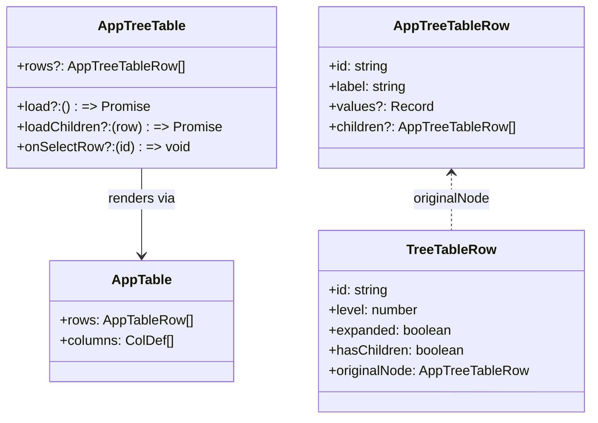
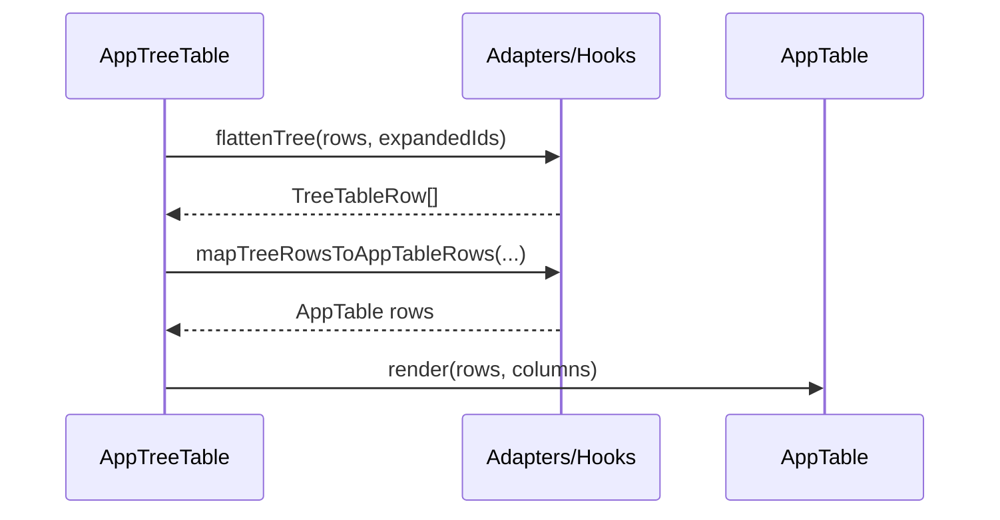
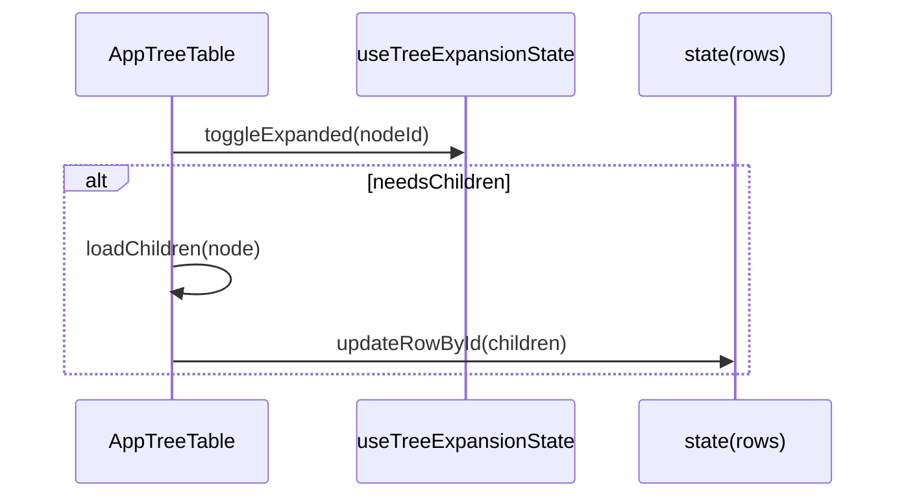
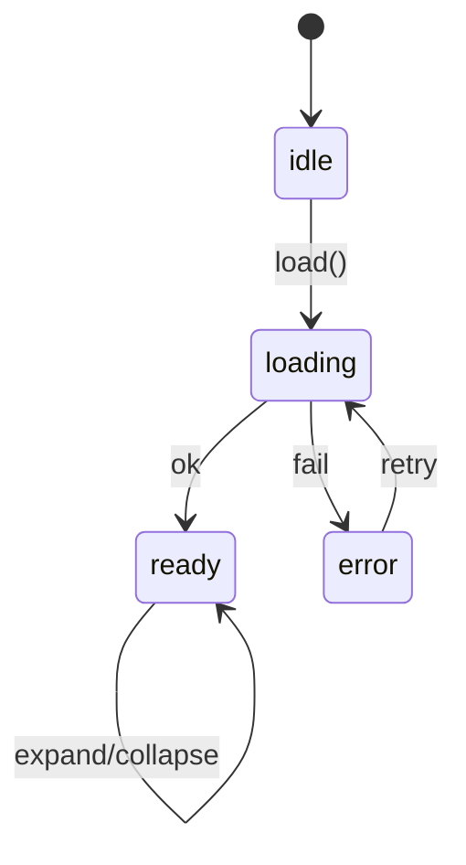

# SCRUMCORE-216 - Arquitectura

## 1. Resumen arquitectonico
Refactoriza `AppTreeTable` para implementarlo como wrapper/adaptador reusable sobre `AppTable`, preservando compatibilidad con consumidores actuales y evitando duplicacion del engine tabular.

Restricciones:
- No reemplazar `AppTable`.
- No acoplar `AppTreeTable` a dominios (ej. `GestionCorrespondencia`).
- No introducir contratos backend-driven nuevos en este ticket.

## 2. Vista estatica

Capas:
- `components`: `AppTreeTable.tsx`
- `hooks`: estado de expansion y filas visibles
- `adapters`: flattening, indentacion, mapeo Tree -> Table
- `types`: tipos publicos y tipos internos
- `style`: `AppTreeTable.module.css`

Dependencias:
- `AppTreeTable` -> `AppTable` -> AG Grid

## 3. Diagrama de clases

## 4. Diagramas de secuencia

### Render inicial

### Expand/Collapse

## 5. Diagrama de estados

## 6. ADRs resumidas
- Wrapper vs segundo motor: se elige wrapper para evitar duplicacion de logica y divergencia UX.
- Expansion local: `AppTreeTable` controla expansion por ser concern jerarquico.

## 7. Riesgos tecnicos y mitigaciones
- Re-render masivo: memoizacion en hooks/adapters.
- Regresiones en consumidores: pruebas unitarias + integracion en `DocumentosWorkbench`.

## 8. Trazabilidad a codigo
- `src/app/Components/UI/AppTreeTable/AppTreeTable.tsx`
- `src/app/Components/UI/AppTreeTable/hooks/useTreeExpansionState.ts`
- `src/app/Components/UI/AppTreeTable/hooks/useTreeVisibleRows.ts`
- `src/app/Components/UI/AppTreeTable/adapters/*`

