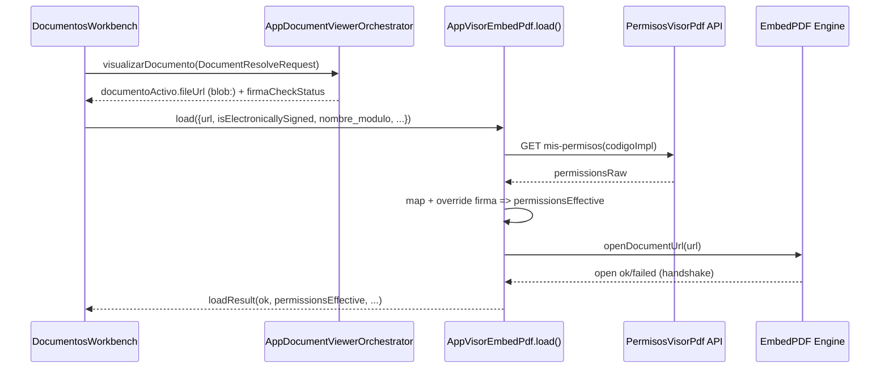

# SCRUMCORE-227 — AppVisorEmbedPdf.load() (Arquitectura)

## Objetivo técnico
Agregar una **API pública managed** en `AppVisorEmbedPdf` basada en `load()` para:

- Recibir **contexto documental consolidado** (URL ya resuelta por `AppDocumentViewerOrchestrator`).
- Consultar **permisos efectivos** del visor PDF.
- Aplicar **override duro** por firma electrónica (fail-closed para edición).
- Mantener compatibilidad con consumidores **legacy** (`fileUrl` directo).

## Problema que resuelve
Los consumidores legacy solo pasan `fileUrl` y el visor no tenía un punto único para:

- Resolver permisos efectivos (policy engine).
- Aplicar reglas transversales (ej. documento firmado => edición bloqueada).
- Proteger estabilidad ante cambios rápidos (stale loads / cancelación).

## Alcance
- API `AppVisorEmbedPdfRef.load(input)` (imperative API).
- Service de permisos `GET /api/gestor-documental/permisos-visorpdf/implementaciones/{codigoImpl}/mis-permisos`.
- Mapping centralizado `permissionsRaw -> permissionsEffective`.
- Override por firma electrónica (`isElectronicallySigned=true` => edición/firmas/anotaciones bloqueadas).
- `managed` vs `legacy` gating: si NO se usa `load()`, el visor no bloquea acciones (comportamiento previo).

## Fuera de alcance
- Resolve documental / firma electrónica (pertenece a `AppDocumentViewerOrchestrator`).
- Cambios de backend / endpoints.
- Persistencia de URLs temporales o tokens.

## Arquitectura por capas (visibilidad)
- `AppVisorEmbedPdf.tsx`: componente UI + API pública `load()`.
- `AppVisorEmbedPdf.service.ts`: consumo backend de permisos.
- `AppVisorEmbedPdf.permissions.ts`: mapping + policy + override por firma.
- `presentation/AppPdfToolbar.tsx`: UI de toolbar (consume flags disabled).
- Consumidor actual: `DocumentosWorkbench.tsx` (wiring).

## Source of truth y contratos
`AppVisorEmbedPdf.load()` recibe:

```ts
type AppVisorLoadInput = {
  url: string;
  isElectronicallySigned: boolean;
  idImagen: number;
  nombreGabinete: string;
  idTareaWorkflow: number;
  radicado: string;
  nombre_modulo: string;
  metadata?: Record<string, unknown>;
}
```

El visor NO infiere `documentId`, NO reconstruye requests, NO ejecuta resolve/firma.

## Concurrencia y estabilidad
- `load()` cancela el request previo de permisos usando `AbortController`.
- `loadSeqRef` protege de stale responses (latest-wins).
- El resultado `load()` se resuelve por **handshake** del engine (`openDocumentUrl` -> `task.wait`).

## Diagrama (sequence)


