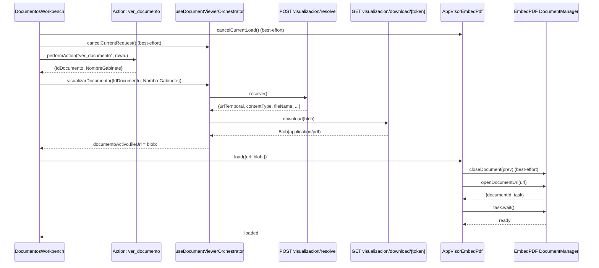
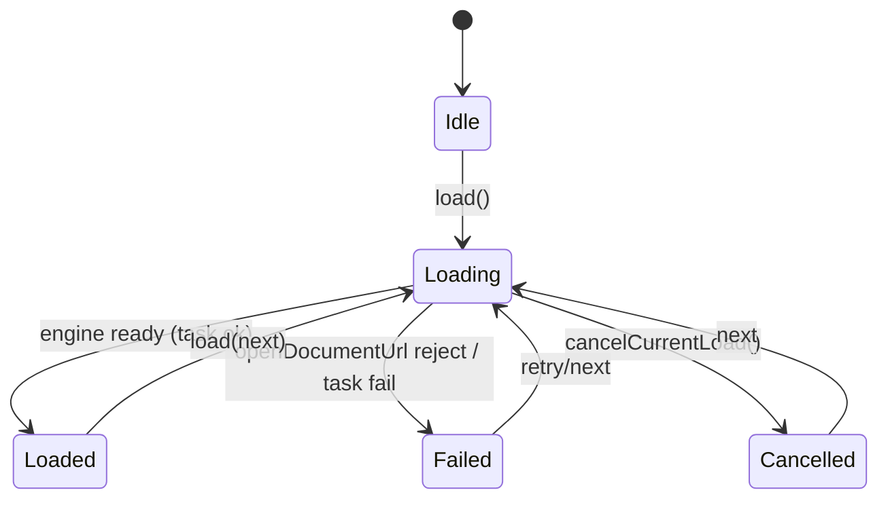

# SCRUMCORE-233 — Arquitectura

## 0) Resumen ejecutivo (mental model)

- 1 click = 1 intento (attempt).
- Estrategia “menos agresiva”: no se bloquea el click; se cancela el intento anterior y se aplica latest‑wins.
- El Orquestador consolida “fuente runtime” (Blob → `blob:` URL) y metadatos; el Visor solo “abre”.
- El Visor mantiene **1 documento activo** en el engine (no acumula) para evitar límites internos del proveedor.

## 1) Problema que resuelve (con evidencia)

### Síntoma observado
Bajo clicks rápidos en el listado, el visor:
- dejaba de abrir documentos,
- “parecía bloqueado” (sin error visible), y/o
- mostraba prompts falsos (“Documento protegido”) cuando el contenido se invalidaba durante swaps.

### Evidencia y causa raíz confirmada
El error real que rompía el flujo no era backend ni permisos: era el engine (EmbedPDF DocumentManager) rechazando aperturas por llegar al máximo de documentos abiertos:

- Rechazo en `openDocumentUrl` (“outer task reject”):
  - `reason.message`: `"Maximum number of documents (10) reached"`

Modelo causal:
- clicks rápidos → múltiples `load()` + re-renders → aperturas repetidas sin cierre explícito → DocumentManager acumula docs → llega a 10 → rechaza nuevos `openDocumentUrl` → el usuario percibe “bloqueo”.

## 2) Alcance / Fuera de alcance

### Alcance (este ticket)
- Cancelación encadenada best‑effort: Workbench → Orquestador → Visor.
- latest‑wins: el intento vigente es el único que debe “commit”.
- Hardening del visor ante fallos genéricos (evitar prompt de contraseña por fallos no‑password).
- Enforzar “single-active document” en el engine para no alcanzar el límite 10.
- Observabilidad temporal con `window.__DV_DEBUG__`.

### Fuera de alcance
- Cambios de backend o endpoints.
- Rediseño del visor para tipos no‑PDF.
- Implementar un policy engine completo de permisos (solo estabilidad/concurrencia).

## 3) Componentes y responsabilidades (3 protagonistas)

### 3.1 Consumidor: `DocumentosWorkbench`
Archivo: `src/modules/gestionCorrespondencia/components/documentosWorkbench/DocumentosWorkbench.tsx`

Responsabilidades:
- Captura click en fila.
- Ejecuta action `ver_documento` y extrae `IdDocumento/NombreGabinete`.
- Inicia el intento (attempt), cancela el intento previo (best‑effort) y dispara orquestación.
- Evita llamadas redundantes a `visorRef.load()` (gate por clave de carga).
- Superficie de error de `ver_documento` (toast) cuando falla o se queda colgado (timeout).

### 3.2 Orquestador: `useDocumentViewerOrchestrator`
Archivo: `src/app/Components/UI/AppDocumentViewerOrchestrator/useDocumentViewerOrchestrator.ts`

Responsabilidades:
- Resolve de visualización y descarga autenticada como `Blob`.
- Construcción de `blob:` URL runtime (`URL.createObjectURL`).
- Cancelación de request in-flight (AbortController / cancel semantics existentes).
- latest‑wins interno por `requestId` (y trazabilidad para correlación).

### 3.3 Visor: `AppVisorEmbedPdf`
Archivo: `src/app/Components/UI/AppVisorEmbedPdf/AppVisorEmbedPdf.tsx`

Responsabilidades:
- Abrir fuente (URL/blob URL) en el engine (DocumentManager).
- Handshake “ready” usando `task.wait` (motor indica doc usable).
- Hardening: no mostrar prompt de contraseña cuando el fallo es genérico (solo ante `PdfErrorCode.Password`).
- “Single-active document”: cerrar (best‑effort) el documento previo antes de abrir uno nuevo.

## 4) Contratos de concurrencia (latest‑wins)

Identidad del intento:
- En el estado actual se instrumentó correlación por `attempt` (Workbench), `req` (orquestador) y `seq` (visor).
- Se extendieron tipos para permitir `attemptId` / `documentKey` (compatibles hacia atrás), pero el criterio principal aplicado aquí es “latest‑wins + gate + single-active engine”.

Regla:
- Cancelación es “normal” (no se muestra como error).
- Respuestas stale deben ignorarse (o no deben “commit” en UI).

## 5) Diagramas (Mermaid)

### 5.1 sequenceDiagram — Click → resolve → blob → visor.open

### 5.2 stateDiagram — Estados del intento en visor (conceptual)

## 6) Cómo ubicar el intento donde se rompe (operativo)

1) Habilitar debug:
   - `window.__DV_DEBUG__ = true`
2) Buscar el primer log del visor:
   - `[DV][visor] openDocumentUrl failed (outer task)`
3) Ese `managedSeq` (o el `seq` inmediatamente anterior) se correlaciona por proximidad temporal con:
   - el último `[DV][attempt:N][seq:S]` del Workbench, y
   - el último `[DV][attempt:N][req:R]` del Orquestador.
4) Si el error es `"Maximum number of documents (10) reached"`, la falla está en el engine y se corrige con “single-active document” (close-before-open) + gate anti-duplicados.

## 7) Loaders / Overlays (UX y timing)

### 7.1 Principio
- El Workbench controla el estado de “viewer loading” (intención UX) y lo pasa al visor como `loading`.
- El Visor pinta el **FullLoadingOverlay** (skeleton) para cubrir el viewport del PDF y evitar “fondo” visible durante swaps/cargas largas.
- El overlay usa un micro-delay (hoy: ~100ms) para evitar flicker en documentos pequeños y aparecer rápido en documentos pesados.

### 7.2 Por qué el overlay vive en el visor
- La región correcta a cubrir es el contenedor/viewport del engine PDF, no el layout del Workbench.
- El visor conoce el borde/radius/stacking (z-index) correcto para que sea consistente con el viewport.
- Evita duplicación de overlays entre Workbench y Visor.

### 7.3 Implicación operativa (primera carga vs swaps)
- El overlay se monta a nivel root del Visor (no solo dentro de la vista “Loaded”) para que se vea:
  - en el primer click (cuando aún no hay `documentId`/`effectiveFileUrl`),
  - durante transiciones (cancel/next) y cargas largas.

## 8) Lifecycle de blobs y riesgo de `ERR_FILE_NOT_FOUND`

### 8.1 Flujo actual (orquestador)
- El orquestador descarga el archivo como `Blob` y genera una URL runtime con `URL.createObjectURL(blob)` (`blob:http://...`).
- Mantiene referencia al blobUrl previo y programa su revocación (`URL.revokeObjectURL`) para evitar leaks.

### 8.2 Riesgo observado
Cuando hay swaps rápidos, el navegador puede intentar leer el `blob:` anterior (p. ej. layers del engine) y si el blobUrl se revoca antes de que el engine deje de usarlo aparece:
- `GET blob:... net::ERR_FILE_NOT_FOUND`

Esto no es backend ni permisos: es invalidación de fuente runtime.

### 8.3 Mitigación aplicada en este ticket (lado visor)
- “Single-active document” (close-before-open) reduce acumulación en el engine (mitiga `maxDocuments=10`).
- Cancel chain + latest-wins reduce solapamiento de lecturas sobre blobs anteriores.

Nota: a largo plazo la solución enterprise completa es “handshake ready + swap seguro active/pending” y coordinar ownership de revocación del blobUrl (quien crea el blobUrl decide cuándo revocar).

## 9) Plugins del visor (EmbedPDF)

El visor registra plugins (scroll/render/interaction/etc.) que determinan:
- render por página (layers),
- scroll/virtualización,
- herramientas (selección/anotación/firma),
- acciones (export/print/rotate/zoom).

Source of truth: `src/app/Components/UI/AppVisorEmbedPdf/plugins/pluginRegistration.ts`.

Listado actual (orden de registro):
- `DocumentManagerPluginPackage` (estado/instancias de documento).
- `ViewportPluginPackage` (viewport/layout del documento).
- `ScrollPluginPackage` (scroll/virtualización de viewport).
- `RenderPluginPackage` (render por página/layers).
- `InteractionManagerPluginPackage` (routing de interacción).
- `SelectionPluginPackage` (selección).
- `AnnotationPluginPackage` con herramientas de firma no-draggable/no-resizable:
  - `signatureStamp` (`isDraggable=false`, `isResizable=false`)
  - `signatureInk` (`isDraggable=false`, `isResizable=false`)
- `SignaturePluginPackage` con `mode=SignatureOnly` (default enterprise).
- `ZoomPluginPackage` con guardrails:
  - `maxZoom=4`
  - `zoomStep=0.1`
- `ThumbnailPluginPackage`:
  - `autoScroll=true`
  - `scrollBehavior="smooth"`
- `RotatePluginPackage`
- `PrintPluginPackage`
- `ExportPluginPackage`

## 10) Observabilidad (sin datos sensibles)

### 10.1 Gating
La trazabilidad temporal está protegida por `window.__DV_DEBUG__` para evitar ruido en producción.

### 10.2 Reglas
- No loguear URLs temporales completas ni tokens.
- Correlación por:
  - `[DV][attempt:N][seq:S]` (Workbench),
  - `[DV][attempt:N][req:R]` (Orquestador),
  - `[DV][visor] ...` (Visor / engine).
