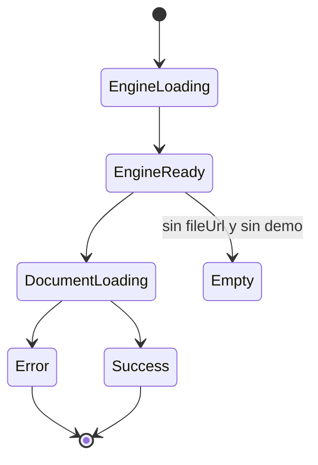

# SCRUMCORE-203 — Arquitectura técnica

## Estructura modular

`src/app/Components/UI/AppVisorEmbedPdf/`

- `AppVisorEmbedPdf.tsx`: composición principal (engine + provider + estados).
- `engine/`: inicialización del engine (Pdfium).
- `plugins/`: registro desacoplado de plugins.
- `presentation/`: host/pipeline de rendering.
- `hooks/`: helpers (demo PDF, etc).
- `styles/`: CSS Modules.
- `types/`: contratos internos (tipado fuerte).

## Capas utilizadas

- UI Component (`AppVisorEmbedPdf`) — API pública mínima.
- Engine layer — inicializa Pdfium y expone engine al provider.
- Plugin layer — registra capacidades EmbedPDF (document/viewport/scroll/render).
- Presentation — orquesta apertura de documento y render del visor.

## Hooks / Providers / Contexts

- Engine: `usePdfiumEngine()` (fuente: `@embedpdf/engines`).
- Provider: `<EmbedPDF ...>` (fuente: `@embedpdf/core`).

Regla crítica:
- Hooks/capabilities de plugins (p. ej. document manager) deben ejecutarse **dentro** del árbol renderizado por `<EmbedPDF>`.

## Rendering pipeline (alto nivel)

1) Inicializa engine (Pdfium)
2) Monta `<EmbedPDF>` con engine + plugins
3) Dentro del provider:
   - abre documento (`fileUrl` o demo)
   - renderiza:
     - `DocumentContent`
     - `Viewport`
     - `Scroller` (virtualización)
     - `RenderLayer` (lazy rendering)

## Dependencias internas/externas

Externas (encapsuladas):
- `@embedpdf/core`
- `@embedpdf/engines` (+ engine Pdfium)
- `@embedpdf/plugin-document-manager`
- `@embedpdf/plugin-viewport`
- `@embedpdf/plugin-scroll`
- `@embedpdf/plugin-render`

Internas:
- Código y estilos bajo `src/app/Components/UI/AppVisorEmbedPdf/`

## Diagramas (Mermaid)

### Flujo

```mermaid
flowchart TD
  A[AppVisorEmbedPdf] --> B[usePdfiumEngine]
  A --> C[EmbedPDF Provider]
  C --> D[Document Host: openDocumentUrl]
  D --> E[DocumentContent + Viewport]
  E --> F[Scroller (virtualización)]
  F --> G[RenderLayer (lazy render)]
```

### Estados


