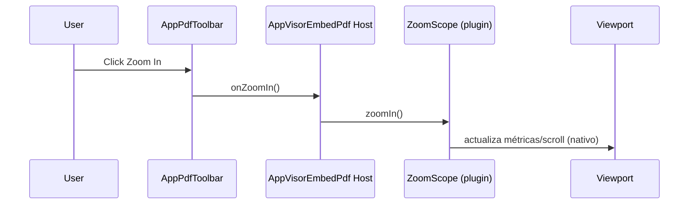

# SCRUMCORE-204 — Arquitectura técnica

## Componentes y capas

- `AppVisorEmbedPdf.tsx`: orquesta engine + provider + host.
- `plugins/pluginRegistration.ts`: registra plugins base + `ZoomPluginPackage`.
- `presentation/AppPdfToolbar.tsx`: toolbar presentacional memoizada.
- `@embedpdf/plugin-zoom`: capability de zoom (scope por documento).

## Toolbar (desacoplada)

Ruta obligatoria:
- `src/app/Components/UI/AppVisorEmbedPdf/presentation/AppPdfToolbar.tsx`
- `src/app/Components/UI/AppVisorEmbedPdf/presentation/AppPdfToolbar.module.css`

La toolbar recibe:
- `zoomLevel`
- `onZoomIn/onZoomOut/onResetZoom`

No conoce engine/plugins/workbench.

## Rendering pipeline (con zoom)

1) Engine listo
2) `<EmbedPDF engine plugins=[..., ZoomPluginPackage] />`
3) Abre documento (DocumentManager)
4) Obtiene `ZoomScope` del plugin para el documento activo
5) Toolbar dispara `zoomIn/zoomOut/requestZoom(1)`
6) Viewport/Scroller/RenderLayer renderizan según zoom nativo

## Diagramas Mermaid (obligatorios)

### Arquitectura

```mermaid
flowchart TD
  A[AppVisorEmbedPdf] --> B[EmbedPDF Provider]
  B --> C[DocumentManager]
  B --> D[Zoom Plugin]
  A --> E[AppPdfToolbar (memo)]
  E --> D
  B --> F[Viewport + Scroller + RenderLayer]
```

### Flujo zoom → viewport



