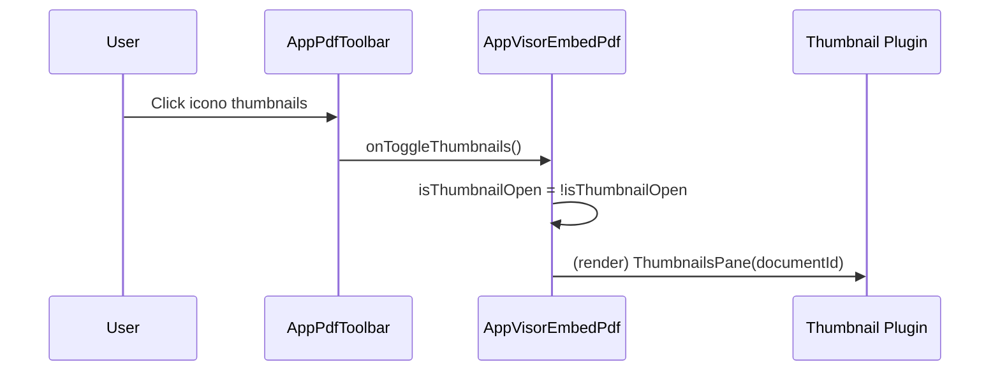
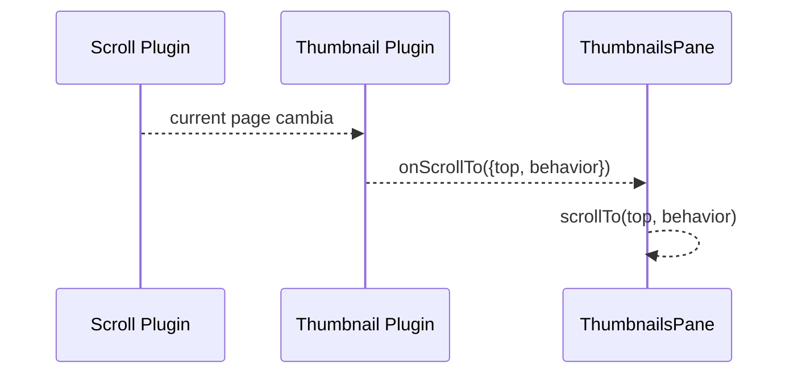

# SCRUMCORE-205 — Arquitectura técnica

## Flujo

```mermaid
flowchart TD
  A[AppVisorEmbedPdf] --> B[EmbedPDF Provider]
  B --> C[ThumbnailPluginPackage]
  A --> D[AppPdfToolbar (memo)]
  D --> E[onToggleThumbnails]
  E --> A
  A --> F[ThumbnailsPane + ThumbImg]
  A --> G[Viewport + Scroller + RenderLayer]
```

## Integración oficial (sin lógica custom)

- Plugin thumbnails: `@embedpdf/plugin-thumbnail`
  - Registro: `createPluginRegistration(ThumbnailPluginPackage, { autoScroll: true, scrollBehavior: "smooth" })`
- Panel thumbnails: render directo desde el plugin:
  - `ThumbnailsPane` + `ThumbImg` (`@embedpdf/plugin-thumbnail/react`)
- Estado UI open/close:
  - `isThumbnailOpen` vive únicamente en `AppVisorEmbedPdf.tsx`

## Interacción toolbar → thumbnails (Mermaid)



## Auto-scroll thumbnails (Mermaid)


