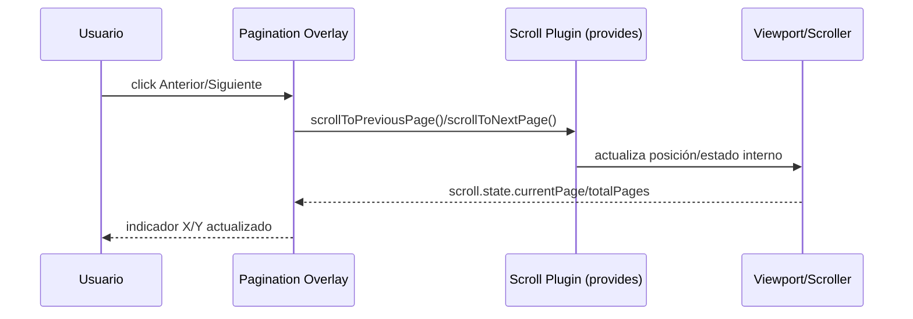

# SCRUMCORE-208 — Arquitectura Técnica

## Estructura / módulos impactados
- `src/app/Components/UI/AppVisorEmbedPdf/AppVisorEmbedPdf.tsx`
- `src/app/Components/UI/AppVisorEmbedPdf/styles/AppVisorEmbedPdf.module.css`
- `src/app/Components/UI/AppVisorEmbedPdf/AppVisorEmbedPdf.test.tsx`

## Pipeline (alto nivel)
```mermaid
flowchart TD
  A[Pdfium Engine] --> B[EmbedPDF Host]
  B --> C[Scroll Plugin (@embedpdf/plugin-scroll)]
  C --> D[useScroll(documentId)]
  D --> E[Pagination Overlay (Prev/Indicator/Next)]
  C --> F[Scroller + Virtualization]
  F --> G[Viewport]
  G --> H[RenderLayer]
```

## Secuencia navegación


## Estados / guardrails
- Si `scroll.provides` es `null` o no expone métodos, los handlers hacen no-op (no crash).
- UI usa `scroll.state` como data source, sin duplicar estado de paginación.

